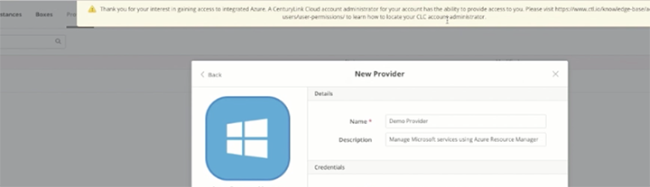
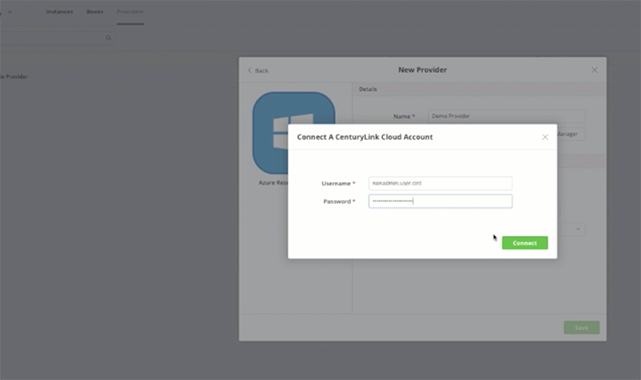

{{{
"title": "Error when Creating a Provider",
"date": "02-20-2017",
"author": "Ben Swoboda",
"attachments": [],
"contentIsHTML": false
}}}

<iframe width="560" height="315" src="https://player.vimeo.com/video/204242838" frameborder="0" allowfullscreen></iframe>

### Introduction

You need to be a CenturyLink Cloud account admin in order to set up a new ARM provider in [Cloud Application Manager](https://www.ctl.io/cloud-application-manager). This tutorial demonstrates the alert message that will display if a non-admin attempts to create a new ARM provider.

### Setting Up a New Provider

After you log-in into Cloud Application Manager, click the **Provider** tab on the top toolbar.

Then click **New Provider** on the left navigation bar.

Select **Azure Resource Manager** to build a customer account in the current Microsoft Azure. Note: this is the new Azure, not the classic Azure. The dialog box that appears will enable you to create a new Azure customer account. Add a name for the account and select the **Create a new Azure customer account** option.

Click **Connect a CenturyLink Cloud Account** and enter your CLC account admin credentials. This ties Azure directly into the CenturyLink Cloud billing service.

### The Exception Message

For billing purposes, only a CenturyLink Cloud account admin is able to approve Azure usage charges. We assume non-admins have not been given high-enough permissions to be able to approve those charges. Therefore, if a non-admin attempts to create a new Azure Customer, you will see the following exception message.

"Thank you for your interest in gaining access to Integrated Azure. A centuryLink Cloud account administrator for your account as the ability to provide access to you. Please visit https://www.cti.io/knowledge-base/accounts-&-users/user-permissions/ to learn how to locate your account administrator."

A link to instructions on how to find your admin in CenturyLink Cloud appears with the message.
