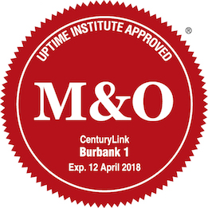

{{{
  "title": "Management & Operations Stamp of Approval -- Proven Operational Excellence and Risk Management",
  "date": "06-06-2016",
  "author": "Christian Brown",
  "contentIsHTML": false,
  "sticky": true
}}}

The Uptime Institute Management & Operations [(M&O)](//www.ctl.io/compliance/management-operations-stamp-of-approval/) Stamp of Approval encompasses a set of benchmarks and outcome-based behaviors that have been proven to support effective data center operations and reduce risk for both the operator and their customers. When applied and followed consistently, well-informed management practices, systematic and documented policies and procedures, and effective training regimens can insulate a data center from the majority of downtime risks. Organizations that have attained the M&O Stamp of Approval have successfully demonstrated leadership and commitment to operational excellence by meeting their assessment criteria.

The M&O Stamp of Approval provides a means to conduct risk analysis at a portfolio level and provide senior management with the information needed to make informed decisions on whether to accept the risk identified in the report or take corrective actions required to mitigate risks. Additionally, in today’s margin-centric world, the M&O Stamp of Approval allows companies to get the most of their facility and related assets and realize cost savings through these efforts.

The M&O behaviors are divided into five categories, with criteria in each that have been identified as necessary for a site to achieve its full uptime potential, reduce its risk of errors, and maintain efficient operations.

### Key Areas Assessed

**Planning, Coordination, and Management**

Site Policies | Financial Process | Reference Library | Capacity Management

**Staffing and Organization**

Staffing | Qualifications | Organization

**Training**

Data Center Staff | Vendors

**Operating Conditions**

Load Management | Operating Set Points

**Maintenance**

PM Program | Housekeeping | MMS | Vendor Support | Deferred Maintenance | Predictive Maintenance | Life-Cycle Planning | Failure Analysis Program

### Benefits of M&O Stamp of Approval

The M&O Stamp of Approval validates the rigor and effectiveness of facility management and operations and gives stakeholders the assurance they need that effective risk mitigation is in place. In addition to reduced exposure to downtime, benefits of the M&O process include:

* Provides a consistent and proven set of standards, processes, and measurements across an entire global data center portfolio, giving customers a point of comparison.
* Ensures that an optimum staffing configuration is in place to support the business objective.
* Validates that appropriate measures are in place to safeguard the facility from errors and failures, mitigating the "human factor" risks.
* Protects investment in data center equipment and systems.
* Improves resource allocation.
* Enhances industry reputation by acknowledging accomplishment as witnessed through an independent and unbiased third-party.

### M&O Certified Data Centers

Atlanta 1

Burbank 1

Chicago 2, 3 & 4

Denver 1, 2 & 3

London 1, 3, 4, 5 & 6

Los Angeles 1

New Jersey 2, 2x, 3 & 4

Orange County 2 Phase I

Santa Clara 4, 5, 8 & 9

Seattle 2, 3 & 4

Sunnyvale 1 & 2

Washington DC 2, 3 & 4
