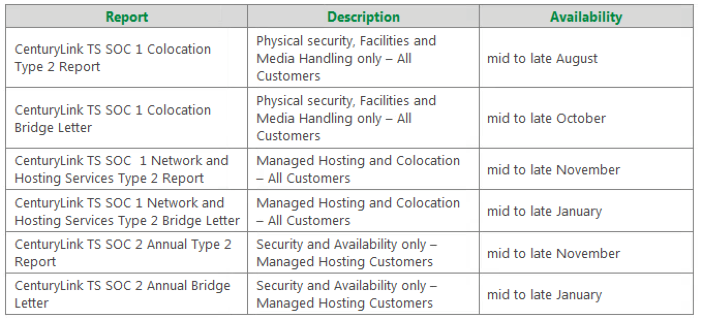
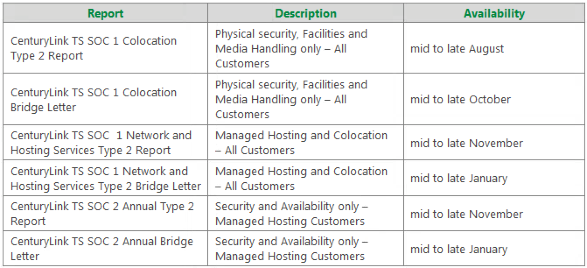

{{{
  "title": "SOC Program Overview",
  "date": "08-01-2016",
  "author": "Christian Brown",
  "contentIsHTML": false,
  "sticky": true
}}}

The CenturyLink SOC Program is designed to help our customers with their financial reporting and to provide them with confidence in CenturyLink as a service provider in the areas of security, availability, processing integrity, confidentiality, and privacy of CenturyLink systems. The majority of CenturyLink customers have Service Organization Control (SOC) 1 (formerly SAS70) or an equivalent written into their contracts and rely heavily on having this report for their auditors during their SOX audits. Many customers also require the SOC 2 report, as it is a framework for using the Trust Service and is recommended for outsourced data center services.

### [SOC 1](//www.ctl.io/compliance/soc-1-ssae-16/)

Statement on Standards for Attestation Engagements (SSAE) 16 examinations, also referred to as SOC 1 examinations, assess controls at service organizations that are relevant to user entities' (i.e., customers') internal control over financial reporting. SSAE No. 16 superseded the SAS 70 audit standard in mid-2011.

The primary purpose of an SSAE 16 report is to provide customers and their financial statement auditors with an understanding of the services being provided and a CPA firm's opinion as to whether the description is fairly presented, the controls are suitably designed, and in the case of a Type 2 report, whether the controls were operating effectively over a specified period of time.

CenturyLink issues a combined SSAE 16 / ISAE 3402 Type 2 report to cover all customers regardless of their country of origin. SSAE 16 is the U.S. standard and ISAE 3402 (International Standards for Assurance Engagements) is the international standard.

### [SOC 2](//www.ctl.io/compliance/soc-2/)

SOC 2 reports are intended to meet the needs of a broad range of users that need to understand internal control at a service organization as it relates to the [Trust Service principles](//www.ssae-16.com/at-101/soc-2-report-trust-services-principles/) framework. The report is relevant to the non-financial reporting controls using the five principles of security, availability, processing integrity, confidentiality and privacy of a system.

The Trust Service Principles are modeled around four broad areas: Policies, Communications, Procedures, and Monitoring. Each of the principles have defined criteria (controls) which must be met to demonstrate adherence to the principles and must also produce an unqualified opinion (no significant exceptions found during your audit). As with a SOC 1, the SOC 2 includes a CPA firm's opinion as to whether the description is fairly presented and also includes whether the controls were operating effectively over a specified period of time.

CenturyLink issues one bridge letter per year, per report following up each report. Bridge letters are used when a SOC 1/SSAE 16 report covers only a portion of a fiscal year, the service organization is able to provide a bridge letter between the end date of the review period and the end of the year. CenturyLink does not issue ad-hoc bridge letters at any other time; this is because a bridge letter requires CenturyLink to perform a mini-audit of each of the controls within the report before executive management will sign it. CenturyLink understands that customers like to have up-to-date information, however, annual audits are the main priority and that is where CenturyLink focuses the effort. Also, SOC standards require that time elapses in order to provide an opinion, making up-to-the-minute information hard to provide. CenturyLink cannot provide reports or letters for future dates.

If the CenturyLink customer has audit rights in their Master Service Agreement (MSA), they can exercise those rights and audit CenturyLink to ensure that the controls impacting them are operating effectively as per the last report if there is not a bridge letter to cover the time period needed.

All distributable documents include a "click wrap" feature that contains the embedded Non-Disclosure Agreement (NDA) language for the customer to agree to at the time the document is opened. This eliminates the need for the customer to sign and fax back an NDA. Any entity receiving the letter or reports is bound by the confidentiality clauses in the NDA.

To request a copy of the SOC2 report, open a ticket with CenturyLink Platform Support, by emailing [help@ctl.io](mailto:help@ctl.io).
