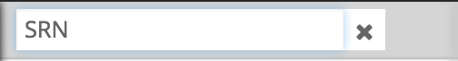
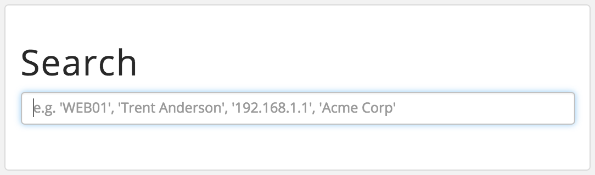
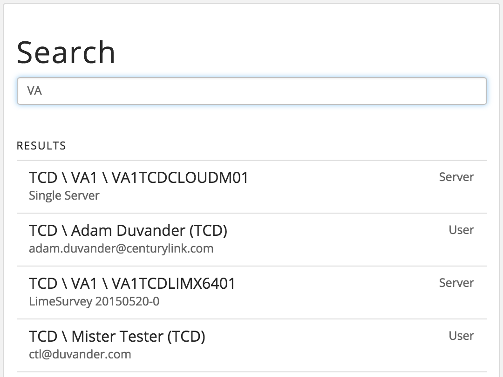
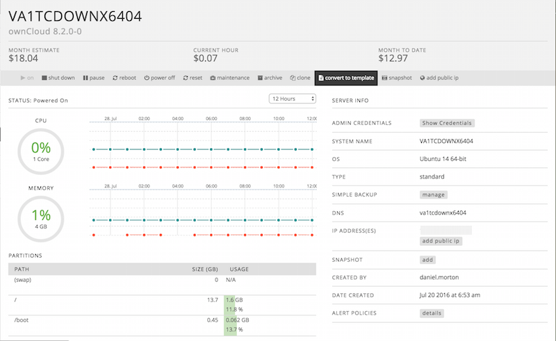
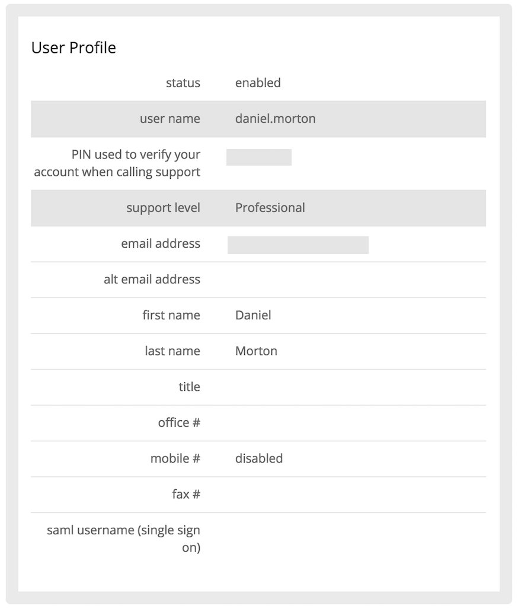

{{{
  "title": "Searching and Filtering within the Control Portal",
  "date": "11-20-2015",
  "author": "Josh Leporati",
  "attachments": [],
  "contentIsHTML": false
}}}

<strong>The AppFog service was retired on June 29, 2018. The AppFog Platform-as-a-Service is no longer available, including all source code, env vars, and database information.</strong>

### Article Overview
There are several ways to perform searching tasks within the CenturyLink Cloud Control Portal. These include methods to search for servers, groups, metadata related to descriptions and custom fields, as well as filtering infrastructure or other lists for specific items.

### Filtering Infrastructure & AppFog Lists
At times it may want to filter your list of Infrastructure down to particular items so you can focus on them. This can be accomplished by using the **Filter** option located at the top of your lists.

This example filters on servers with **SRN** in the name. Note that the filter applies across all of your infrastructure, even to servers that are spread across multiple data centers (within the same account).

1. From the Navigation Panel, click **Infrastructure > Servers**.

2. Click the 'spy glass' at the top of the list.
   

3. In the filter text box, enter **SRN**.
   

4. While the filter is still applied you can navigate between all the results. Close the filter by clicking the **x** on the filter bar. Canceling the filter brings all Infrastructure back into view.

### Global Searching in the Control Portal
The Global search feature in the Control Portal can be found in the upper right hand corner. You can use it to search across different kinds of information in the platform. Some of the searchable items (Server and User results) are:
* Servers (by Name or IP)
* Server metadata (Description field information / custom fields)
* Accounts (Platform Users and API)

Selecting any item in the search will take you to that item. The following steps include examples on searching basics:

1. Click the 'spy glass' located in the upper right corner of the Dashboard near your user name. This opens a global Search window.
   

2. Enter you search criteria. This example uses a simple text string.
   

   Multiple results are returned that match the query. The left side contains the list of items. The right side contains the type of result.

3. Clicking an item takes you to the page for that item.
   

4. This time search for who created the server. This example search on a user name. Click on a line item takes you to the drill-down information.
   

   The more specific the search, the more fine tuned the results. This example takes you to the User Profile page.

Make use of the powerful search and filtering abilities in the platform. It can greatly aid in managing large deployments. Using these features helps you to quickly navigate to and find key components very quickly.
