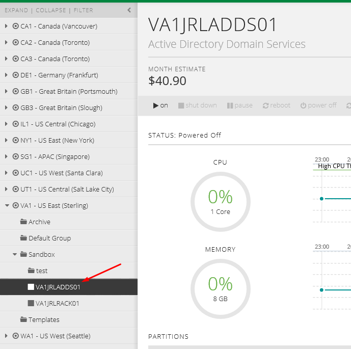

{{{
  "title": "Searching and Filtering within the Control Portal",
  "date": "11-20-2015",
  "author": "Josh Leporati",
  "attachments": [],
  "contentIsHTML": false
}}}

### Article Overview
There are several ways to perform searching tasks within the CenturyLink Cloud Control Portal. These include methods to search for servers, groups, metadata related to descriptions and custom fields - as well as filtering infrastructure & appfog lists for specific items.

### Filtering Infrastructure & AppFog Lists
At times it may prove beneficial to filter your list of Infrastructure or AppFog down to the items you want to focus on.  This can be accomplished by utilizing the **FILTER** option located at the top of your lists.  Lets walk through filtering our Infrastructure to only show us servers with **SRN** in their name.  Note that this filter applies across all of your Infrastructure, even spread out across multiple datacenters (within the same account).

1. Select "FILTER"

  

2. In the white bar, enter any text that your server name contains.

  

3. While the filter is still applied you can navigate between all the results.  Once completed, simply select the **x** on the filter bar to bring back all Infrastructure.

  

### Global Searching within the Control Portal
The Global search feature within the portal is accessed in the upper right hand corner, and can be used to search across a plethora of information within the platform.  Some of the items searchable from here are (Server and User results):

  - Servers (by Name or IP)
  - Server metadata (Description field information / custom fields)
  - Accounts (Platform Users and API)

Selecting any item in the search will take you to that item.  The following steps include examples on some searching basics:

1. Select the global search bar and enter in any query, for this first example we will search for a user in the platform (billing man)

  

  Notice how multiple results are returned matching our query.  On the right side we are informed the type of result returned as well.  Selecting on our request will then take us to the page with relevant information

2. Select the appropriate result to be taken to the correct page.

  

3. Perform another search, this time with a server description in mind.  For this example I'll search for one that has (active directory) in the description

  

  Notice that the more specific the search, the more fine tuned the results.  Selecting this server will then take me directly to that server in my infrastructure lists

  

Making use of the powerful search and filtering abilities within the platform can greatly aid in managing large deployments.  Use of these features helps you to quickly navigate to and find key components at a moments notice.
