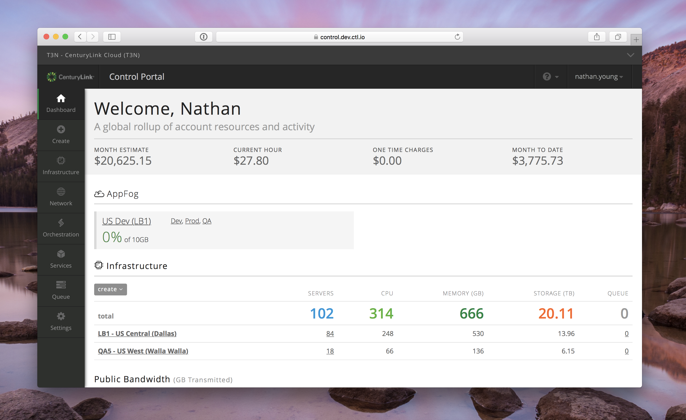
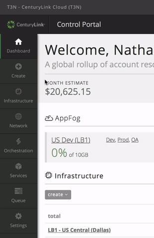
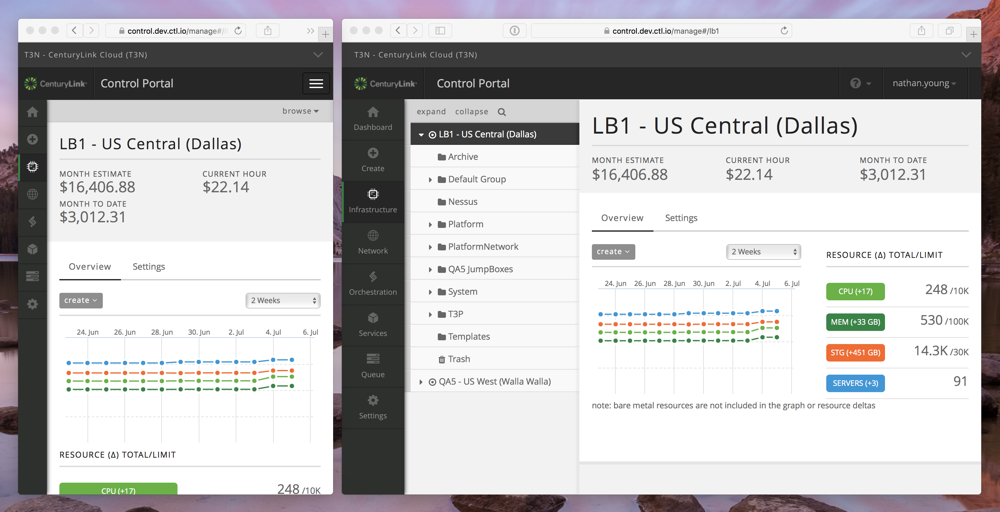
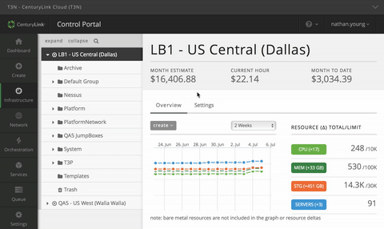
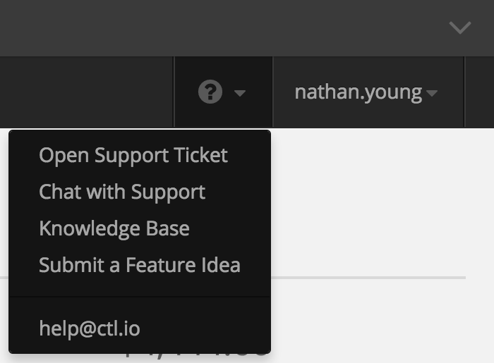
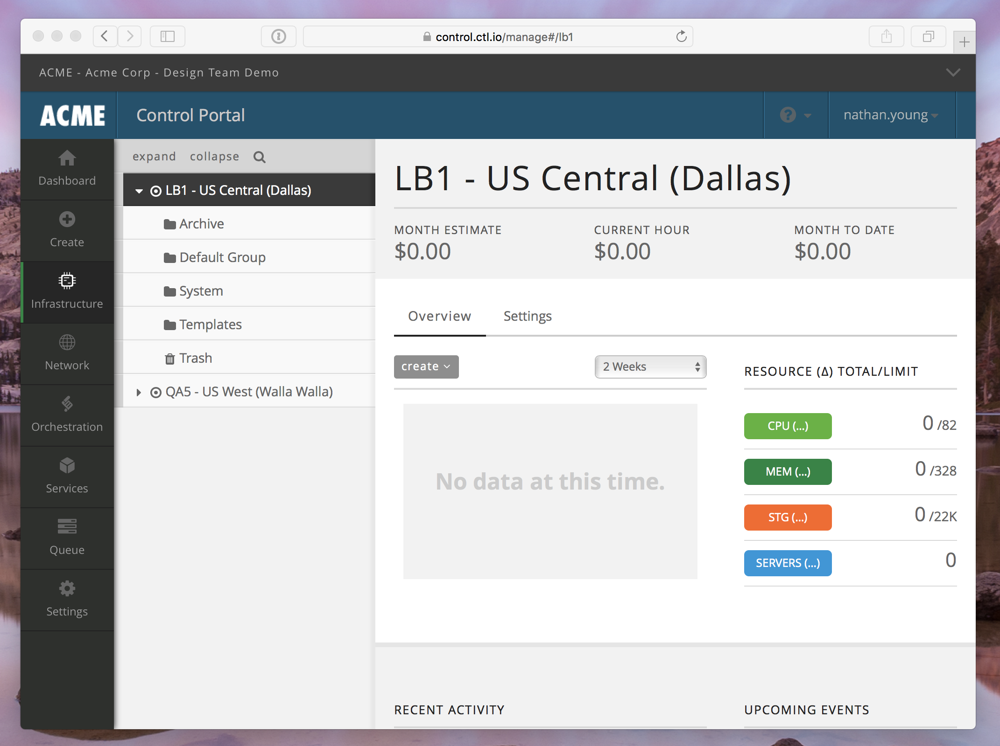

{{{
  "title": "Control Portal Navigation Update",
  "date": "7-6-2016",
  "author": "Nathan Young",
  "attachments": [],
  "related-products" : [],
  "contentIsHTML": false,
  "sticky": false
}}}

_NOTE: On July 19, the user interface for the Lumen Cloud will be updated with a new navigation menu. Most notably, the interactive main navigation bar at the top of the screen will be removed in favor of a left-hand navigation experience. This new approach better reflects the breadth and depth of our services. Our Creative Director, Nathan Young explains the rationale behind this change, and what users can expect when they login after the update._

Over the past year, we’ve added new services like [Runner](https://www.ctl.io/runner/), [relationalDB](https://www.ctl.io/relational-database/), and [Simple Backup](https://www.ctl.io/simple-backup-service/), with more under development and on the way. With a growing portfolio of services, it’s become clear that we have outgrown the existing navigation menu in the Control Portal. So earlier this year we began to update the design of the Control Portal to better accommodate for existing services, while allowing room for us to add more down the road.

We’ve redesigned our Control Portal experience with you in mind, to make navigation faster, more intuitive, and mobile-friendly. Additionally, we also want to give you consistent, high-quality experience when interacting with the Lumen Cloud Control Portal, and our cloud-related services. But before it launches, here's a preview of what’s to come.

### Main Navigation

The green top navigation bar has been replaced with a new nav bar on the left side of the page. We have organized services and settings into eight categories, each containing links to services and settings that fall within each category.

* **Dashboard**
* **Create:** a menu for quickly provision servers or services
* **Infrastructure:** manage your servers by data center
* **Network:** network and ip address management
* **Orchestration:** Runner and Blueprints
* **Services:** Relational DB
* **Queue:** blueprint queue
* **Settings:** account settings, user management, branding and theming

This new navigation bar is designed to be responsive, so whether you use a desktop or mobile device to browse the Control Portal, it will adapt itself appropriately. We’re working to make all areas of the site responsive as well.

### Sub-Account

If you are a customer that happens to use our sub-account feature, there is a new sub-account navigation menu at the very top of the page. This displays your current account name and alias, giving you context for the data on the page below. To open the menu, click the account name (or press ctrl + i on your keyboard) to view the entire account hierarchy your user has access to.

If you belong to a large organization with a long list of accounts, you can filter the list of accounts by account name or alias using the filter input box to quickly change account context. The full account hierarchy for each sub-account is displayed, so it is easier to understand what sub-account belongs to whom.

### Help and Support

To access help and support options, a menu is available at the upper right next to the username of the person currently signed in. Clicking the question mark icon will reveal your support options.

### Custom Colors and Logos

The most commonly customized color option (header bar color) has been maintained, and we have removed the rarely used, or confusing options. The logo, favicon, and mobile icons have remained unchanged. If you wish to update the color scheme of your account after seeing the navigation update, view your [organization color settings page](https://control.ctl.io/Organization/Settings/theme).

We’re really excited to share the upcoming design with you, and we’ll be iterating on it based on your usage and feedback. We understand that site changes can be disruptive, but we believe this is an important and beneficial change that will improve your experience of using the Control Portal.
