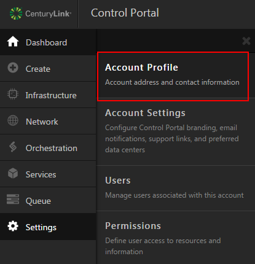
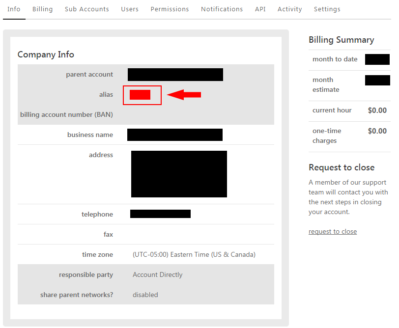

{{{
  "title": "Finding the Account Alias",
  "date": "11-9-2021",
  "author": "Derek Jansen",
  "attachments": [],
  "contentIsHTML": false
}}}

## Description

An account alias is a 2-4 character alphanumeric code that is used to uniquely identify a specific account.

---
## Detailed Steps

When logged into the [control portal](//control.ctl.io), the account alias will be shown in the top-left corner of the page. Alternatively, it can also be found using the following steps.

1. On the left side of the page, select "settings" then "account profile".  

2. The account alias will be shown on the info tab.  

