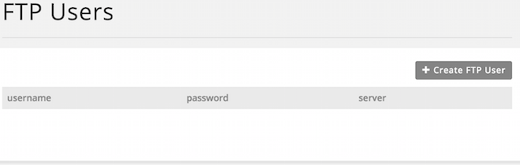
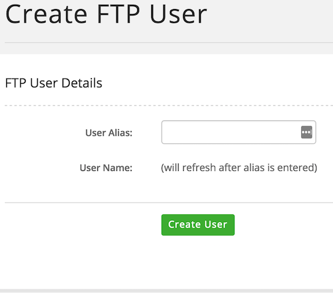
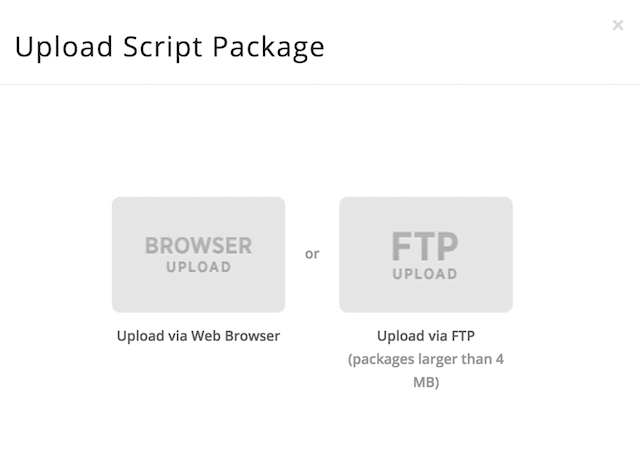
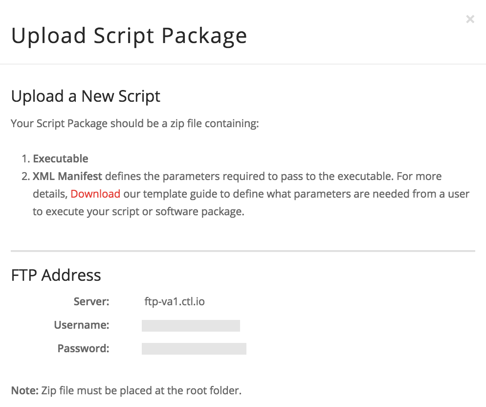
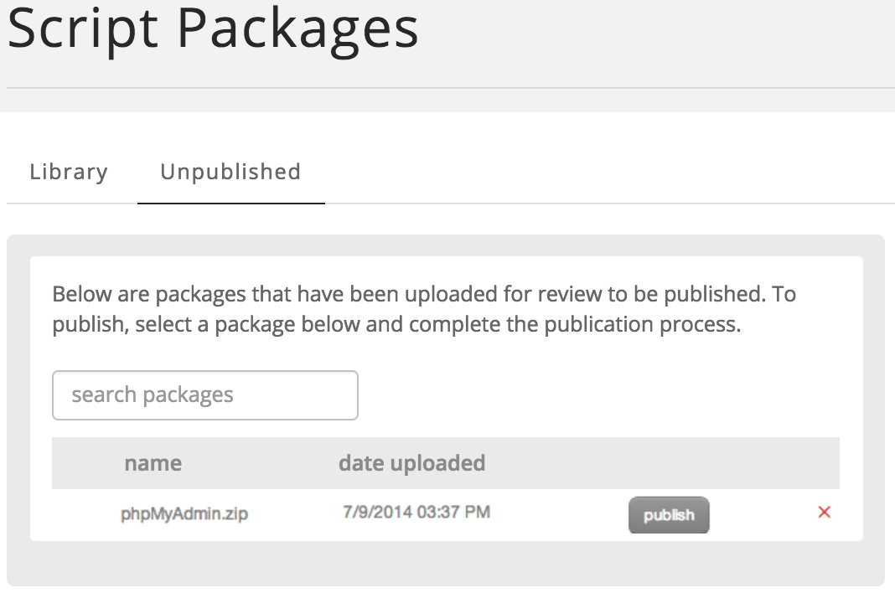

{{{
  "title": "FTP Users in Control Portal",
  "date": "07-09-2014",
  "author": "Bryan Friedman",
  "attachments": [],
  "contentIsHTML": false
}}}

### Overview
The CenturyLink Cloud Control Portal allows for the creation of FTP users. These FTP users are intended to be used *only for the uploading of custom script and software packages* to be run as part of a Blueprint or directly on a server or group of servers. The FTP users created in Control Portal may also be used for uploading VM images for import. This article explains what the FTP users service is used for and the process for using it.

### Audience
CenturyLink Cloud customers

### Creating FTP Users
1. From the Navigation Menu, select **Orchestration > FTP Users**. This opens a page showing the FTP users that have been created.
   

2. To create a new FTP User, click **Create FTP User**.

3. Enter the alias for the User Alias and click **Create User**. **Note**: Your account alias is prepended to the user name.

   

4. A strong password is automatically assigned to the user. User information also includes the server name to which the user is assigned.

### Uploading Script Package
When you create a new script package from the Scripts page, you have the option to upload via the Web Browser or via FTP. For smaller packages, it is easier to use the browser upload option. However, for packages that are larger than 4 MB, we recommend an FTP upload. This (and only this) is what the user(s) you created in the previous steps should be used for.

1. From the Navigation Menu, select **Orchestration > Scripts**. Then, click **New Script**.
   

2. When you click the **FTP Upload** option, you are given instructions on how to upload a package. It creates an FTP user for you, if you don't already have one.
   

3. Using the server name, username, and password listed (or the one from the previous steps for creating a new user), login to the FTP server with an FTP client.

4. On the Script Packages page, click the **Unpublished** tab. You should see the script that you just uploaded in the list.

5. Click **Publish** to take you through the process of completing the publication of your script package.

### Additional Information
The FTP account may also be used for uploading OVF templates or VM images to import.

See [Blueprints Script Package Management](../Blueprints/blueprints-script-and-software-package-management.md) for more information on how to create and publish packages for upload.
