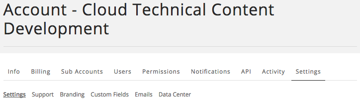

{{{
  "title": "Getting Started with White Labeling",
  "date": "03-25-2015",
  "author": "Jared Ruckle",
  "attachments": [],
  "contentIsHTML": false
}}}

### Getting Started with White Labeling
Lumen Cloud includes several features that allow organizations to replace specific Lumen branding elements with their own brand. This article covers the most popular elements of white-labeling, including:

* Site Name
* Header Bar Color Scheme
* Logos
* Site Footer

**NOTE**: Not all changes appear immediately. New site branding, logos, and other personalized elements may take up to 30 minutes to appear throughout the site. In addition, some changes appear only after the user has logged in and logged out a few times.

1. From the Navigation Menu, click **Settings > Account Settings**.

2. Make sure the **Settings** tab is active.

3. Click **Branding**.
   

### Customizing the Site Name
1. In the Site section, click the site name and replace it. Typically, this is the name of your company or division.

2. Click **save**.

3. After the change takes effect, the name appears in the header and on the login page of your [subdomain featuring an account alias](../Release Notes/2015/2015-03-05-cloud-platform-release-notes.md).

### Customizing the Header Bar Color Scheme
The colors used throughout the Control Portal can be changed to reflect your organization's color scheme.
1. In the Header Bar Color section, click **custom**.

2. Specify the exact HEX or RBG value for the color.

3. Click **save**.

### Customizing Different Logos
Changes made to logos may take up to 30 minutes to propagate across the site. Note the specifications for each logo type. You can modify the following:
* **Control Portal Logo**
  * PNG, GIF, or JPG format only
  * a maximum of 100 pixels wide by 50 pixels high.
  * For best results, make sure the logo is on a transparent background, or that the logo background matches the header background.
* **Sign in Page Logo**
  * PNG, GIF, or JPG format only
  * For best results, make sure the logo is on a transparent background, or that the logo background matches the header background.
* **Shortcut Icon (favicon)**
  * must be a square ICO (preferred)
  * PNG, GIF, or JPG format only
  * at least 16 pixels by 16 pixels
  * Use transparency (with ICO or PNG) to let the background show
* **iPhone/iPad Icon**
 * must be a square PNG or JPG
 * ideally 152 pixels by 152 pixels
 * Use transparency (with PNG) to let the background show through.

1. Click **change** for the icon type you want to change.

2. Click **choose file**.

3. Navigate to the file on your computer and click **Open**.

4. Click **save**.

### Customizing the Site Footer
You can customize the Control Portal to use your company's information.

1. From the Navigation Menu, click **Settings > Account Settings**.

2. Make sure the **Settings** tab is active.

3. Click **Settings**.
   

4. Click **site footer**.

5. Click **enable** and click **save**.

### Using Custom Domains
A custom subdomain is automatically available for each account alias, in the format of `https://alias.cloudportal.io`. A customized 'Sign In Page' logo, if specified, appears on this URL. Nothing is required for the custom domain to be available. It should just be promoted as the flagship login page where appropriate.
