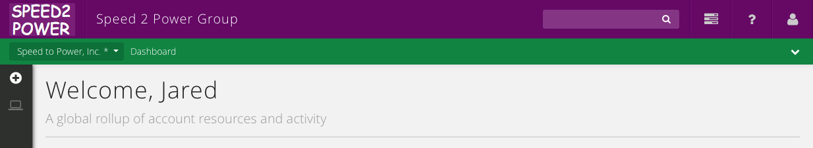

{{{
  "title": "Getting Started with White Labeling",
  "date": "3-25-2015",
  "author": "Jared Ruckle",
  "attachments": [],
  "contentIsHTML": false
}}}

##Getting Started with White Labeling

CenturyLink Cloud includes several features that allow organizations to replace specific CenturyLink branding elements with their own brand. This article covers the most popular elements of white-labeling, including:

* Site Branding (logos, site name)
* Color Scheme
* Login URL (also called subdomains featuring your account alias)

**NOTE: Not all changes will appear immediately. New site branding, logos, and other personalized elements may take up to 30 minutes to take effect. In addition, some changes will only appear after the user has logged in and logged out a few times.**

First, navigate to "Account" - > "Settings," then click "Site Branding."

###Updating the Site Name

Click this section, and replace "Control Portal" with any name - this will usually be the name of your company or division. Make sure to click "Save" at the bottom of the page. After the change takes effect, users will see this name in the header as well as on the login page of your unique [subdomain that features an account alias](../Release Notes/2015-03-05-cloud-platform-release-notes.md).

###Customize the Control Portal Logo

This logo appears on the header of every page in the Control Portal. To change it:

1. Select the "change" button and choose a file on your computer. The chosen file must be:
  * PNG, GIF or JPG format.
  * A maximum of 100 pixels wide by 50 pixels high.
  * For best results, select a logo that's on a transparent background. Alternatively, you can adjust the logo background and the header background to be the same color.
2. Select the "save" button at the bottom of the page to apply the logo change. It may take a few minutes before your changes to take effect while your web browser's cache clears.

###Customize the 'Sign In Page' Logo

This logo appears on the sign in page to the Control Portal for accounts using a [subdomain that features an account alias](../Release Notes/2015-03-05-cloud-platform-release-notes.md).

1. Select the "change" button and choose a local file on your computer. The chosen file must be:
  * PNG, GIF or JPG format.
  * For best results, make sure the logo is on a transparent background or the logo background matches the header background.
2. Select the "save" button at the bottom of the page to apply the logo change. Again, it may take a few minutes to see the changes due to your web browser's cache.

###Customize the Shortcut (or 'Favicon') Icon

The shortcut icon, or 'favicon', appears in some web browsers on the address bar, tabs or bookmarks.

1. Select the "change" button and choose a local file on your computer. The selected file must be:
  * A square ICO file (preferred), PNG, GIF, or JPG.
  * At least 16 pixels by 16 pixels
  * Use transparency (with ICO/PNG) to let the background color of the browser navigation window to show through.
2. Select the "save" button at the bottom of the page to apply the logo change. Changes will take a few moments to appear.

###Customize the iOS Screen Icon

This icon appears when you add a home screen icon for the Control Portal on iOS device. To change it from the default:

1. Select the "change" button and choose a local file on your computer. The chosen file must be:
  * The uploaded image must be a square PNG or JPG and at least 152 pixels by 152 pixels.
  * Use transparency (with PNG) to let the background show through.
2. Select the "save" button at the bottom of the page to apply the logo change. Changes will take a few moments to appear.

#### Customize the Control Portal Color Scheme

The colors used throughout the Control Portal can be changed to reflect your organization's color scheme.

1. Navigate to the **Color Scheme** page in the **Settings** section.
2. Choose from a variety of preset color schemes.
3. For additional customization options, choose the colored box next to item to customize it further. A color picker will appear. Here, you may select a specific color or specify the exact HEX or RBG value for a color.
4. Select "save" to commit the new color(s).

Here's a preview of what the newly branded portal looks like with the settings applied in this article:

###Using Custom Domains

A custom subdomain is automatically available for each account alias, in the format of <code>https://alias.cloudportal.io</code>. A customized "Sign In Page" logo, if specified, will appear on this URL. Nothing is required for this custom domain to be available - it should just be promoted as the flagship login page where appropriate.

