{{{
  "title": "How to manage public DNS in Control",
  "date": "11-25-2015",
  "author": "Chris Little",
  "attachments": [],
  "contentIsHTML": false
}}}

### Overview
Lumen Cloud supports the ability to host and manage **Public** DNS zones within the Control Portal.  Customers can configure services to manage their entire domain or an individual subdomain DNS zone.  

### Audience
* Lumen Cloud Customers who wish to manage public DNS services in the Control Portal

### Prerequisites
* Customers must procure a domain
* Administrative control of the domain with the domain registrar
* A Lumen Cloud user with [Account Administrator, Network Manager or DNS Manager role.](../Accounts & Users/role-permissions-matrix.md)

### Configuring a Domain
The steps below will guide a user through configuring a domain within the Control Portal and making the necessary changes with the domain registrar allowing complete management of the DNS records and zone within the platform.  Refer to the [Configuring a Subdomain](#configuring-a-subdomain) portion of this article for steps on leveraging subdomains.

1. In the Control Portal navigate to DNS, select **new dns zone** and input the required information.
    * Zone: The name of your zone, in this case we want to manage an entire domain
    * TTL: The zones Time to Live, this is set at the zone level and cannot be changed after creation.
    * Email: The email for the administrative contact for this Zone
    * Configure Google Apps: If you plan to leverage Google apps configure this service setting

    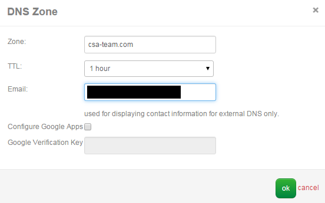

2. Once your DNS Zone is created, select it and capture the **Name Server Records** information for use with your domain registrar.  The name servers are:
    * NS1.P04.DYNECT.NET
    * NS2.P04.DYNECT.NET
    * NS3.P04.DYNECT.NET
    * NS4.P04.DYNECT.NET

    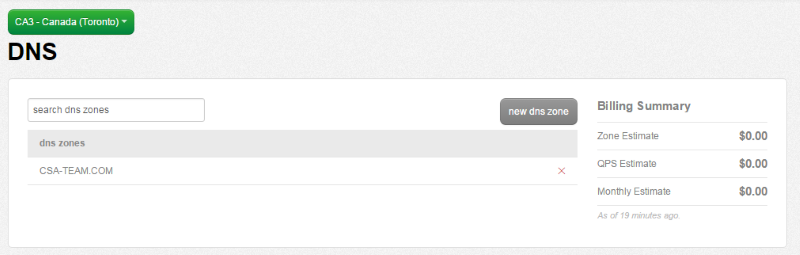

    

3. Login to your domain registrar portal and update your name server information for your domain to the list provided in the previous step. Each domain registrar will have its own self-service UI to complete this action and we've shown the [Godaddy.com](//www.godaddy.com) approach below.  Depending on your domain registrar it can take up to 24 hours for these changes to take effect.

    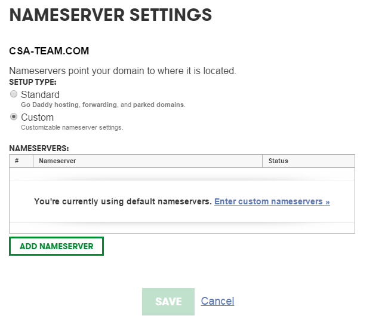

    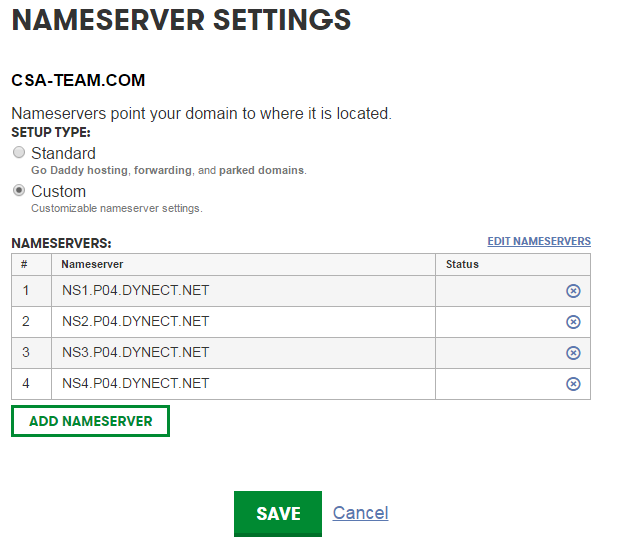

    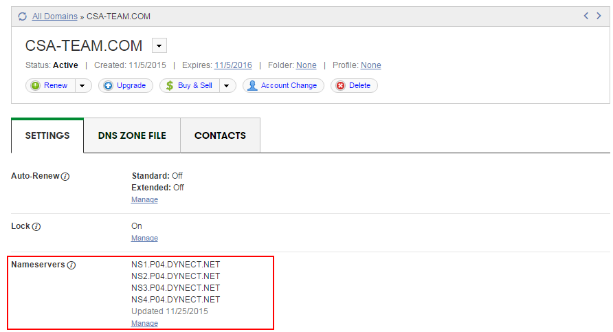

4. Navigate to DNS in the Control Portal, select your DNS zone and choose **add record.** Create your DNS records as required for your services.  To validate our configuration we simply created a sample A Record mapping www to a [public IP](../Network/Lumen Cloud/how-to-add-public-ip-to-virtual-machine.md) bound to a virtual web server.

    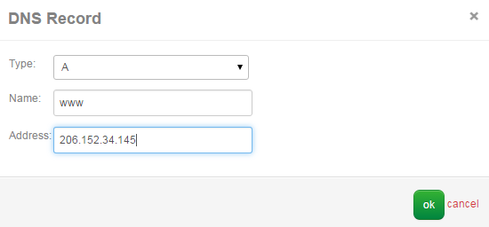

5. Validate the DNS record has propagated (this may take up to 24 hours) using a simple nslookup on your computer.

    ```
    nslookup www.csa-team.com
    Server:  resolver1.opendns.com
    Address:  208.67.222.222

    Non-authoritative answer:
    Name:    www.csa-team.com
    Address:  206.152.34.145
    ```

6. Browse to the virtual web server URL to validate the service is delivered as you desired.

    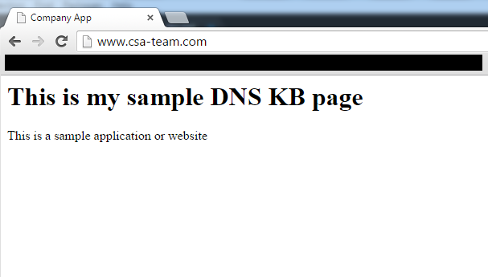

### Configuring a Subdomain
The steps below will guide a user through configuring a **subdomain** within the Control Portal and making the necessary changes with the domain registrar allowing complete management of the DNS records and zone within the platform.  In leveraging a subdomain customers can gain self-service for DNS record management without having administrative control of the entire domain.  

1. In the Control Portal navigate to DNS, select **new dns zone** and input the required information.
    * Zone: The name of your zone, in this case we want to manage just a subdomain
    * TTL: The zones Time to Live, this is set at the zone level and cannot be changed after creation.
    * Email: The email for the administrative contact for this Zone
    * Configure Google Apps: If you plan to leverage Google apps configure this service setting

    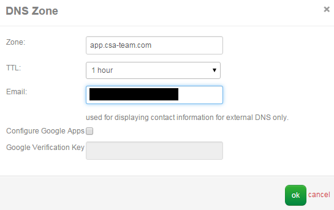

2. Once your DNS Zone is created, select it and capture the **Name Server Records** information for use with your domain registrar.  The name servers are:
    * NS1.P04.DYNECT.NET
    * NS2.P04.DYNECT.NET
    * NS3.P04.DYNECT.NET
    * NS4.P04.DYNECT.NET

    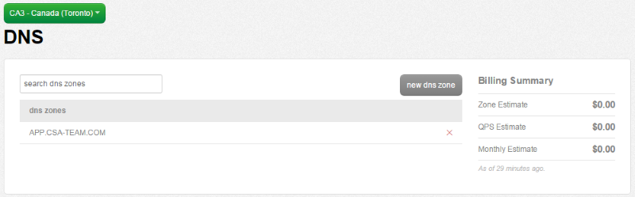

    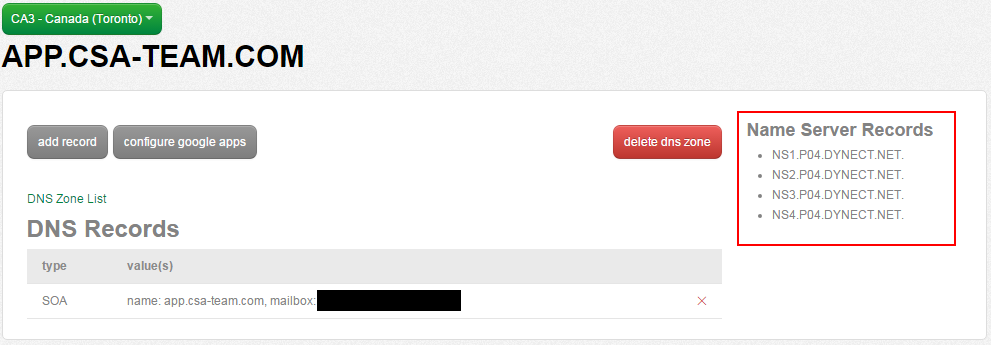

3. Request that the administrator of your domain (or perform this action directly if you are the domain administrator) **add zone records** for your subdomain using the list in the previous step. The record details will be as follows:
    * Record Type: nameserver
    * Host: the subdomain name.  in this example we used app which will result in app.csa-team.com
    * Points To: the name servers supplied in the previous step
    * TTL: Time to live for this record

      You should perform this action for each of the 4 name servers Control provides.

      Each domain registrar will have its own self-service UI to complete this action and we've shown the [Godaddy.com](//www.godaddy.com) approach below.  Depending on your domain registrar it can take up to 24 hours for these changes to take effect.

      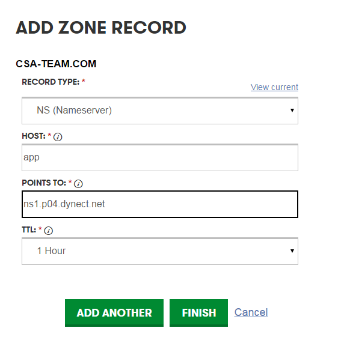

      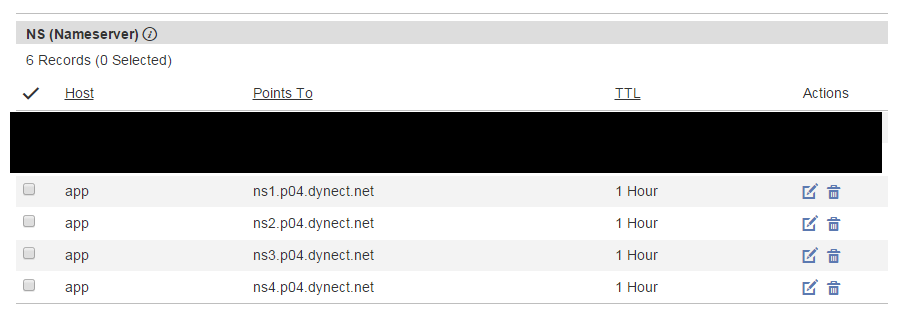

4. Navigate to DNS in the Control Portal, select your DNS zone and choose **add record.** Create your DNS records as required for your services.  To validate our configuration we simply created a sample A Record mapping a virtual server name to a [public IP](../Network/Lumen Cloud/how-to-add-public-ip-to-virtual-machine.md) on this new subdomain.

    

5. Validate the DNS record has propagated (this may take up to 24 hours) using a simple nslookup on your computer.

    ```
    nslookup ca3ccvawebnlb01.app.csa-team.com
    Server:  resolver1.opendns.com
    Address:  208.67.222.222

    Non-authoritative answer:
    Name:    ca3ccvawebnlb01.app.csa-team.com
    Address:  206.152.34.145
    ```

6. Browse to the public DNS name to validate the service is delivered as you desired.

    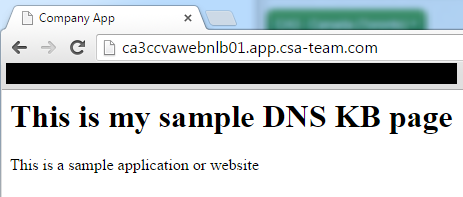
