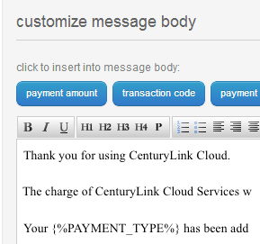

{{{
  "title": "List of Available Tokens for Email Notification Templates",
  "date": "02-21-2013",
  "author": "Richard Seroter",
  "attachments": [],
  "contentIsHTML": false
}}}

### Description
Lumen Cloud offers resellers a way to customize and personalize the Lumen Cloud to fit their needs. One way to do that is to modify the default email templates that are used by the Lumen Cloud system. Many of the email templates offer "tokens" which represent information about the user (e.g., "username") or resource (e.g., "Blueprint name") that the email applies to. In this KB article, we'll list each email template and which tokens are available.

Note that to view the available tokens for a template, click inside the "message body" to switch from the Viewer interface to the Editable interface.

### Audience
* Lumen Cloud customers

### Pre-Requisites
* Account must be enabled for full customization.
* Contact the Lumen Cloud NOC to enable your account.

### Template List
1. Billing Invoice
   * no template-specific tokens

2. Billing Receipt
   * payment amount - amount charged to your account for the billing cycle
   * transaction code - unique identifier for the payment transaction
   * payment type - the payment type set for the account. Values include: check, ACH, credit card

3. Billing Failure
   * payment amount - amount charged to your account for the billing cycle
   * payment type - the payment type set for the account. Values include: check, ACH, credit card
   * failure reason - description of why the attempt to charge the designated payment type failed

4. Blueprint Success
   * blueprint name - the name given to the blueprint template
   * server info - information about the server(s) impacted by the blueprint
   * warnings - message containing details of any errors that occurred while executing the blueprint

5. User Welcome
   * base url - home URL for accessing the Control Portal
   * username - username defined by the new user
   * password - temporary password for the new user

6. User Password Reset
   * new password - new password defined by the user

7. VPN Server Confirmation
   * no template-specific tokens

8. WebFabric Success
   * webfabric name - friendly name provided by the user when creating the Web Fabric environment
   * webfabric domain name - management API URL for the Web Fabric environment
   * management url - Control Portal URL to manage this Web Fabric environment

9. Server Lifespan Expiration
   * server name - name of the server that is about to expire
   * expiration date - date that the named server will expire
   * expiration timezone - timezone associated with the expiration date/time
   * expiration action - what will happen on expiration. Options include: archive, delete

10. Group Lifespan Expiration.
   * group name - name of the group that is about to expire (as defined in the Scheduled Task)
   * server list - collection of servers that are impacted by the expiration
   * expiration date - date that the named group will expire
   * expiration timezone - timezone associated with the expiration date/time
   * expiration action - what will happen on expiration. Options include: archive, delete
