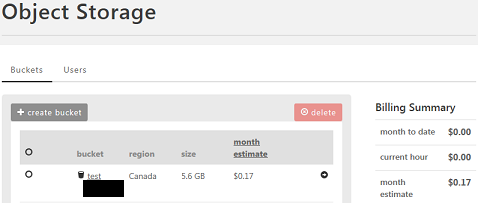

{{{
  "title": "Understanding Cost Estimates in Control Portal",
  "date": "12-13-2016",
  "author": "Gavin Lai",
  "attachments": [],
  "contentIsHTML": false
}}}

<strong>The AppFog service was retired on June 29, 2018. The AppFog Platform-as-a-Service is no longer available, including all source code, env vars, and database information. More information is available [here](../../appfog/appfog-retirement-guide/).</strong>

### Contents
- [Overview](#overview)
- [Dashboard](#main-dashboard)
- [Data Center View](#data-center-view)
- [Group View](#group-view)
- [Server View](#server-view)
- [Network](#network)
- [Services](#services)
- [Billing](#billing)
- [Summary](#summary)

### Overview
One of the best features of the Control Portal is the cost estimation in every level within the account.  In this knowledge article, we will have a look at what is included in each level of the Control Portal.  Monthly and hourly estimates are found in the following levels of the Portal:
- Main Dashboard
- Data Centers
- Groups
- Server
- Services (Simple Backup, Object Storage, Relational Database)
- Network
- Monthly Usage Summary

### Main Dashboard
When logging into the CenturyLink Control Portal, the main dashboard is displayed.  There are four estimates at the top of the page.  

There are four values at the top of the dashboard.  
***Month Estimate*** includes (assuming full usage):
 - All infrastructure costs (CPU, Memory, disk) and OS licenses (where applicable) from all datacenters
 - Managed Services costs (Managed OS, Active Directory, Databases, Web server)
 - Microsoft SQL licenses(account wide)
 - VLANs (across all datacenters) and Site to Site VPNs
 - Shared Load Balancer
 - Object Storage
 - Public IP addresses
 - Simple Backup Usage
 - Relational Database Services

***Current Hour*** includes (MSSQL is no longer included as billing has been changed to monthly):
 - All infrastructure costs (CPU, Memory, disk) and OS licenses (where applicable) from all datacenters
 - Managed Services costs (Managed OS, Active Directory, Databases, Web server)

***One Time Changes*** includes:
 - Any Service Task charges

***Month to Date***
 - Base on Current Hour data, this is the month to date estimate

For the following views, the estimations are displayed with the following data:
***Month Estimate*** represents the estimation of the usage cost from the creation of the server til the end of the month.  
***Current Hour*** is the cost of the current hour.
***Month to Date*** is the accumulated cost since the creation of the server.

### Data Center View

Jumping from the main dashboard to an individual data center, the cost estimation will be more data center infrastructure focused.  The list of items included in the cost estimation in the data center level are:
 - All infrastructure costs (CPU, Memory, disk) and OS licenses (where applicable) within the data center
 - Managed Services costs (Managed OS, Active Directory, Databases, Web server)

### Group View

For an indiviual group, its estimate is similar to the Data Center View.  
 - All infrastructure costs (CPU, Memory, disk) and OS licenses (where applicable) from the data center
 - Managed Services costs (Managed OS, Active Directory, Databases, Web server)

### Server View

The estimate for a server will show:
 - All infrastructure costs (CPU, Memory, disk) and OS licenses (where applicable) from the data center
 - Managed Services costs (Managed OS, Active Directory, Databases, Web server)

### Network

Under Network menu, the cost of VLANs, Share Load Balanacer, DNS and Site to Site VPN can be found within the configuration page of the service.

#### Networks:

#### Load Balancers:

#### Site to Site VPN:

#### DNS:

### Services

CenturyLink Cloud offers different services for which the cost estimation can be found under the individual service page.

#### Backup

#### Object Storage

#### Relational DB

### Billing

If a detailed breakdown of the usage is required, "Usage History" can be found under "Settings" -> "Billing".  In this section, a monthly usage report can be viewed and downloaded for accounting purposes.  The details include:
 - Usage Total of the account
 - Group sub-total of each Group
 - Simple Backup Service usage for individual server
 - Microsoft SQL licenses for individual server including server name
 - Managed Services (if applicable) for each server
 - Other license costs
 - Service Task breakdown
 - Bandwidth usage based on data center
 - Public IP per data center
 - Support costs
 - Discount or credit if applicable

Screesnshot of the detail usage breakdown:

### Summary

Below is a table to summarize the services included in portal cost estimation:

| Portal | Estimates |
| ------------ | ------------ |
| Main Dashboard Month Estimate | CPU Memory Disk OS license Database License VLANs VPN Load Balancer Object Storage Public IP Simple BAckup Appfog Relational DB DNS |
| Data Center View Group View Server View | CPU Memory Disk OS license |
| Network | VLANs |
| Load Balancer | Load Balancer |
| Site to Site VPN | VPN |
| DNS  | DNS |
| Backup | Simple Backup |
| Object Storage | Object Storage (month estimate/current hour/month to date) |
| Relational DB | Relational DB |
| Billing | CPU Memory Disk OS license Database License (per server) VLANs VPN Load Balancer Object Storage Public IP (per data center) Simple Backup Appfog Relational DB DNS Bandwidth Support Credit |
