{{{
  "title": "Using SAML for Multi-Factor Authentication to CenturyLink Control Portal",
  "date": "UPDATED WITH SIGNING CERTIFICATE 3-5-2015",
  "author": "Bryan Friedman",
  "attachments": [],
  "contentIsHTML": false
}}}

###Description

As described in [Using SAML for Single-Sign-On](../Control Portal/using-saml-for-single-sign-on-to-the-centurylink-platform-control-portal.md), CenturyLink Cloud supports the use of Security Assertion Markup Language (SAML) for exchanging user authentication data as XML between trusted parties. This industry standard protocol empowers customers to use their **own** SAML-supported identity management system for authenticating users of the CenturyLink Control Portal.

Now, with the addition of the **Require SAML for Login** option provided by Control Portal, customers can *force* users to authenticate through their identity providers to enable additional identity management features like multi-factor authentication (MFA) and user provisioning. This way, the CenturyLink Cloud platform can provide flexible, standards-based capabilities while allowing an organization to keep the nuts-and-bolts of their IdM configurations in their pre-existing systems.

For more details and how SAML works in general and how to specifically setup an ADFS IdP for use with Control Portal, refer to [Using SAML for Single-Sign-On](../Control Portal/using-saml-for-single-sign-on-to-the-centurylink-platform-control-portal.md).

In the example below, however, we will use a separate software-as-a-service vendor as the identity provider in order to also enforce multi-factor authentication. The following steps will walk through the process of configuring the IdP to add users, enabling MFA and SAML, and configuring CenturyLink Control Portal's SAML settings to enforce the use of the IdP.

###Steps

In this example, we will use the cloud-based identity and access management solution <a href="http://www.onelogin.com">OneLogin</a> as our identity provider since it is free to use as a demo, easy to setup, and supports both SAML and MFA.

Though we are using OneLogin in our example here, of course the principles will apply for any IdP with support for SAML and MFA. The steps below assume you have already [signed up](http://www.onelogin.com/signup) for a OneLogin account and are able to login to its administrator interface.

###Configure IdP for SAML

1. In the CenturyLink Cloud Control Portal, from the Account Settings page, navigate to the "Users" tab and the "Authentication" sub-menu.
2. Click the "SAML 2.0 Authentication" checkbox to show all the available settings. For now, just take note of the "Relying Party Assertion Consumer Service URL" listed there. It should be in the format of <code>https://{account-alias}.cloudportal.io/SAMLAuth/Post</code>. (Highlighted in the screenshot below.)
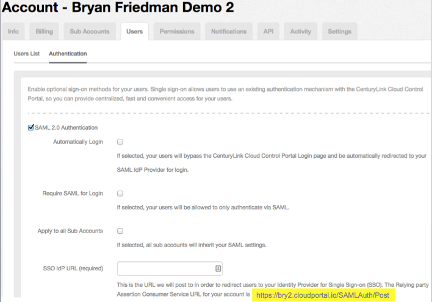
3. Now login to the OneLogin end-user dashboard.
4. From the "Apps" menu, select "Add Apps".
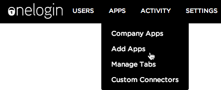
5. In the search field, type "onelogin saml" and select the first app that shows up. It should be called "OneLogin SAML Test (IdP)".
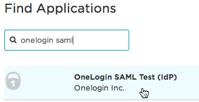
6. Rename this app to "CenturyLink Cloud Control Portal" and click the "Save" button.
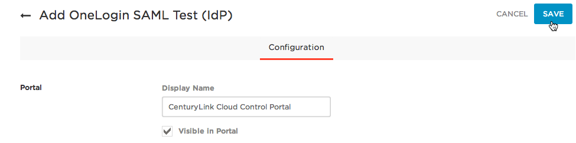
7. Now, on the "Configuration" tab, enter the URL you copied from Step 2 in the section above into the "SAML Consumer URL" field. Optionally, you may provide other values in the additional fields if you know them. (You will find the Single Logout URL also available on the Control Portal page from Step 2 above.)
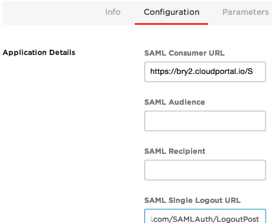
8. Click the "Save" button in the upper right hand corner to save the OneLogin configuration.

There are a number of other settings that OneLogin supports or that may be supported by other IdPs, but this is the minimal configuration required on the OneLogin side for SAML authentication to work.

###Configure Control Portal SAML Settings

1. While still in the OneLogin administrator interface, click on the "SSO" tab to view SAML configuration information required to plug in to the Control Portal settings. You should see a SAML 2.0 Endpoint and a X.509 Certificate. Both of these values are required to configure SAML in CenturyLink Cloud Control Portal.
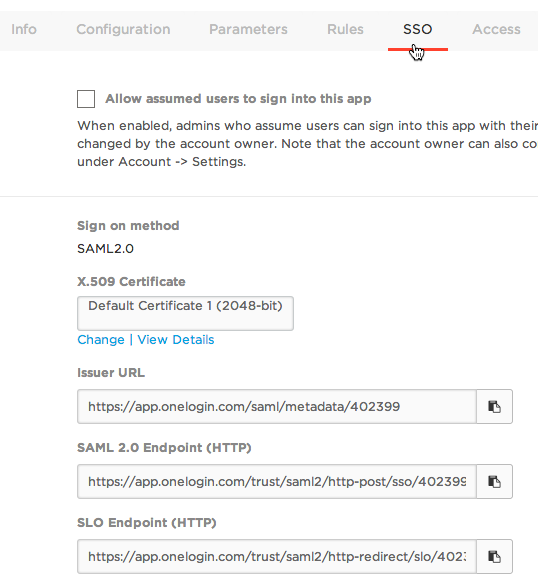
2. Back in the Control Portal Authentication settings page, check the "Require SAML for Login" option and the "Apply to all Sub Accounts" options. This will require SAML login only for this account and all sub accounts. Next, enter the SAML 2.0 Endpoint URL provided in the previous step into the "SSO IdP URL (required)" field and copy and paste the certificate value from OneLogin page into the "Signing Certificate Key" field in Control Portal. Optionally, you can configure the "SLO IdP URL" as well. Click "Save" to apply the SAML settings to control.
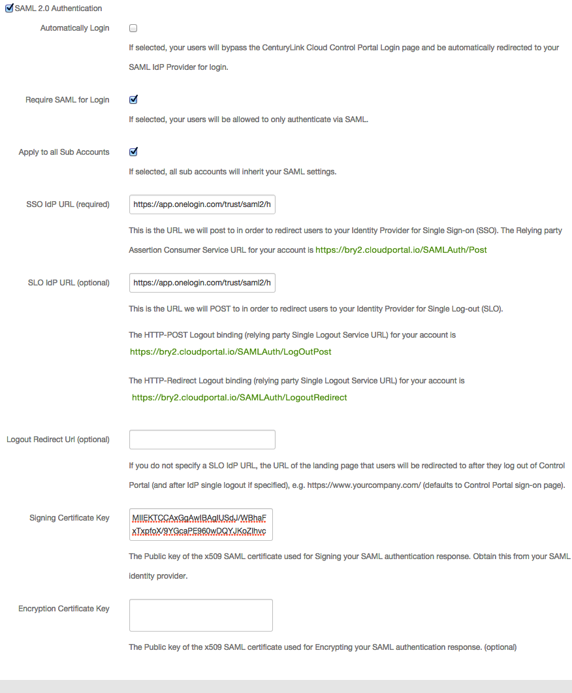

At this point, SAML is configured on both ends. All that's left is to enable MFA and begin provisioning users.

###Configure IdP for MFA

1. From the OneLogin interface, select the "Settings" menu and go to "Authentication Factors". From this screen you will be presented with a number of available multi-factor authentication providers that can be enabled. Clicking the provider name and clicking the "Save" button activates it as an additional authentication factor. In this example we will use "Google Authenticator" since it's ubiquitous and easy to setup. (You could choose RSA SecurID or another provider of your choice.)
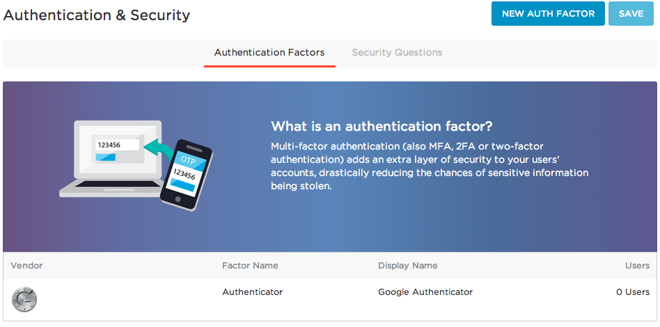
2. To complete the setup, we need to define and apply a policy that requires users to authenticate with MFA. Select "Policies" from the "Settings" menu and click on the "Default policy" to edit. (We could create a new policy to apply only to our set of Control Portal users if we are using OneLogin with multiple applications. Here, we will keep things simple and apply a single policy for all users and apps.)
3. On the MFA tab, click the "OTP Auth Required" and "Google Authenticator" checkboxes. To keep things simple, we'll keep the setting to require OTP for all users at every login, but this can be adjusted as desired. Click "Save".
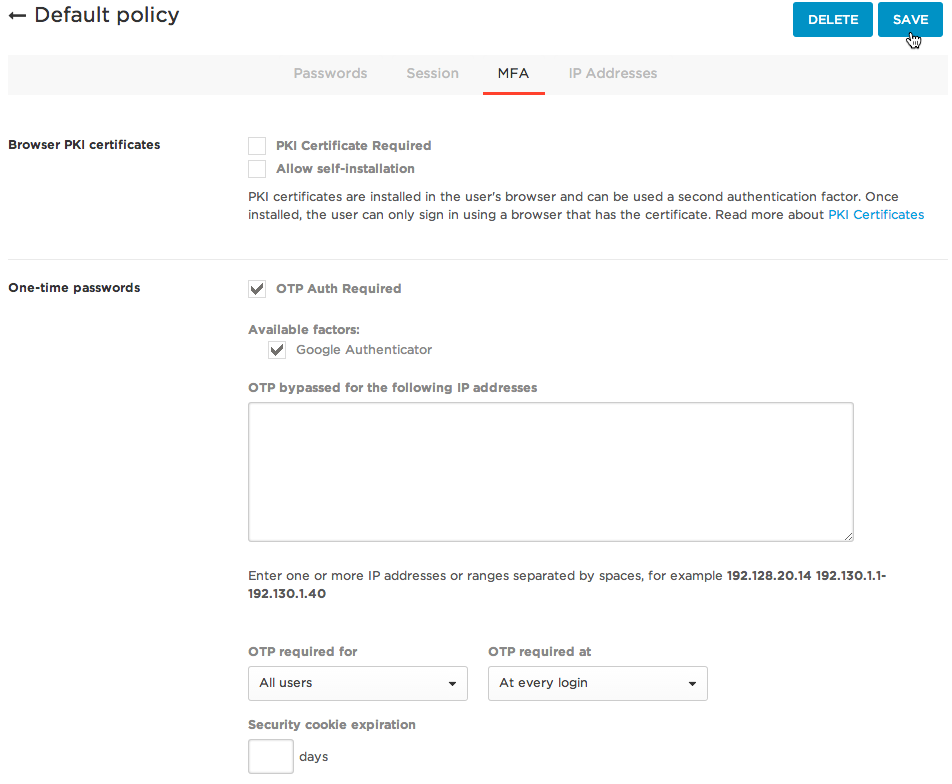
All that's left is to provision users in the IdP and associate them with users in Control Portal.

###Provision User(s)

There are a few different options for provisioning users to CenturyLink Cloud and no doubt the IdP you choose to use has a number of options as well. OneLogin supports both bulk user import from a flat file as well as an [API](https://onelogin.zendesk.com/hc/en-us/articles/201175524-Users-API) for creating users. CenturyLink Cloud's API also provides the capability to programmatically create users. In this example, we will assume we already have a user in the Control Portal that we want to provision to OneLogin.

You may have the opposite situation where you need to create users in Control that already exist in your IdP. Or you may not have users in either location. No matter how you choose to provision users, as you will see, the important thing is that the SAML username in Control matches the SAML username in the IdP.

1. In the Control Portal, from the "Users" page in Account Settings, click the user you will be provisioning to OneLogin. (If you need to create a new user in Control, you can follow the instructions in [Creating Users](../Accounts & Users/creating-users.md)
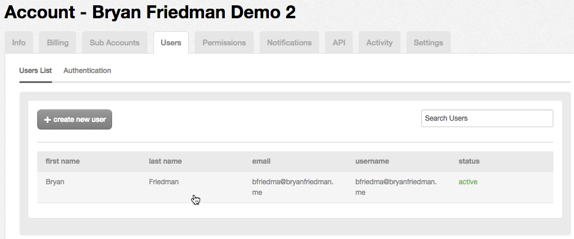
2. On the User Profile page, take note of the e-mail address, first and last name. Most importantly, click on the "saml username (single sign on)" field and enter the *e-mail address* for this user. The OneLogin SAML configuration uses e-mail as the default username. To keep this example simple, we will stick with this rather than set it to a custom value. Here, it is also the same as the user name, which is a good practice for uniqueness.
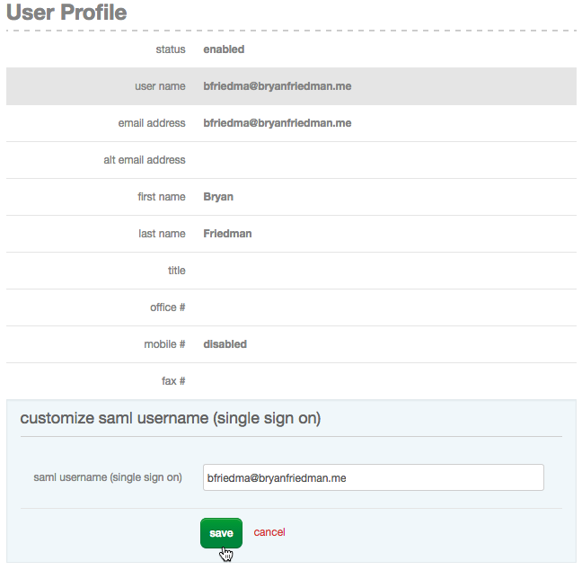
3. Back in the OneLogin configuration, navigate to "Users -> All Users" from the menu and click the "New User" button to create a new user. Enter the first name, last name, and e-mail address you took note of in Step 3. All of these fields are required and as noted above, the e-mail address must match the value entered into the SAML username field in Control. You may also fill in other fields as desired. Click "Save User".
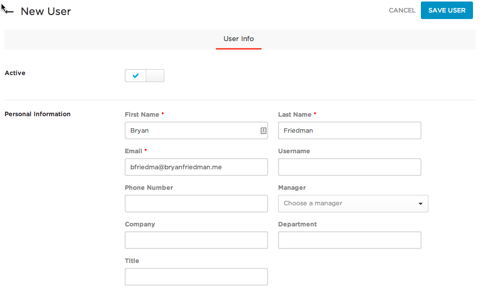
4. Now we have to give the user access to the Control Portal SAML application. On the "Applications" tab for the user, click the "+" sign to add a new app. Select "CenturyLink Cloud Control Portal" and click "continue" then enter the user's e-mail address and click "save".
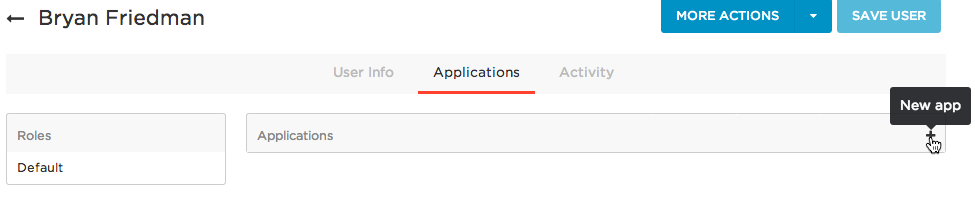

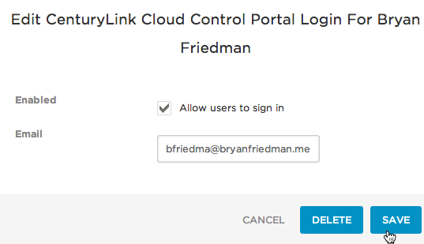
5. Select  "Send Invitation" from the "More Actions" menu. This sends an e-mail to the user, initiating provisioning.
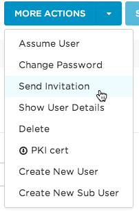
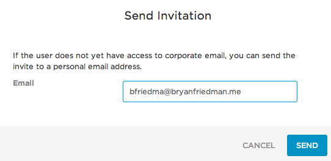
6. The user receives an e-mail with a link to set their password. When they follow the link, they will set their password and then, in this case since we are using Google Authenticator, will be presented with a QR code to scan using the Google Authenticator app to setup a token and be given a security code to enter. Once this is done, the user enters the security code and clicks "log in". This will activate the user's MFA token for use.
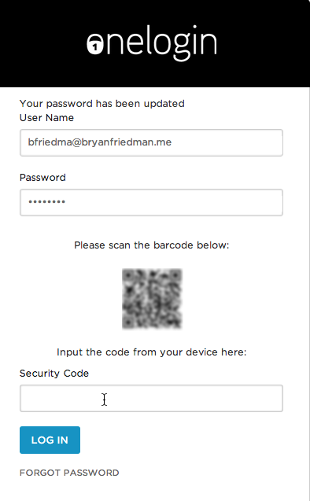

###Putting It All Together

Now that all the configuration is complete, users must login to Control Portal using their OneLogin credentials.

1. From a browser, go to your SAML Login page. This is the root of the highlighted URL from the very second step above, in the format <code>https://{account-alias}.cloudportal.io</code>. (In this example, it's https://bry2.cloudportal.io.) If you have the "Require SAML for Login" setting turned on as described above, this should ultimately result in you being redirected to the OneLogin login screen.
2. Login using the username, password, and Google Authenticator security code. You should be directed back to the Control Portal and logged in as that user. You can use the logout link as well if you have set the logout URLs appropriately.

Note that the "Require SAML for Login" setting will force this user to login this way whether they access the SAML-specific login page as described in Step 1 or the primary control URL (https://control.ctl.io). If the primary URL is used, when logging in using the regular login screen, after entering the username (and any value for password), the user will be redirected to the SAML login page as described above.

###Updated Signing Certificate (March 2015)

Customers with an existing SAML configuration as of March 5 2015 will need to update their signing certificate for use with their IdP with the following text:

```
-----BEGIN CERTIFICATE-----
MIIFWTCCBEGgAwIBAgIRAIaoEvXi1F232F/HCw8kRFQwDQYJKoZIhvcNAQELBQAw
gZAxCzAJBgNVBAYTAkdCMRswGQYDVQQIExJHcmVhdGVyIE1hbmNoZXN0ZXIxEDAO
BgNVBAcTB1NhbGZvcmQxGjAYBgNVBAoTEUNPTU9ETyBDQSBMaW1pdGVkMTYwNAYD
VQQDEy1DT01PRE8gUlNBIERvbWFpbiBWYWxpZGF0aW9uIFNlY3VyZSBTZXJ2ZXIg
Q0EwHhcNMTUwMjA5MDAwMDAwWhcNMTkwMjA5MjM1OTU5WjBeMSEwHwYDVQQLExhE
b21haW4gQ29udHJvbCBWYWxpZGF0ZWQxHjAcBgNVBAsTFUVzc2VudGlhbFNTTCBX
aWxkY2FyZDEZMBcGA1UEAxQQKi5jbG91ZHBvcnRhbC5pbzCCASIwDQYJKoZIhvcN
AQEBBQADggEPADCCAQoCggEBAJ1d0VSSzywVLVAxVxHPLSdMcH5xdPBkPE2VELD1
2BMhyuhS2TQ7D8MAQFLS0FZjTXkOIRdccWUU9tZw3sQRxwDSgMc4xXrQAIgPxVgr
Bwfqtm5a4+bJqdTHpQzSv3KcsnEl+Ha/nq7mydjRQ0Xu0iETON6JWAd8Wtzw7pZo
LNkSn7WarhG9orwh03Q+vzPMnowR0wrVqTXF9mjFqyPuGAwgtO45BfRPobc0FSEt
RuYiIlfQ1eZCXfD/Mg4uh+kIOe8LXd2GokZ3vdvI4zlsgUe5FmRqAFoTtX4MNSgt
R5vrDcilTzbRFJ+BwOPuwOy4j8xiHqpsNUWPxDLdD6GVfj0CAwEAAaOCAd0wggHZ
MB8GA1UdIwQYMBaAFJCvajqUWgvYkOoSVnPfQ7Q6KNrnMB0GA1UdDgQWBBQ83AlA
ZTxRkOtGeS94uIwMrtDaEDAOBgNVHQ8BAf8EBAMCBaAwDAYDVR0TAQH/BAIwADAd
BgNVHSUEFjAUBggrBgEFBQcDAQYIKwYBBQUHAwIwTwYDVR0gBEgwRjA6BgsrBgEE
AbIxAQICBzArMCkGCCsGAQUFBwIBFh1odHRwczovL3NlY3VyZS5jb21vZG8uY29t
L0NQUzAIBgZngQwBAgEwVAYDVR0fBE0wSzBJoEegRYZDaHR0cDovL2NybC5jb21v
ZG9jYS5jb20vQ09NT0RPUlNBRG9tYWluVmFsaWRhdGlvblNlY3VyZVNlcnZlckNB
LmNybDCBhQYIKwYBBQUHAQEEeTB3ME8GCCsGAQUFBzAChkNodHRwOi8vY3J0LmNv
bW9kb2NhLmNvbS9DT01PRE9SU0FEb21haW5WYWxpZGF0aW9uU2VjdXJlU2VydmVy
Q0EuY3J0MCQGCCsGAQUFBzABhhhodHRwOi8vb2NzcC5jb21vZG9jYS5jb20wKwYD
VR0RBCQwIoIQKi5jbG91ZHBvcnRhbC5pb4IOY2xvdWRwb3J0YWwuaW8wDQYJKoZI
hvcNAQELBQADggEBACmkIX6Elg3wcJi8Is7bp3fpDfeGPXfIFsSCXp5dNyuAXkCP
DKhpCnXZqmS8uWOGlU5H9rIn4rqlbRg4/t7Wxca9Gxi6FQ+D0+LO9ljQFN+qgqc0
FgyEgx9AN4lf1wZpJ782v83NXIVt/qiRtJueCKhIWnh2PmgbO7JwDdk2HNFc5dGP
e1LteC6ByXx9mHAsBX366IlcoNOpBlQjj9mX0atCMrlW6q6kYrQ1ZgPEf+o8TBHR
lNaLaTC0C8pixcdubTIkPNs3cQijzsxkyGvivsSkkAPTZe3AzdvHeSqNIrKUjo+j
bdS+NhURkFTdtV0/YCSvbAukw6l4WY8ZqaJYcCk=
-----END CERTIFICATE-----
```
