{{{
  "title": "Using SAML for Single-Sign-On to the Lumen Platform Control Portal with Windows 2012 R2",
  "date": "2/06/2019",
  "author": "Matthew Ordman",
  "attachments": [],
  "contentIsHTML": false
}}}

### Overview
The purpose of this guide is to provide step by step instructions for configuring Windows 2012 R2 with ADFS 3.0 to authenticate with Lumen Cloud SAML.  For simplicity sake, a single server will be used for directory services and certificate services.Depending on your company's requirements you may choose to use multiple servers for the various roles and services that are required. If you choose to segregate the roles and services this guide will still provide a useful instruction set for configuration guidelines.

### Description
Lumen Cloud supports the use of Security Assertion Markup Language (SAML) for exchanging user authentication data as XML between trusted parties. This industry standard protocol empowers our customers to use their **own** identity management system for authenticating users of the Lumen Cloud Control Portal.

SAML has three main parties: the user, the identity provider (IdP), and service provider (SP). The IdP is the repository that holds identity information. The SP is the party that wants to authenticate a particular user who is using an application.

The SAML flow occurs as shown below.
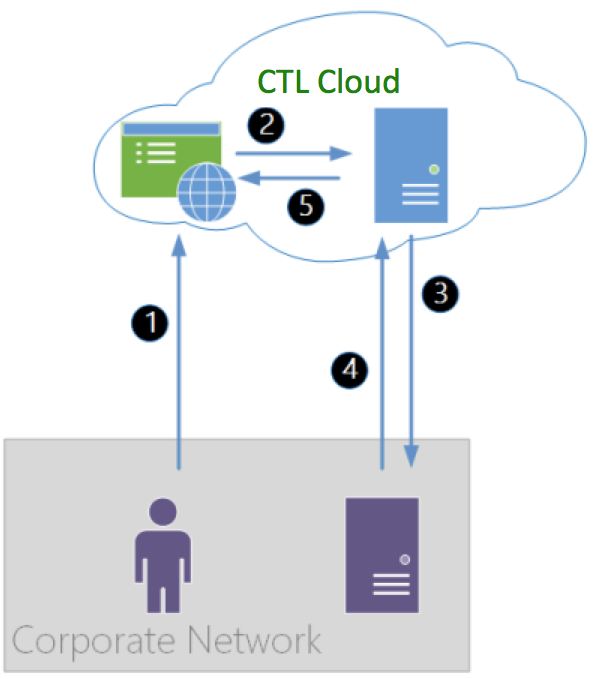

Specific steps in this flow are:

1. The enterprise user of the Lumen Cloud hits a URL that is dedicated to their account. The user is asked how they would like to log into the system and they choose SAML.

2. The web application contacts the Lumen Cloud SAML service to initiate the SAML message exchange.

3. The Lumen Cloud SP sends a digitally signed SAML authentication request to the enterprise IdP. This IdP takes the user's Kerberos token and validates them as a user on the enterprise network.

4. The IdP returns a signed (and optionally, encrypted) SAML authentication response message to the Lumen Cloud SP. This message includes a Name ID assertion and that value is matched to a User record in the Lumen Cloud.

5. The user is logged into the Lumen Cloud and operates under the roles and permissions assigned to their Lumen Cloud user account.

The steps below walk through the process of building an entire SSO and SAML scenario based on Microsoft Active Directory Federation Services as the IdP proxy. If you already have an identity provider, you can skip to step 3 where trust is established between Lumen Cloud and the IdP.

### Prerequisites
All steps in this guide require Domain Administrator permissions in Active Directory.  This guide assumes you have the Account Administrator Role in the Lumen Cloud Control Panel.  This guide will use a valid public domain name and valid public DNS for name resolution needs. This guide will use private SSL certificates that are signed by the Certificate Authority that is created while following this guide.  Some organizations will prefer the use of third party trusted certificates.  This guide is still applicable except you will use your already requested and signed certificates from your trusted third party source.

**Steps**

**1. Provision server to act as Identity Provider.**

Log into the Lumen Cloud Control Portal and choose to create a new Blueprint. Using the left navigation bar, choose **Orchestration** > **Design Blueprint**. 

1.  Using Blueprint Designer you have several choices for versioning, privacy settings, etc.  In this step you can choose the settings that are appropriate for your intended use.  There is one required field, Description.  Populate with a description that is accurate for your use.

2.  Add a single Windows 2012 R2 server to the Blueprint (you may have to scroll down to see this option).  Name the server and accept the sizing defaults.  In this example we have used server name DE1CCTSADFS301.  Within the "Add Server Tasks" section, choose "execute script".  Add "Install Active Directory on Windows 2012 (1 of 2) [Primary Node]".  Under "run task", choose "Reboot Server".  Under "execute script", choose "Install IIS 8 on Windows".  Under "run task" choose "Add Public IP".  Select the option for "HTTPS" which uses port 443 for communication. Click "Add Global Tasks". IMPORTANT: Click the "+add" button in this window after the choices have been made. Then, click "next, tasks & order".

The Active Directory packages give us a custom domain to work with, and an identity directory for our user records. Microsoft Internet Information Services (IIS) provides a web application host for the Active Directory Federation Services (ADFS) web services used later in this configuration guide.

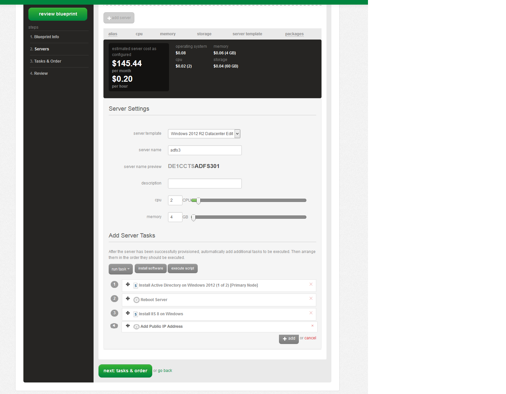

3.  No steps required.  Click "next, review"

4.  Click "submit for publishing"  Note: Blueprint may take up to 15 mins to create.

Once the Blueprint has been published, navigate to the Blueprint Library, use the "Refine Results" column to find your Blueprint, and select your Blueprint by clicking on it.  Click the "Deploy Blueprint" button to initiate the provisioning process.

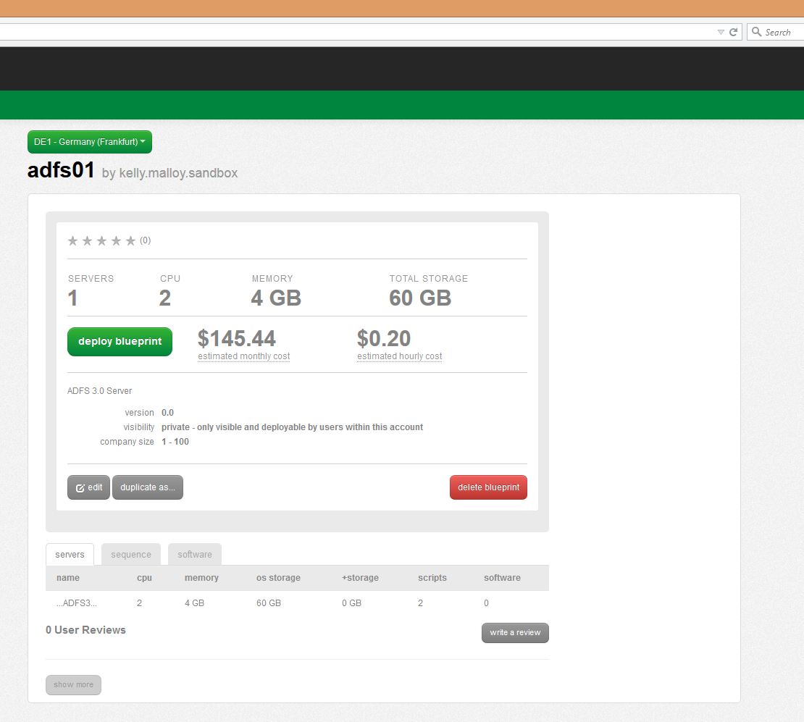

On the "Customize Blueprint" step of the deployment wizard, the user is asked to provide deploy-time build parameters such as the server password, host network, and Active Directory domain name. Note a few key values: first, the **Primary DNS** value *must be equal to the name of the server being created*. Recall that we already added DNS services to the server itself, so THIS is the domain that the new server should use for resolution. The **Domain Name** parameter typically contains the full name of the domain (including a suffix such as ".com") while the Net BIOS Name omits the suffix.

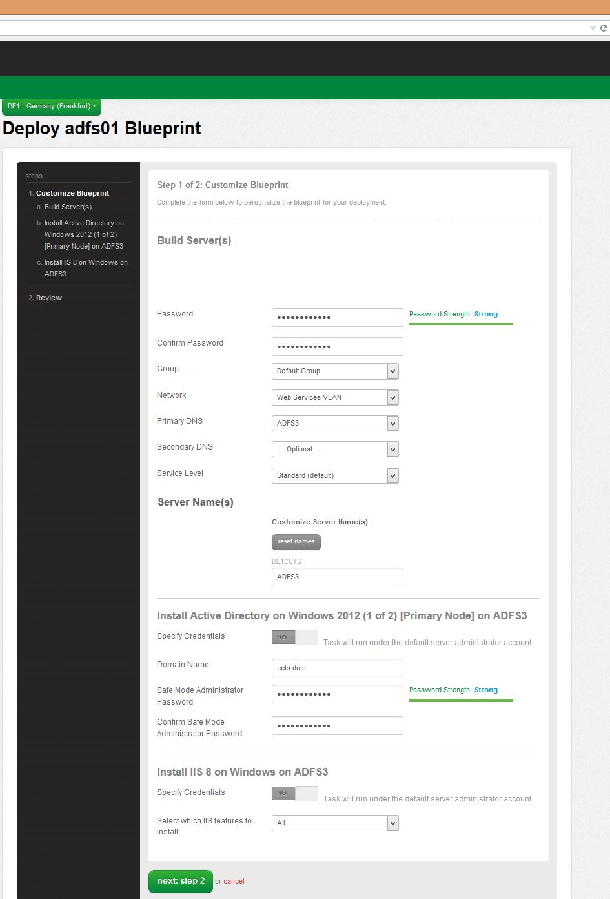

After clicking "Next: Step 2" you will be taken to the "review blueprint" page. Once you have confirmed your choices, complete the deployment process by clicking "deploy blueprint", and wait for the new server to be built by the Lumen Cloud Blueprint engine. It may take up to 20 minutes and you can monitor progress in the queue.

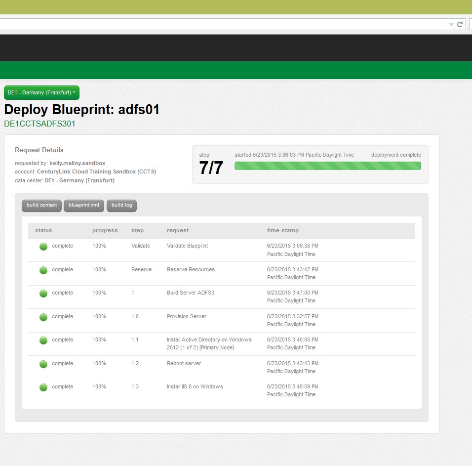

Locate the server that has been deployed by clicking "Servers" within the Control Panel.  View the information within the "Server Info" section, to record the public and private IP addresses for your new server.

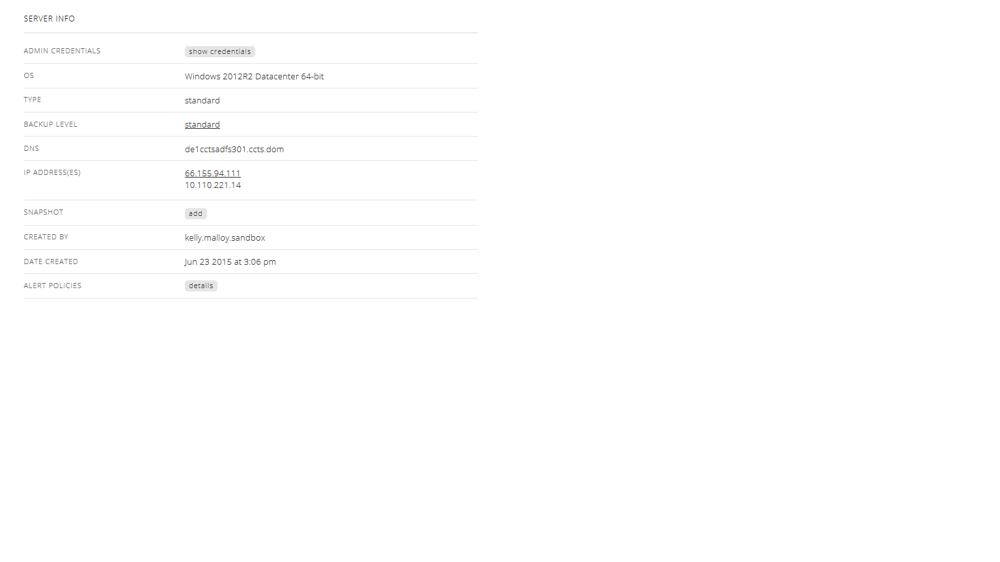

**2. Install and configure Active Directory Federation Services.**

Use the OpenVPN client software or Tunnelblick client software to connect to the Lumen Cloud network. Once connected, create a Remote Desktop session to your server using the private IP address recorded above. In the Server Manager, confirm the installation of DNS, Active Directory, and IIS.

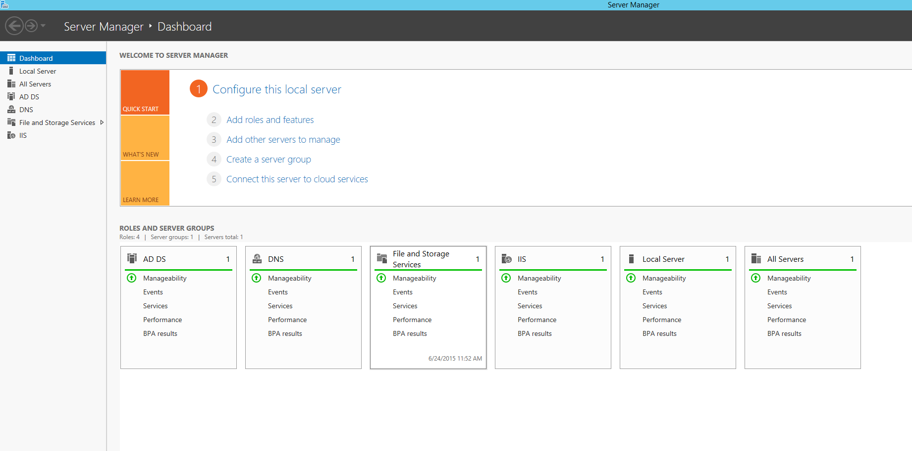

In order to issue certificates easily from this server, install the **Active Directory Certificate Services** role on the server using the "Add roles and features" wizard. Choose "Role based or feature based installation". Accept the defaults for the remaining installation choices but make sure the box is checked for "Active Directory Certificate Services" on the "Server Roles" step. (see screenshot)  Click the "Close" button once complete.

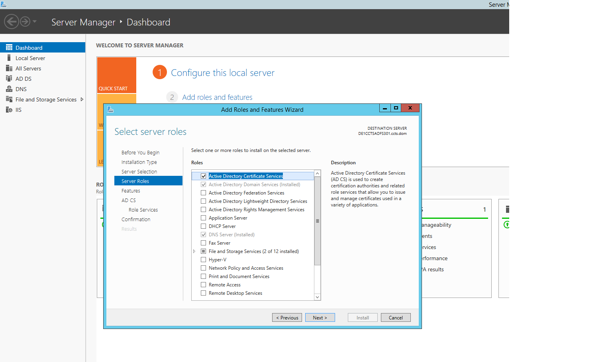

When the role installation has been completed additional configuration will now be required.  A link to the required configuration will be available on the "Results" screen and will also show as an action item in Server Manager - AD CS.  Start the wizard by clicking on that link. On the "Role Services" step of the wizard, check the box for "Certification Authority" . Choose the Setup Type as "Enterprise CA".  Choose the CA Type as "Root CA".  Choose to create a new private key.  For Cryptography use the default provider and encryption settings of "Key length 2048" and hash algorithm "SHA1".  CA Name, Validity Period, and Certificate Database can use default settings.  Click the "Configure" button to complete.

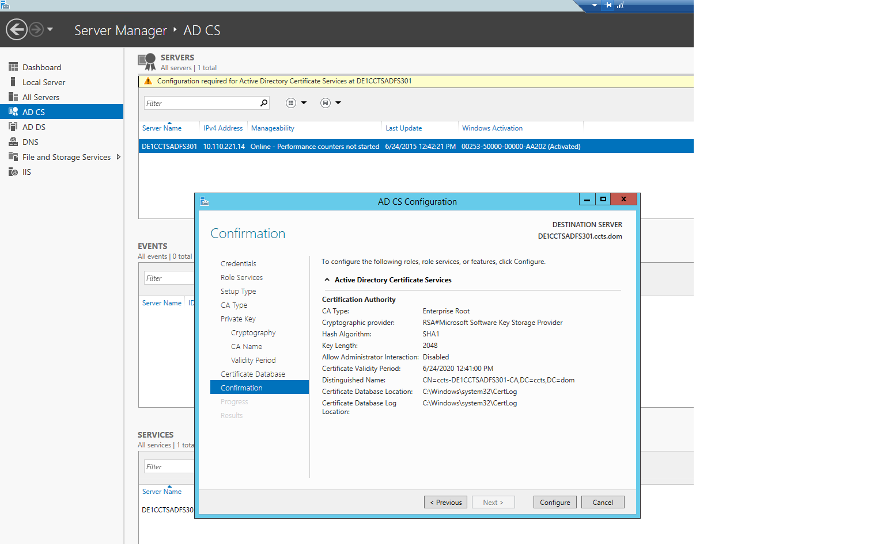

Open IIS Manager via the "Tools" menu, click the host name, and locate the **Server Certificates** feature.

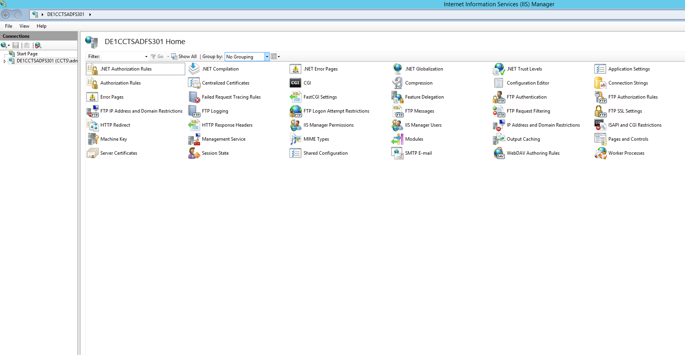

Double-click the **Server Certificates** icon and select the option on the right to **Create Domain Certificate**. Use this wizard to complete all fields.  In this example we will be using a common name of clcsamldemo.falconinfosec.com.  The common name will need to match the external DNS A record you create for your servers public IP address.  In this example we have created an A record of clcsamldemo.falconinfosec.com mapping to external IP address 66.155.94.111 which we verified in the Server Info tab in the Control Panel.  Click "Next".

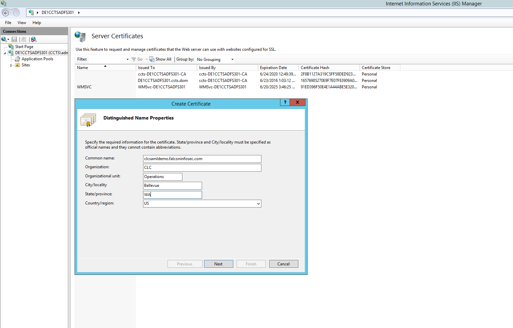

On the next page of the wizard, choose the Online Certificate Authority and set a friendly name for the certificate.  It is useful to set a friendly name that corresponds with information that will help an administrator easily identify basics about this certificate, especially if an organization has numerous certificates. Click "Finish".

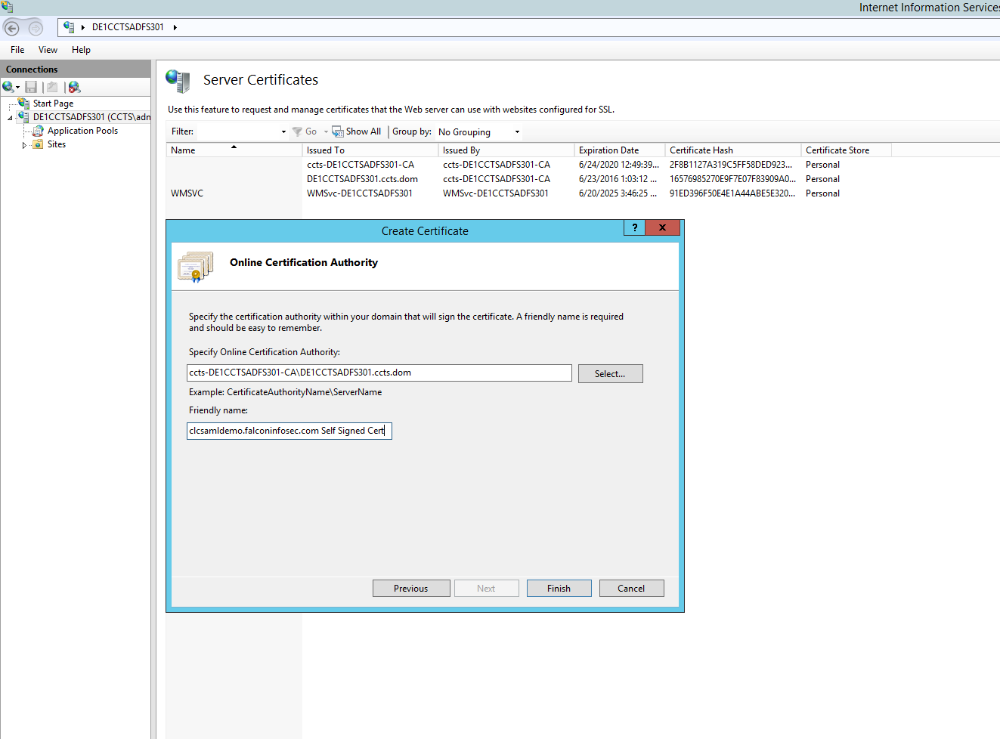

Within IIS Manager, click on "Sites" in the left column to expand the list, select the "Default Web Site", Right click to "Edit Bindings", or use the right menu option to do the same.  Click "Add".  Select Type as "https".  In the SSL certificate drop down box, select the certificate previously created.  Click "OK".  Click "Close".

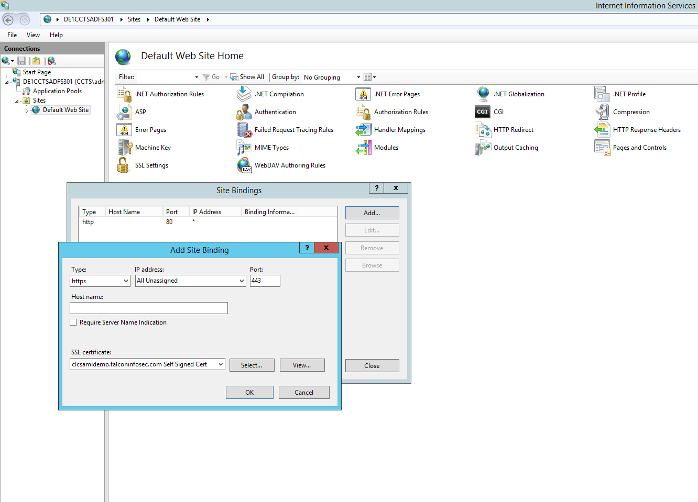

Launch Active Directory Users and Computers via the "Tools" menu and create a service account for ADFS.  This service account does not need special permissions, a normal user account is permitted.  In this example we have created an account named samldemo.  Create another account that will be used for authenticating a user against Lumen Cloud Control Portal.  In this example we have created an account named kellytest.  The full User Principal account name for this account is kellytest@ccts.dom. **Note: Write down these two accounts, identify which is the service account vs. the authenticating user account (will go in the "SAML username" field later on), and note the password you set for each, because you will need them both later in the instructions.**

Windows 2012 has ADFS included.  Return to Server Manager to Add the "Active Directory Federation Services" Role via the "Add roles and features" wizard. Choose "Role based or feature based installation". Accept the defaults for the remaining installation choices but make sure the box is checked for "Active Directory Federation Services" on the "Server Roles" step. (see screenshot below)

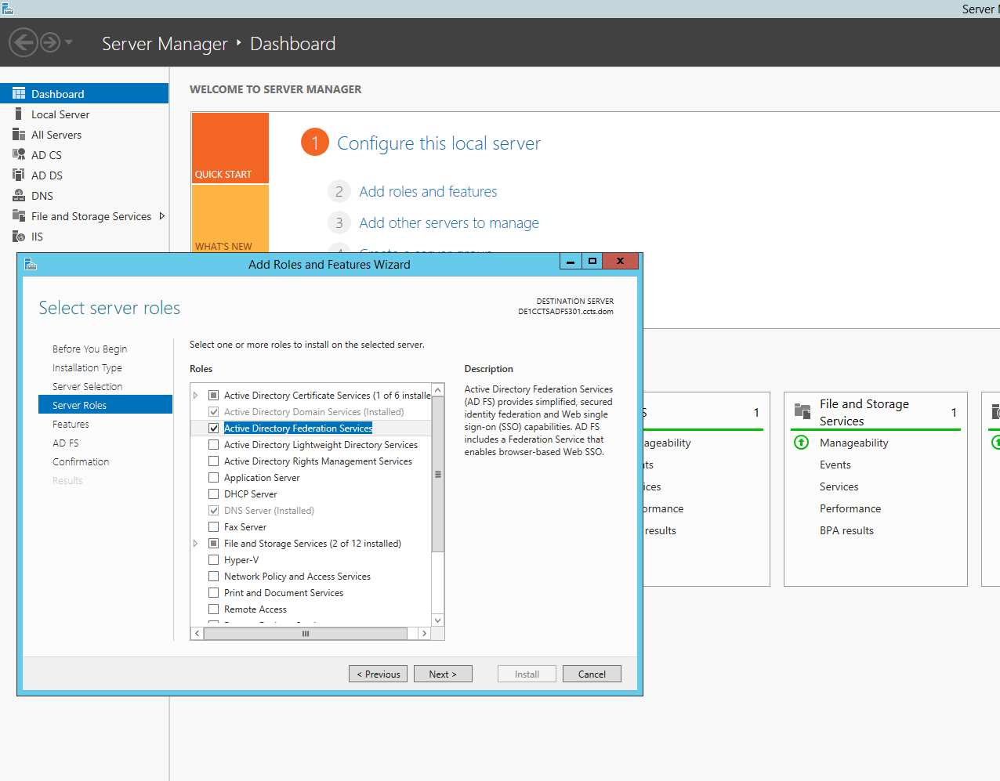

Once the role has been added select "Configure the federation service on this server", which will be a hyperlink on the "Results" screen.

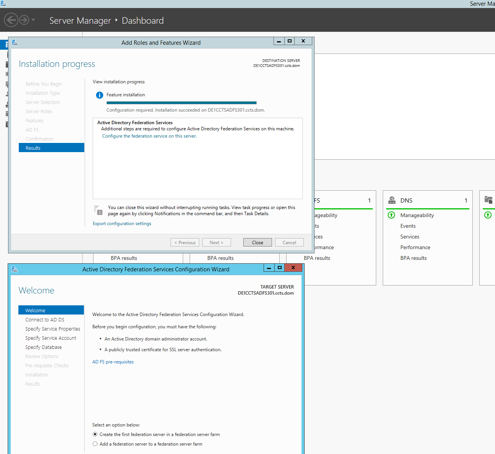

Ensure the option "Create the first federation server in a federation server farm" is selected, click "Next".  Select the appropriate account with domain administrator permissions, click "Next".  Select the correct SSL Certificate from the drop down box.  This will automatically populate the Federation Service Name.  Federation Service Display Name can be customized as desired.  In this example we choose "clcsamldemo".  Click "Next".  Choose the option "Use an existing domain user account or group Managed Service Account"  After selecting this, select the **service** account created earlier.  Specify the correct account password, click "Next".  Select "Create a database on this server using Windows Internal Database"  Click "Next".  Review your summary, Click "Next".  Click "Configure".  Click "Close", twice.

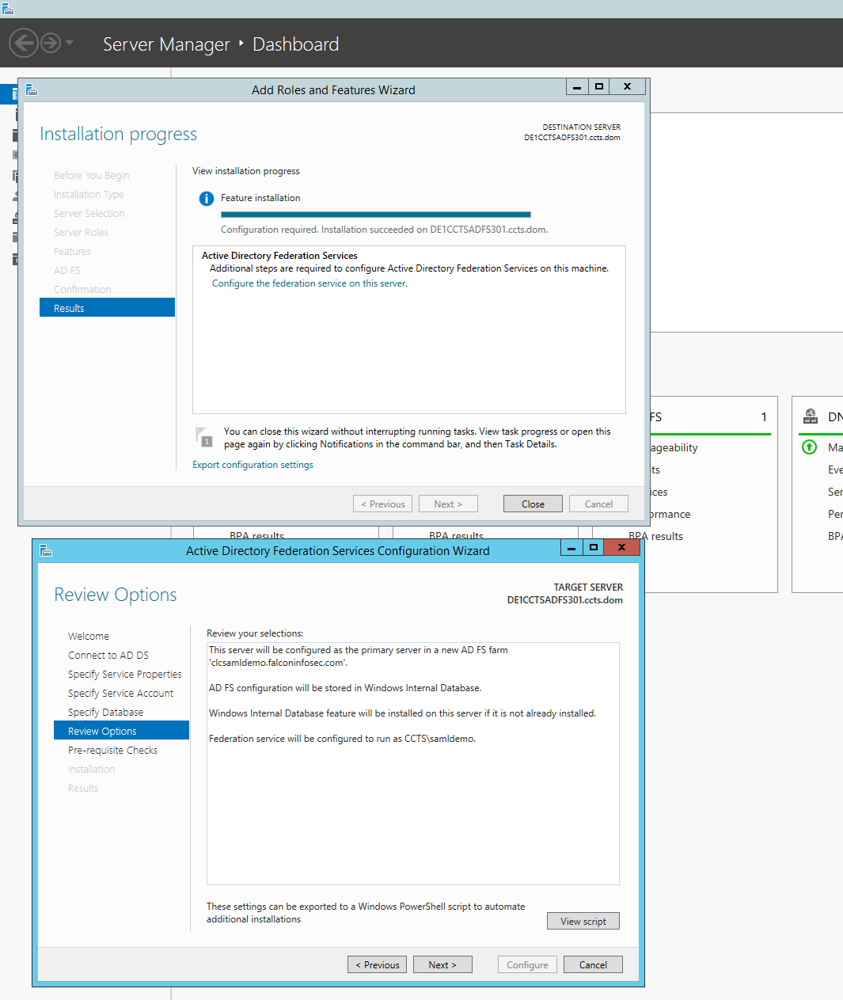

**3. Create trust relationship with Lumen Cloud.**

Launch "AD FS Management" from Administrative "Tools" menu.  Expand "Trust Relationships", right click on "Relying Party Trusts" and select "Add Relying Party Trust", or use the right menu to do the same.  This part of the configuration uses a public certificate from Lumen Cloud for the local IdP so the system recognizes the SAML authentication request in order to validate the inbound signature.

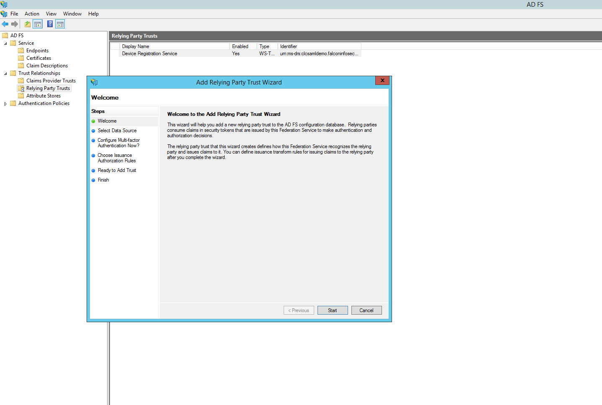

Click "Start".  Select the option "Enter data about the relying party manually".  Click "Next".

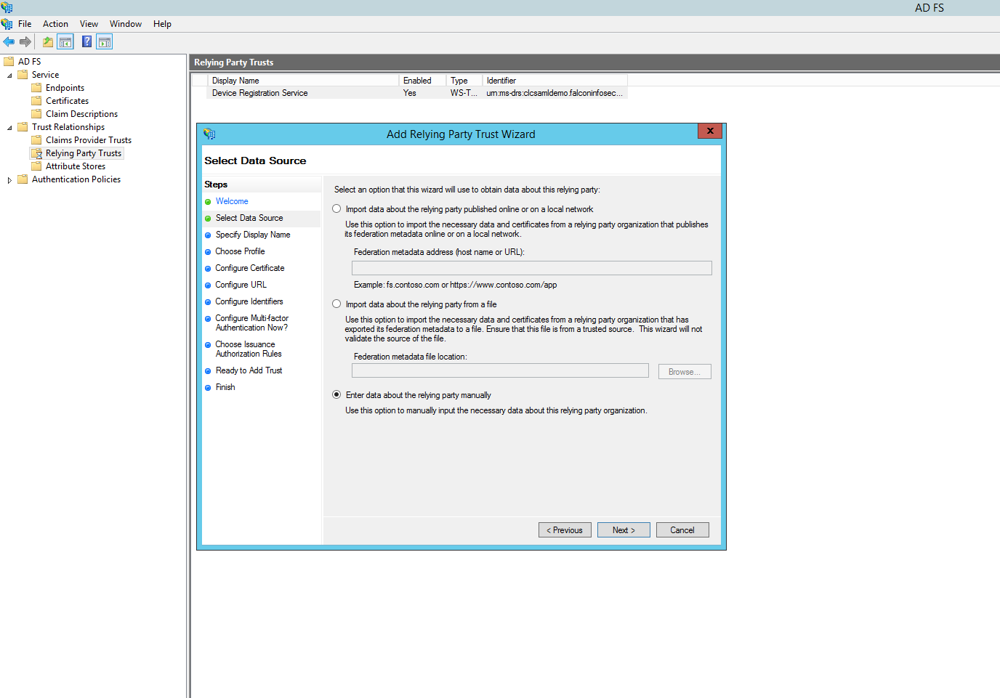

Enter a display name in order to easily identify this relying party, something like "Lumen Cloud Control Portal".  Click "Next".  Select "AD FS Profile", click "Next". Click "Next". Click "Next".  At the Configure Identifiers step, enter the following value for "Relying party trust identifier", <code>https://alias.cloudportal.io/SAMLAuth</code>.  Substitute "alias" with your Lumen Cloud Control Portal alias.  In this example we will use ccts **Note that ALL values in this address are case-sensitive!** Click "Add", click "Next". Ensure "Multi-factor" is set to "disabled", click "Next".  Ensure "Permit all users" is selected, click "Next".

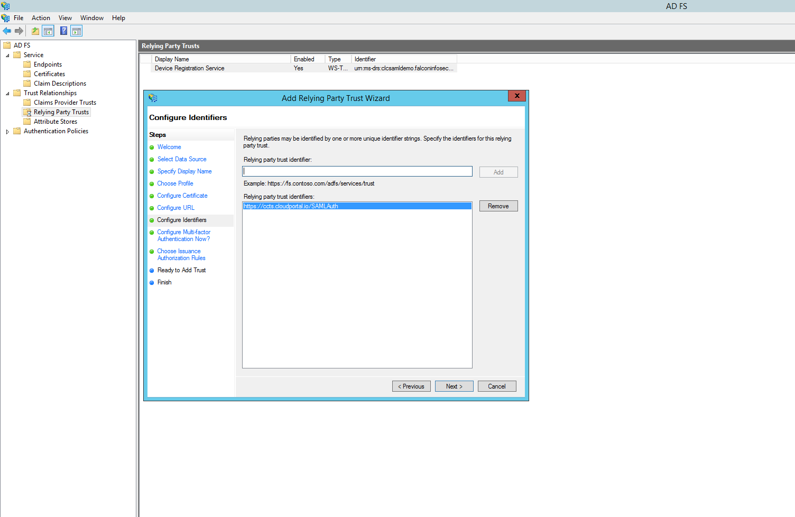

Finish the wizard.  On the last wizard page, click the checkbox to **Open the Edit Claims Rules dialog.** Here is where we define which Active Directory values (claims) map to the SAML attributes sent back to Lumen Cloud.

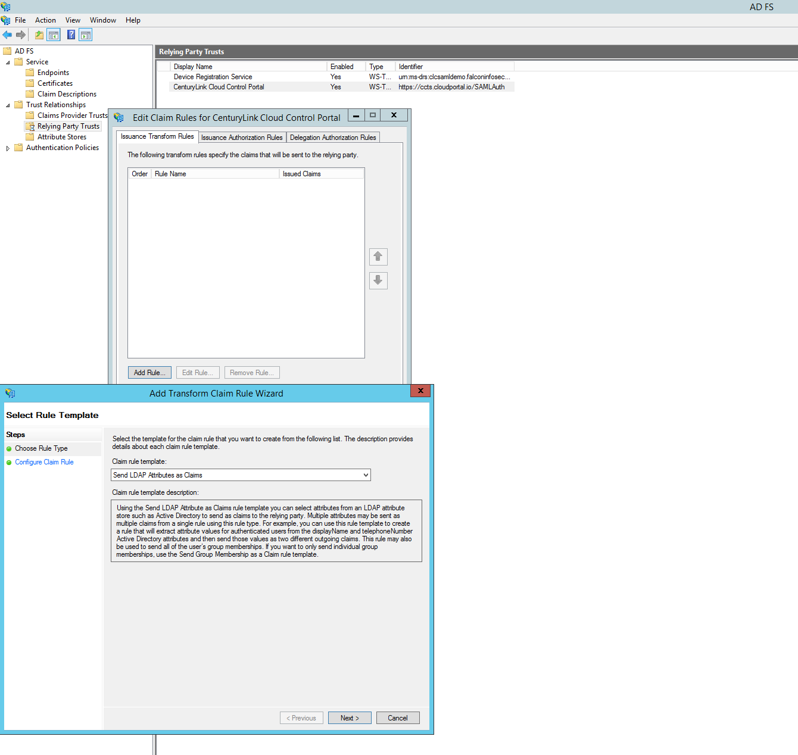

Click "Add Rule".  Ensure "Send LDAP Attributes as Claims" is selected. Click "Next".

Enter a Claim rule name such as "Map UPN to Name ID".  Set the Attributes store to "Active Directory". Choose the **User-Principal-Name** as the **LDAP Attribute**, set the **Outgoing Claim Type** to **Name ID**.  Click "Finish". Click "Apply". Click "Ok".

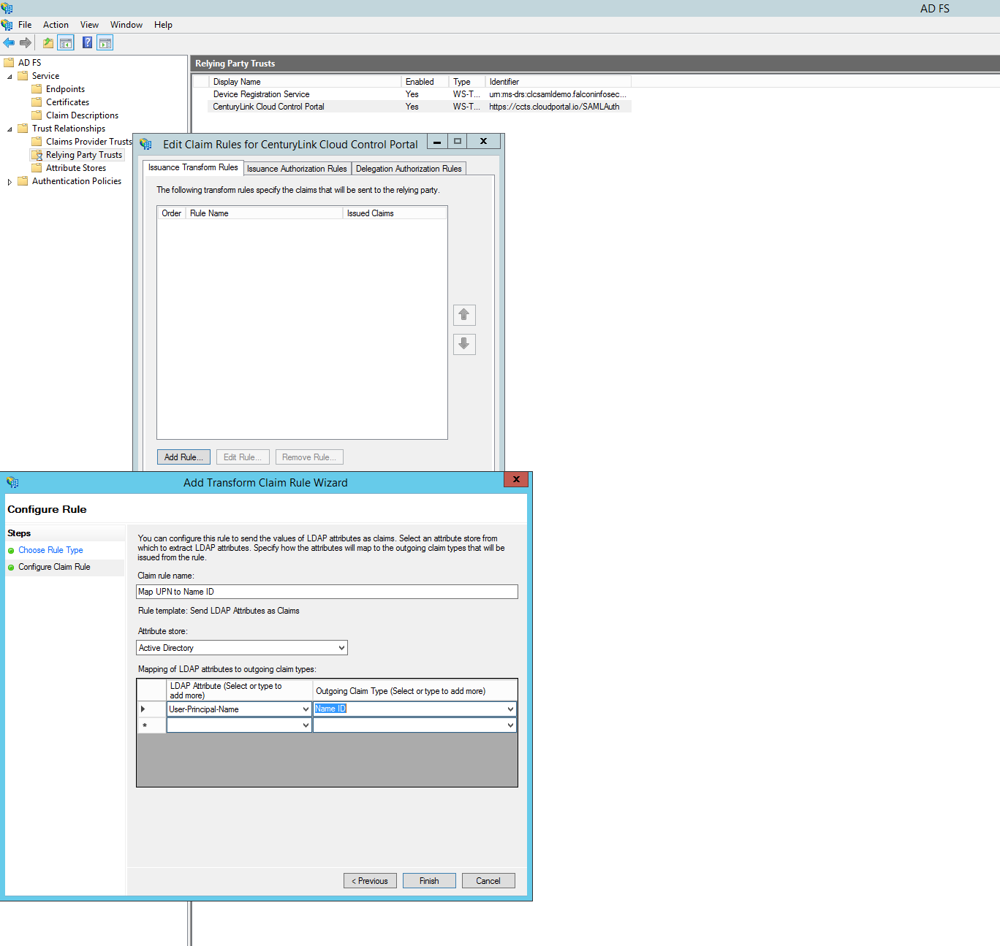

Open Notepad and paste in the contents of this entire text string below, omitting no characters.

```
-----BEGIN CERTIFICATE-----
MIIGvjCCBaagAwIBAgIQC9J/z9RWYiVoDYkFqpPAdDANBgkqhkiG9w0BAQsFADBN
MQswCQYDVQQGEwJVUzEVMBMGA1UEChMMRGlnaUNlcnQgSW5jMScwJQYDVQQDEx5E
aWdpQ2VydCBTSEEyIFNlY3VyZSBTZXJ2ZXIgQ0EwHhcNMTkwMTI0MDAwMDAwWhcN
MjEwMTI4MTIwMDAwWjB8MQswCQYDVQQGEwJVUzESMBAGA1UECBMJTG91aXNpYW5h
MQ8wDQYDVQQHEwZNb25yb2UxGjAYBgNVBAoTEUNlbnR1cnlMaW5rLCBJbmMuMREw
DwYDVQQLEwhQbGF0Zm9ybTEZMBcGA1UEAwwQKi5jbG91ZHBvcnRhbC5pbzCCASIw
DQYJKoZIhvcNAQEBBQADggEPADCCAQoCggEBALRNQL0YZ3OyMxe0PttiGPtfWfUX
4sqTD5Ssna2MCMN/z81iokSIpmA7D9ut8vN89bHSbRAJh+FTdgFm7uDorZJrP9KP
wDdqtYpjEkByDNzJJPgCdIm8x4KYLQRwrU4i4Cj+okP+Lf81WPAMVFfihWgQpCJf
41nkSDHj4rXPnh3+kIB30B9k7mE/CCndTX0NJu3g444WDNTLkh4Rw6mY7Ih1unQh
lLn3qiNdXMQCPBumUIc5pGhPXsPSbW01QR9ESfaV74qeQ0Dq+To5Ixbf6QCEGjGx
WeD5ucGvMzN0Bz35uTvaRsRYEDXYjIXaX2Ca8rGX/Ode0+l66YLlGwZswb0CAwEA
AaOCA2kwggNlMB8GA1UdIwQYMBaAFA+AYRyCMWHVLyjnjUY4tCzhxtniMB0GA1Ud
DgQWBBTMq0/6LK9TdpGGlBfW+ofW76tYrjArBgNVHREEJDAighAqLmNsb3VkcG9y
dGFsLmlvgg5jbG91ZHBvcnRhbC5pbzAOBgNVHQ8BAf8EBAMCBaAwHQYDVR0lBBYw
FAYIKwYBBQUHAwEGCCsGAQUFBwMCMGsGA1UdHwRkMGIwL6AtoCuGKWh0dHA6Ly9j
cmwzLmRpZ2ljZXJ0LmNvbS9zc2NhLXNoYTItZzYuY3JsMC+gLaArhilodHRwOi8v
Y3JsNC5kaWdpY2VydC5jb20vc3NjYS1zaGEyLWc2LmNybDBMBgNVHSAERTBDMDcG
CWCGSAGG/WwBATAqMCgGCCsGAQUFBwIBFhxodHRwczovL3d3dy5kaWdpY2VydC5j
b20vQ1BTMAgGBmeBDAECAjB8BggrBgEFBQcBAQRwMG4wJAYIKwYBBQUHMAGGGGh0
dHA6Ly9vY3NwLmRpZ2ljZXJ0LmNvbTBGBggrBgEFBQcwAoY6aHR0cDovL2NhY2Vy
dHMuZGlnaWNlcnQuY29tL0RpZ2lDZXJ0U0hBMlNlY3VyZVNlcnZlckNBLmNydDAM
BgNVHRMBAf8EAjAAMIIBfgYKKwYBBAHWeQIEAgSCAW4EggFqAWgAdADuS723dc5g
uuFCaR+r4Z5mow9+X7By2IMAxHuJeqj9ywAAAWiBxvFPAAAEAwBFMEMCH1g2X6mG
fgMCXyGC6XwEk28hKzw7/WY5h/aOu4J57Z8CICb5Wubj9gZaVWl1cr8m333abDLC
rVxJlsXviQjiA+ATAHcAh3W/51l8+IxDmV+9827/Vo1HVjb/SrVgwbTq/16ggw8A
AAFogcbyHQAABAMASDBGAiEAzdDtGXGoi8rZ2ZUuoy6UT7PPdmL+d+GqKpMEZqWz
bFACIQCdUFBQ1ULXNTBn+Pj4r/jOEwxb/J3P3m3oq80Px/3FWwB3AG9Tdqwx8DEZ
2JkApFEV/3cVHBHZAsEAKQaNsgiaN9kTAAABaIHG8pcAAAQDAEgwRgIhAI6iGoO9
El0hqH10OcoWgerCKLceAbHRCL3ODV90hu38AiEAnm4MgcNNTcVdlCKvO8a1IPVV
pHrY1mWgHH1hHWF8/QgwDQYJKoZIhvcNAQELBQADggEBALlx1DGkMBFO2ACl30fJ
lPX5GWdOLCAvChi6WvQVxzaxq2SLhRpeFgjnnpv7gD7CLRAgOHxE9SdNBb2fu8pF
2rdvGzq7UFelkcYBdo+xPk1qtwyUM1ARMjHyN+mJG9fwlpeTm3XDQB8EhpYNTkgx
KZO7ktZl7nFnGpipedSmjLF3kSf7OpbfOdbl16KAhGv5MZrbRpn3kA2gyO3+sg9O
9wXHB/sItzCyrqIcv+zIXUexaIyPVOoWodv0klvneYPZbv8eGFSxN04kzmc45gc9
wAKX3paIbiJtcbtotFHd/TxvCWpa/KswEVb4SZwI4M9JkTYQT8BlqYRwxVPqx1cu
9c8=
-----END CERTIFICATE-----
```

Save your notepad session with .cer extension.  In this example we are saving the file name as control.cer

Under "AD FS Relying Party Trusts" right click the "Relying Party Trusts" you just created, and choose "Properties", or use the right menu to do the same. Switch to the **Signatures** tab, and add the certificate you created above.

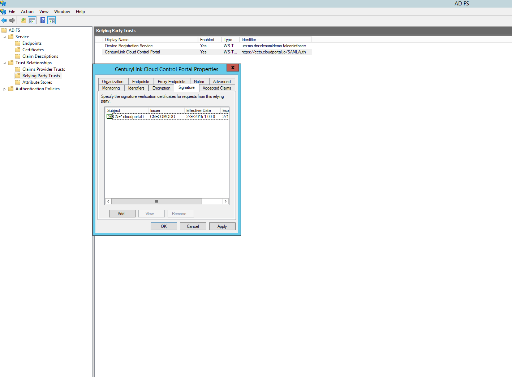

Switch to the **Endpoints** tab and add a **SAML Assertion Consumer** with a **POST** binding and set the URL to <code>https://alias.cloudportal.io/SAMLAuth/Post</code>. Once again, this value is case-sensitive.  Substitute "alias" with your Lumen Cloud Control Portal alias.  In this example we will use "ccts".  Click "Ok".

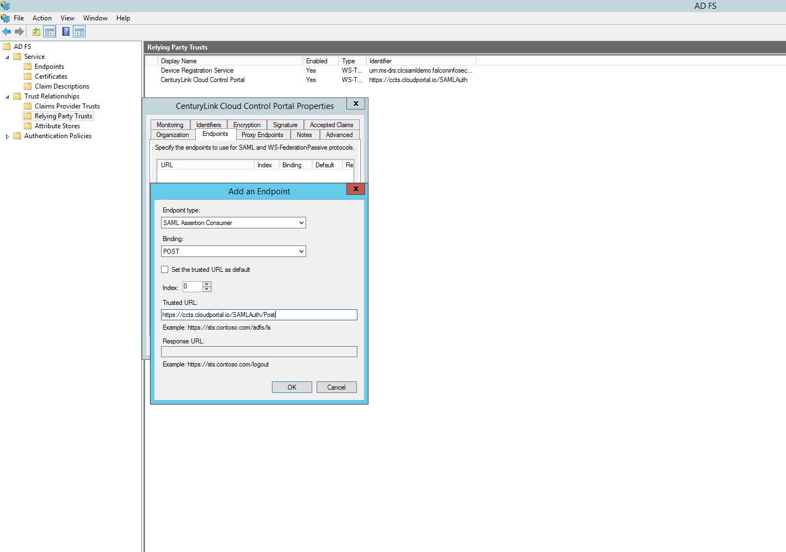

Switch to the **Advanced** tab, change the **Secure Hash Algorithm** to **SHA-1**. Click "Ok".

**4. Configure Lumen Cloud account with SAML settings.**

Log into the Lumen Cloud Control Portal and under **Account** menu, select the **Users** tab. Switch to the **Authentication** sub-section and check the box labeled **SAML Authentication**. This opens up a series of configuration settings.

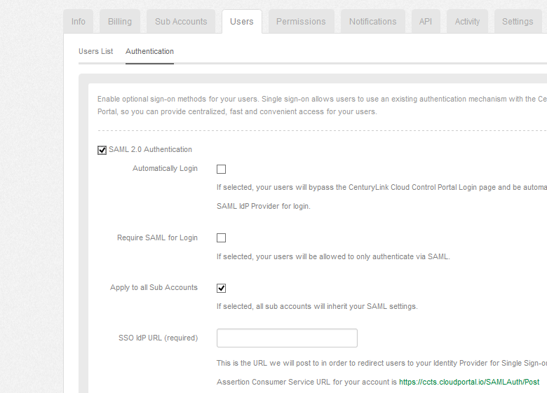

For the **SSO IdP URL**,set the ADFS service URL. This includes the full public domain name of the ADFS server. In this example we are using the URL https://clcsamldemo.falconinfosec.com/adfs/ls/  For the **SLO IdP URL** set the URL as indicated in the Lumen Cloud Control Portal.  The URL for this test account is https://ccts.cloudportal.io/SAMLAuth/LogoutPost

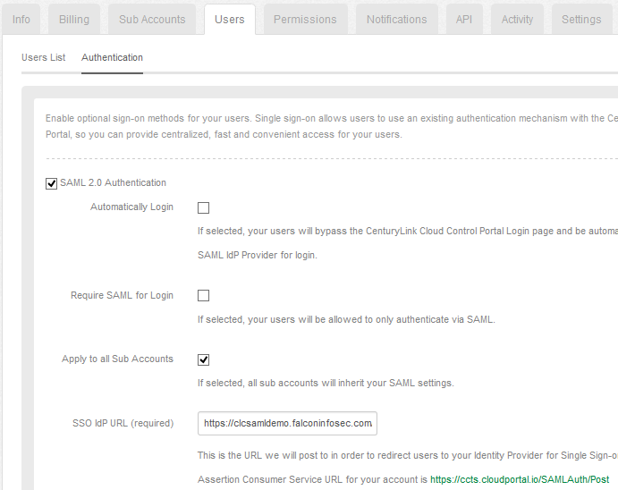

The next required field is the **Signing Certificate Key**.  Return to the ADFS server, view the AD FS Management Console, and find the **Certificates** directory under the **Service** node. Notice the **Token-signing** certificate.

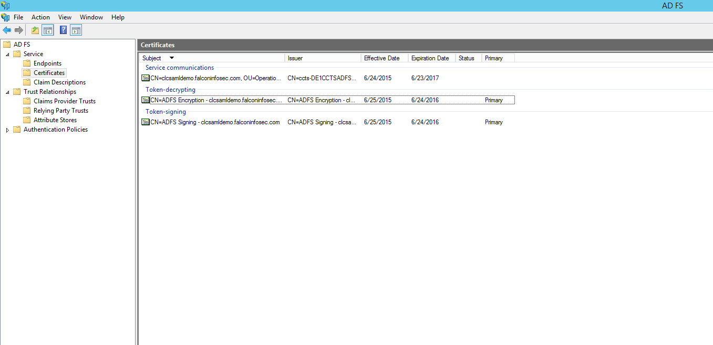

Right click the certificate, choose "View Certificate", or use the right menu to do the same.  Switch to the **Details** tab and select **Copy to File**. Click "Next". Export a **Base-64 encoded X.509** certificate.  Click "Next".

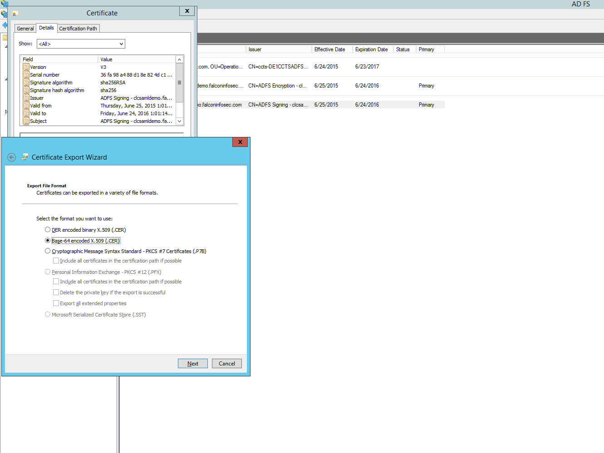

Save the file to a known location on the file system. Open the file with a text editor and copy all of the text between the "Begin Certificate" and "End Certificate" indicators.

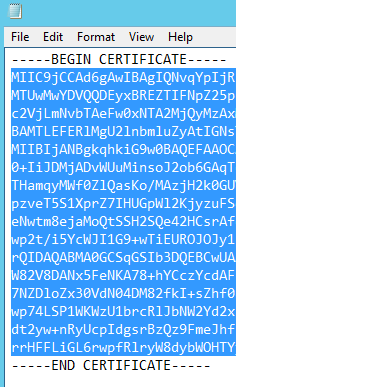

Paste this string of text into the **Signing Certificate Key** field in the Lumen Cloud Control Portal. Click the **Save** button and switch back to the **Users List** view. Select the user that you want to perform SSO with, and locate the **SAML Username** field. Since we chose above to use the "Active Directory User Principal Name" as the lookup value to the Lumen Cloud account, we must plug in the User Principal Name associated with this user.  in the example the User Principal Name is kellytest@ccts.dom.  Click "Save".

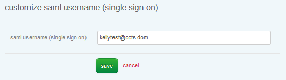

**5. Exchange SAML messages to perform Single Sign On.**

 Go to a web browser and plug in <code>https://alias.cloudportal.io</code>. Here you can sign in via Lumen Cloud Portal username and password, or choose the **Sign In Using SAML** option. If you choose the latter, then the Lumen Cloud SAML service redirects the browser to the URL specified in the account's **SAML SSO URL** setting.

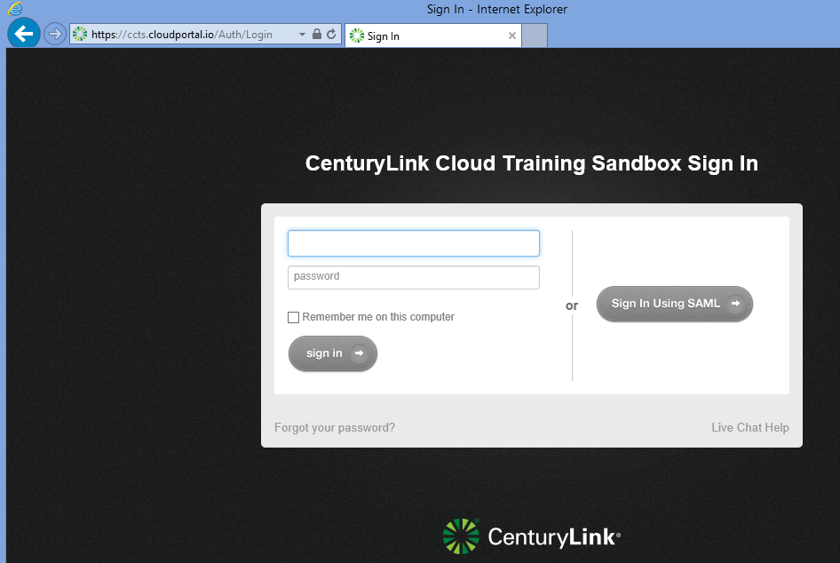

The user experience when clicking the Sign In Using SAML button is that the user is prompted for credentials (if the user is not hitting the website from within the domain itself) and once provided, the user is automatically logged into the Lumen Cloud portal. **Because they used Single Sign On and SAML, they did NOT have to enter their Lumen Cloud account credentials, but rather, were able to use their regular network credentials.  In this example we logged in with User Principal Name kellytest@ccts.dom that we created earlier in this guide.**
