{{{
  "title": "Using SAML for Single-Sign-On to the Lumen Platform Control Portal",
  "date": "UPDATED WITH SIGNING CERTIFICATE 02-01-2019",
  "author": "Matthew Ordman",
  "attachments": [],
  "contentIsHTML": false
}}}

### Description
Lumen Cloud supports the use of Security Assertion Markup Language (SAML) for exchanging user authentication data as XML between trusted parties. This industry standard protocol empowers our customers to use their **own** identity management system for authenticating users of the Lumen Cloud Control Portal.

SAML has three main parties: the user, the identity provider (IdP), and service provider (SP). The IdP is the repository that holds identity information. The SP is the party that wants to authenticate a particular user who is using an application.

The SAML flow occurs as shown below.


Specific steps in this flow are:

1. The enterprise user of the Lumen Cloud hits a URL that is dedicated to their account. The user is asked how they would like to log into the system and they choose SAML.

2. The web application contacts the Lumen Cloud SAML service to initiate the SAML message exchange.

3. The Lumen Cloud SP sends a digitally signed SAML authentication request to the enterprise IdP. This IdP takes the user's Kerberos token and validates them as a user on the enterprise network.

4. The IdP returns a signed (and optionally, encrypted) SAML authentication response message to the Lumen Cloud SP. This message includes a Name ID assertion and that value is matched to a User record in the Lumen Cloud.

5. The user is logged into the Lumen Cloud and operates under the roles and permissions assigned to their Lumen Cloud user account.

The steps below walk through the process of building an entire SSO and SAML scenario based on Microsoft Active Directory Federation Services as the IdP proxy. If you already have an identity provider, you can skip to step 3 where trust is established between Lumen Cloud and the IdP.

**Steps**

**1. Provision server to act as Identity Provider.**

* Log into the Lumen Cloud Control Portal and choose to create a new Blueprint. Using the left navigation bar, choose **Orchestration** > **Design Blueprint**. 

* Include a single (Windows Server 2008 or above) server to the Blueprint and add packages to **Install DNS**, **Install Active Directory**, **Reboot**, **Install IIS**, and **Add a Public IP**. The DNS and Active Directory packages give us a custom domain to work with, and an identity directory for our user records. Microsoft Internet Information Services (IIS) provides a web application host for the Active Directory Federation Services (ADFS) web services used later on. Finally, the public IP address exposes our server to the public internet where applications (like the Lumen Cloud Control Portal) can access it for a SAML exchange.

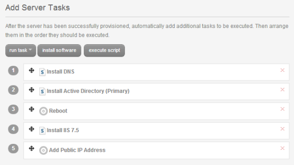

* Publish the Blueprint and then locate it in the Blueprint library. Click the **Deploy Blueprint** button to initiate the provisioning process.

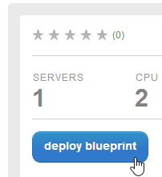

* On the "Customize Blueprint" step of the deployment wizard, the user is asked to provide deploy-time build parameters such as the server password, host network, and Active Directory domain name. Note a few key values: first, the **Primary DNS** value *must be equal to the name of the server being created*. Recall that we already added DNS services to the server itself, so THIS is the domain that the new server should use for resolution. The **Domain Name** parameter typically contains the full name of the domain (including a suffix such as ".com") while the Net BIOS Name omits the suffix.

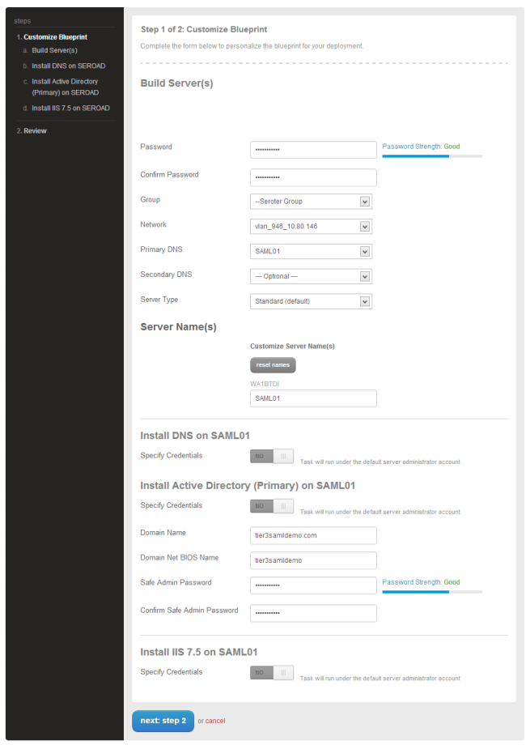

* Complete the deployment process and wait for the new server to be built by the Lumen Cloud Blueprint engine.

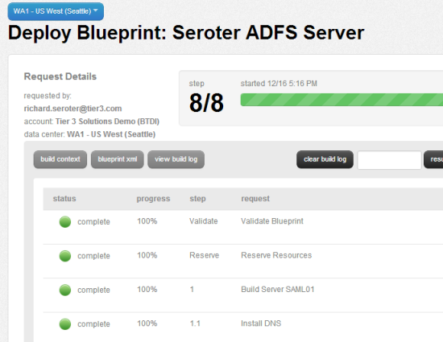

* Locate the server in the designated group and confirm its DNS value and public IP address.

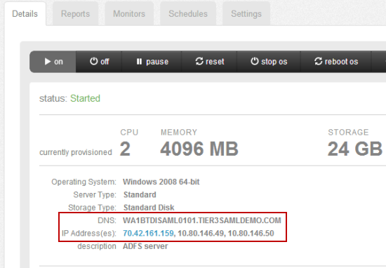

**2. Install and configure Active Directory Federation Services.**
* Open client VPN software and connect to the Lumen Cloud network. Once authenticated, create a Remote Desktop session to the target server. In the Server Manager, confirm the installation of DNS, Active Directory, and IIS.

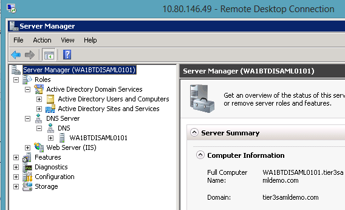

* In order to issue cerificates easily from this server, install the **Certificate Services** role on the server. Choose the **Certificate Authority** role, select **Enterprise CA**, set this to a **Root CA**, and create a new private key. Finish the wizard.

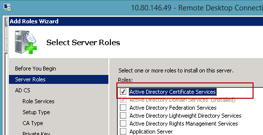

* Open the IIS Manager, click the host name, and locate the **Server Certificates** feature.

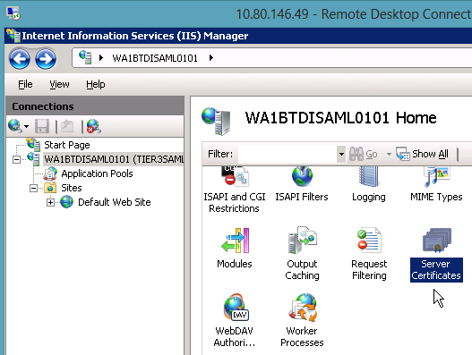

* Double-click the **Server Certificates** icon and select the option on the right to **Create Domain Certificate**. On the first page of the wizard choose the common name (it could be a wildcard entry like <code>tier3samldemo.com</code>) and organizational details.

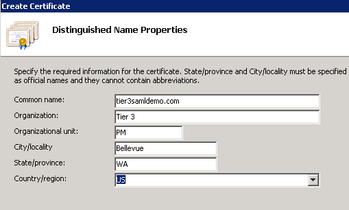

* On the next page of the wizard, choose the Certificate Authority and set the friendly name of the certificate.

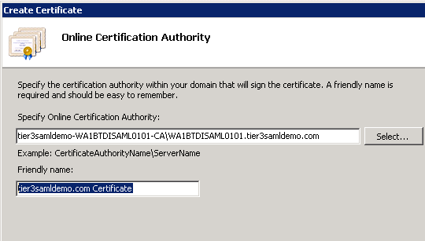

* After completing the wizard (and creating a certificate that should show up in the Certificates MMC as a **Personal** certificate for the Computer account), right-click the Default Web Site in the IIS Manager and choose Edit Bindings. Here, we set the site to use our new certificate for SSL.

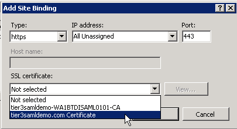

* For users working with Windows Server 2008 or Windows Server 2008 R2, [download ADFS 2.0](http://www.microsoft.com/en-us/download/details.aspx?id=10909) download from the Microsoft website. Windows Server 2012 comes with ADFS pre-installed. Run the ADFS Setup Wizard.

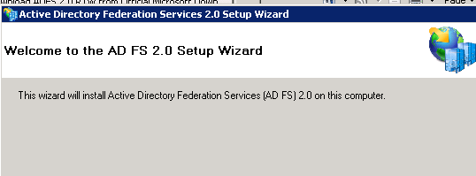

* Select the **Federation server** role, and complete the short wizard. Once the wizard installs prerequisite software and finishes installing ADFS 2.0, choose the option to launch the ADFS Configuration Wizard.

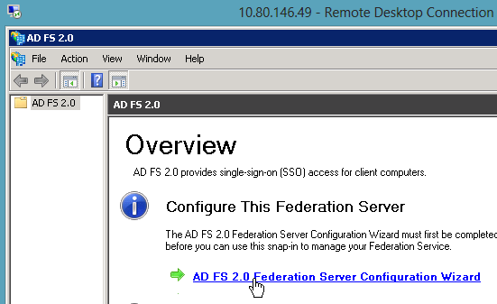

* Choose to **Create a new Federation Service**, a **Stand-alone federation server**, and notice that the wizard pulls in the name of the certificate set for SSL in IIS.

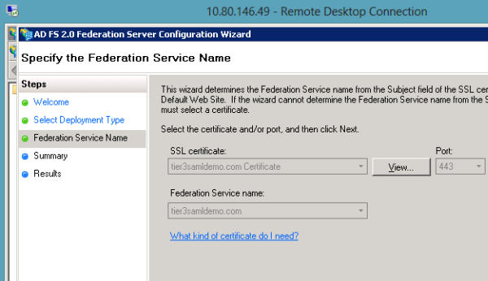

* When the wizard completes, notice the new ADFS configuration options.

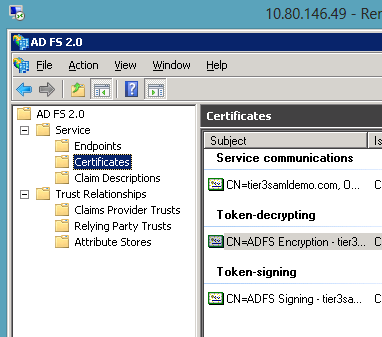

* Before proceeding, add a new user to the Active Directory. In the Server Manager, expand the **Active Directory Domain Services** node, then **Active Directory Users and Computers**, and then the domain.

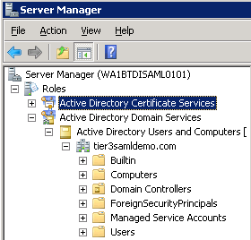

* Right-click on the **Users** node and select **New**, then **User**. Add the details of this new user and save the settings.

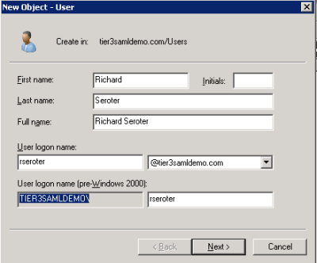

**3. Create trust relationship with Lumen Cloud.**
* Prior to starting this step, **See below to acquire the public certificate** that validates the message coming from Lumen Cloud.
* In the ADFS 2.0 Management console (or whatever IdP service that's being used), create a new Relying Party Trust. This is where the settings from the Lumen Cloud are added to the local IdP so that it recognizes the SAML authentication request and can validate the inbound signature.

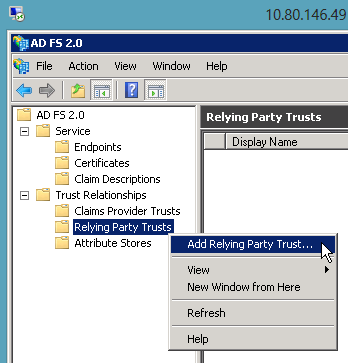

* Choose the option to add the relying party metadata manually.

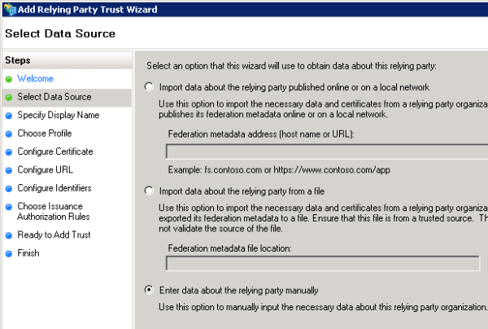

* Name the relying party something like "Lumen Cloud Control Portal." Select the ADFS 2.0 profile. When asked for the **Relying party trust identifier**, use the following value (while filling in your specific account alias): <code>https://alias.cloudportal.io/SAMLAuth</code>. **Note that this value is case-sensitive!**

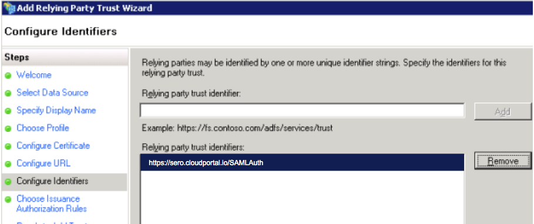

* Finish the wizard, and plan on addition a pair of additional values later on. On the last wizard page, click the checkbox to **Open the Edit Claims Rules dialog.** Here is where we define which Active Directory values (claims) map to the SAML attributes sent back to Lumen Cloud.

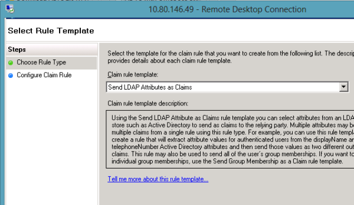

* Set the source of attributes (Active Directory), choose the **User-Principal-Name** as the **LDAP Attribute**, set the **Outgoing Claim Type** to **Name ID**.

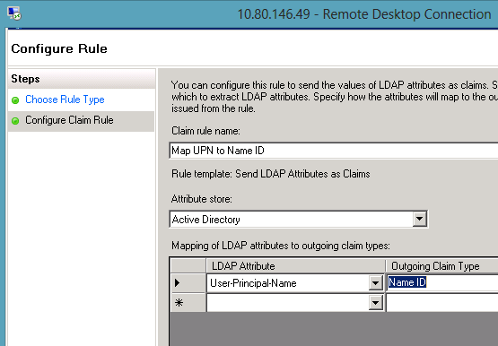

* After completing this wizard, go back to the Relying Party Trusts folder and open the new entry. Switch to the **Signatures** tab, and add the certificate from below.

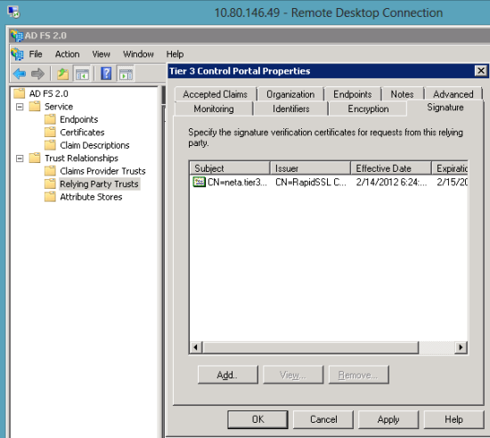

* Switch to the **Endpoints** tab and add a **SAML Assertion Consumer** with a **POST** binding and set the URL to <code>https://alias.cloudportal.io/SAMLAuth/Post</code>. Once again, this value is case-sensitive.

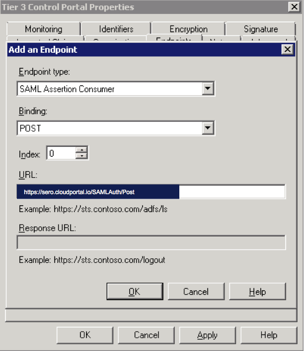

* Finally, on the **Advanced** tab, change the **Secure Hash Algorithm** to **SHA-1**. Save the Relying Party Trust entry.

**4. Configure Lumen Cloud account with SAML settings.**
* Log into the Lumen Cloud Control Portal and under **Account** menu, select the **Users** tab.

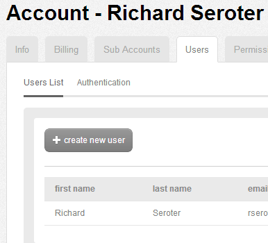

* Switch to the **Authentication** sub-section and check the box labeled **SAML Authentication**. This opens up a series of configuration settings.

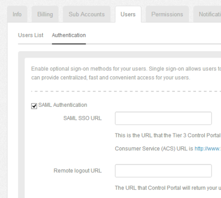

* For the **SAML SSO URL**,set the ADFS service URL. This includes the domain name the ADFS server. Even if you don't own the public domain name used here, enter the domain created for the local server.

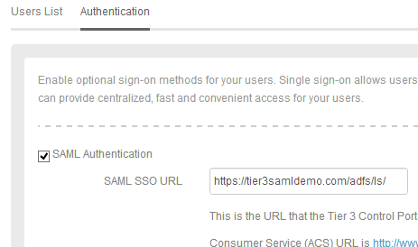

* To get the **Signing Certificate Key**, return to the ADFS server, view the ADFS Management Console, and find the **Certificates** directory under the **Services** node. Notice the **Token-signing** certificate.

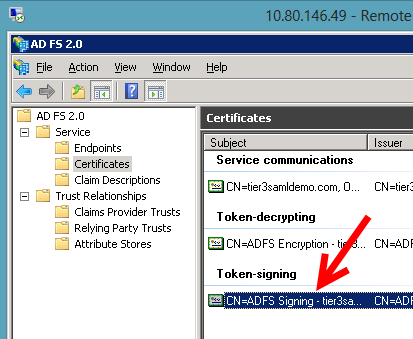

* Choose to view the certificate (by right-clicking it), switch to the **Details** tab and select **Copy to File**. Export a **Base-64 encoded X.509** certificate.

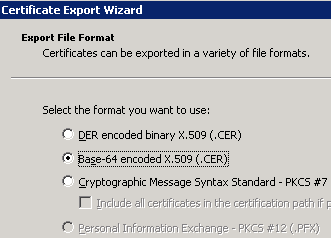

* Save the file to a known location on the file system. Open the file with a text editor and copy all of the text between the "Begin Certificate" and "End Certificate" indicators.

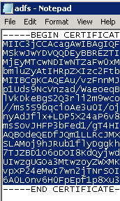

* Paste this value into the **Signing Certificate Key** field in the Lumen Cloud Control Portal. Click the **Save** button and switch back to the **Users List** view. Select the user that you want to perform SSO with, and locate the **SAML Username** field. Since we chose above to use the Active Directory User Principal Name as the lookup value to the Lumen Cloud account, we must plug in the User Principal Name associated with this user.

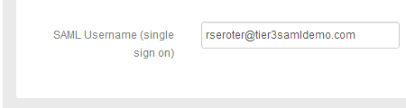

* Save the user record.

**5. Exchange SAML messages to perform Single Sign On.**
* Before testing, if you do not own the public domain name corresponding to the DNS name of your server, then your test will fail. To test successfully, change your local machine host file so that the browser translates the domain name to the public IP address of the server. When the SAML request comes in to ADFS, it tries to match the SAML Destination ID (retrieved from the SAML configuration in your Lumen Cloud account) to the Federation Service name in the ADFS server.

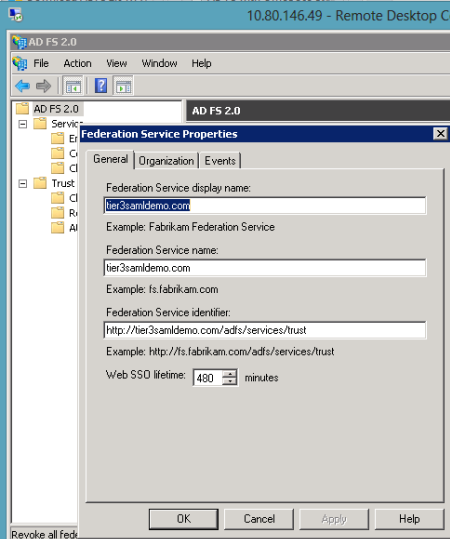

* If the values do not match, then ADFS will return an exception. In order to test this scenario without registering and owning the corresponding public domain name, navigate to your local machine's host file (C:\Windows\System32\Drivers\etc\hosts) and add an entry that maps the public IP address of the server to the DNS name of the server.

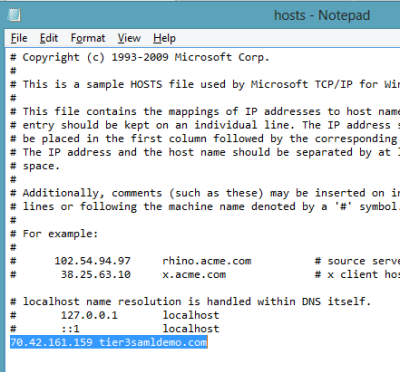

* Go to a web browser and plug in <code>https://alias.cloudportal.io</code>. Here you can sign in via Lumen Cloud username and password, or choose the **Sign In Using SAML** option. If you choose the latter, then the Lumen Cloud SAML service redirects the browser to the URL specified in the account's **SAML SSO URL** setting.

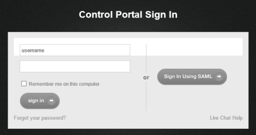

* Clicking the **Sign In Using SAML** results in the following message being sent to the ADFS (or any IdP) service.

```
<samlp:AuthnRequest
  ID="--ID--"
  Version="2.0"
  IssueInstant="2012-12-06T21:30:41.385Z"
  Destination="https://tier3samldemo.com/adfs/ls/"
  ForceAuthn="false"
  IsPassive="false"
  ProtocolBinding="urn:oasis:names:tc:SAML:2.0:bindings:HTTP-POST"
  AssertionConsumerServiceURL="https://ALIAS.cloudportal.io/SAMLAuth/Post"
  xmlns:samlp="urn:oasis:names:tc:SAML:2.0:protocol">
  <saml:Issuer xmlns:saml="urn:oasis:names:tc:SAML:2.0:assertion">https://ALIAS.cloudportal.io/SAMLAuth</saml:Issuer>
  <Signature xmlns="http://www.w3.org/2000/09/xmldsig#">
    <SignedInfo>
    <CanonicalizationMethod Algorithm="http://www.w3.org/2001/10/xml-exc-c14n#" />
    <SignatureMethod Algorithm="http://www.w3.org/2000/09/xmldsig#rsa-sha1" />
      <Reference URI="URI">
       <Transforms>
          <Transform Algorithm="http://www.w3.org/2000/09/xmldsig#enveloped-signature" />
          <Transform Algorithm="http://www.w3.org/2001/10/xml-exc-c14n#">
      <InclusiveNamespaces PrefixList="#default samlp saml ds xs xsi" xmlns="http://www.w3.org/2001/10/xml-exc-14n#"/>
          </Transform>
        </Transforms>
        <DigestMethod Algorithm="http://www.w3.org/2000/09/xmldsig#sha1" />
        <DigestValue>VALUE</DigestValue>
      </Reference>
    </SignedInfo>
    <SignatureValue>VALUE</SignatureValue>
  <KeyInfo>
     <X509Data>
       <X509Certificate>CERTIFICATE</X509Certificate>
     </X509Data>
        </KeyInfo>
        </Signature>
  <samlp:NameIDPolicy AllowCreate="true" />
</samlp:AuthnRequest>
```

* If the SAML request is successfully processed by the ADFS server, then ADFS sends a SAML response that the Lumen Cloud Control Portal uses to log in the federated user.

```
<samlp:Response ID="--ID--"
  Version="2.0"
  IssueInstant="2012-12-06T22:22:35.344Z"
  Destination="https://ALIAS.cloudportal.io/SAMLAuth/Post"
  Consent="urn:oasis:names:tc:SAML:2.0:consent:unspecified"
  InResponseTo="ID" xmlns:samlp="urn:oasis:names:tc:SAML:2.0:protocol">
  <Issuer xmlns="urn:oasis:names:tc:SAML:2.0:assertion">http://tier3samldemo.com/adfs/services/trust</Issuer>
  <samlp:Status>
    <samlp:StatusCode Value="urn:oasis:names:tc:SAML:2.0:status:Success" />
  </samlp:Status>
  <Assertion ID="ID" IssueInstant="2012-12-06T22:22:35.303Z" Version="2.0" xmlns="urn:oasis:names:tc:SAML:2.0:assertion">
  <Issuer>http://tier3samldemo.com/adfs/services/trust</Issuer>
     <ds:Signature xmlns:ds="http://www.w3.org/2000/09/xmldsig#">
       <ds:SignedInfo>
    <ds:CanonicalizationMethod Algorithm="http://www.w3.org/2001/10/xml-exc-c14n#" />
    <ds:SignatureMethod Algorithm="http://www.w3.org/2000/09/xmldsig#rsa-sha1" />
    <ds:Reference URI="URI">
       <ds:Transforms>
         <ds:Transform Algorithm="http://www.w3.org/2000/09/xmldsig#enveloped-signature" />
         <ds:Transform Algorithm="http://www.w3.org/2001/10/xml-exc-c14n#" />
       </ds:Transforms>
       <ds:DigestMethod Algorithm="http://www.w3.org/2000/09/xmldsig#sha1"/>
       <ds:DigestValue>VALUE</ds:DigestValue>
    </ds:Reference>
    </ds:SignedInfo>
      <ds:SignatureValue>VALUE</ds:SignatureValue>
      <KeyInfo mlns="http://www.w3.org/2000/09/xmldsig#">
        <ds:X509Data>
          <ds:X509Certificate>CERTIFICATE</ds:X509Certificate>
        </ds:X509Data>
      </KeyInfo>
      </ds:Signature>
      <Subject>
    <NameID>rseroter@tier3samldemo.com</NameID>
     <SubjectConfirmation Method="urn:oasis:names:tc:SAML:2.0:cm:bearer">
    <SubjectConfirmation Data InResponseTo="ID"
      NotOnOrAfter="2012-12-06T22:27:35.346Z"
      Recipient="https://ALIAS.cloudportal.io/SAMLAuth/Post" />
    </SubjectConfirmation>
       </Subject>
       <Conditions NotBefore="2012-12-06T22:22:34.417Z" NotOnOrAfter="2012-1206T23:22:34.417Z">
    <AudienceRestriction>
      <Audience>https://ALIAS.cloudportal.io/SAMLAuth</Audience>
    </AudienceRestriction>
       </Conditions>
       <AuthnStatement AuthnInstant="2012-12-06T22:22:33.401Z" SessionIndex="ID">
    <AuthnContext>
      <AuthnContextClassRef>urn:federation:authentication:windows</AuthnContextClassRef>
    </AuthnContext>
       </AuthnStatement>
    </Assertion>
</samlp:Response>

```

* The user experience when clicking that button is that the user is prompted for credentials (if the user is not hitting the website from within the domain itself) and once provided, the user is automatically logged into the Lumen Cloud portal. **Because they used Single Sign On and SAML, they did NOT have to enter their Lumen Cloud account credentials, but rather, were able to use their regular network credentials.**

### Updated Signing Certificate (February 2019)

Customers with an existing SAML configuration as of February 9, 2019 will need to update their signing certificate for use with their IdP with the following text:

```
-----BEGIN CERTIFICATE-----
MIIGvjCCBaagAwIBAgIQC9J/z9RWYiVoDYkFqpPAdDANBgkqhkiG9w0BAQsFADBN
MQswCQYDVQQGEwJVUzEVMBMGA1UEChMMRGlnaUNlcnQgSW5jMScwJQYDVQQDEx5E
aWdpQ2VydCBTSEEyIFNlY3VyZSBTZXJ2ZXIgQ0EwHhcNMTkwMTI0MDAwMDAwWhcN
MjEwMTI4MTIwMDAwWjB8MQswCQYDVQQGEwJVUzESMBAGA1UECBMJTG91aXNpYW5h
MQ8wDQYDVQQHEwZNb25yb2UxGjAYBgNVBAoTEUNlbnR1cnlMaW5rLCBJbmMuMREw
DwYDVQQLEwhQbGF0Zm9ybTEZMBcGA1UEAwwQKi5jbG91ZHBvcnRhbC5pbzCCASIw
DQYJKoZIhvcNAQEBBQADggEPADCCAQoCggEBALRNQL0YZ3OyMxe0PttiGPtfWfUX
4sqTD5Ssna2MCMN/z81iokSIpmA7D9ut8vN89bHSbRAJh+FTdgFm7uDorZJrP9KP
wDdqtYpjEkByDNzJJPgCdIm8x4KYLQRwrU4i4Cj+okP+Lf81WPAMVFfihWgQpCJf
41nkSDHj4rXPnh3+kIB30B9k7mE/CCndTX0NJu3g444WDNTLkh4Rw6mY7Ih1unQh
lLn3qiNdXMQCPBumUIc5pGhPXsPSbW01QR9ESfaV74qeQ0Dq+To5Ixbf6QCEGjGx
WeD5ucGvMzN0Bz35uTvaRsRYEDXYjIXaX2Ca8rGX/Ode0+l66YLlGwZswb0CAwEA
AaOCA2kwggNlMB8GA1UdIwQYMBaAFA+AYRyCMWHVLyjnjUY4tCzhxtniMB0GA1Ud
DgQWBBTMq0/6LK9TdpGGlBfW+ofW76tYrjArBgNVHREEJDAighAqLmNsb3VkcG9y
dGFsLmlvgg5jbG91ZHBvcnRhbC5pbzAOBgNVHQ8BAf8EBAMCBaAwHQYDVR0lBBYw
FAYIKwYBBQUHAwEGCCsGAQUFBwMCMGsGA1UdHwRkMGIwL6AtoCuGKWh0dHA6Ly9j
cmwzLmRpZ2ljZXJ0LmNvbS9zc2NhLXNoYTItZzYuY3JsMC+gLaArhilodHRwOi8v
Y3JsNC5kaWdpY2VydC5jb20vc3NjYS1zaGEyLWc2LmNybDBMBgNVHSAERTBDMDcG
CWCGSAGG/WwBATAqMCgGCCsGAQUFBwIBFhxodHRwczovL3d3dy5kaWdpY2VydC5j
b20vQ1BTMAgGBmeBDAECAjB8BggrBgEFBQcBAQRwMG4wJAYIKwYBBQUHMAGGGGh0
dHA6Ly9vY3NwLmRpZ2ljZXJ0LmNvbTBGBggrBgEFBQcwAoY6aHR0cDovL2NhY2Vy
dHMuZGlnaWNlcnQuY29tL0RpZ2lDZXJ0U0hBMlNlY3VyZVNlcnZlckNBLmNydDAM
BgNVHRMBAf8EAjAAMIIBfgYKKwYBBAHWeQIEAgSCAW4EggFqAWgAdADuS723dc5g
uuFCaR+r4Z5mow9+X7By2IMAxHuJeqj9ywAAAWiBxvFPAAAEAwBFMEMCH1g2X6mG
fgMCXyGC6XwEk28hKzw7/WY5h/aOu4J57Z8CICb5Wubj9gZaVWl1cr8m333abDLC
rVxJlsXviQjiA+ATAHcAh3W/51l8+IxDmV+9827/Vo1HVjb/SrVgwbTq/16ggw8A
AAFogcbyHQAABAMASDBGAiEAzdDtGXGoi8rZ2ZUuoy6UT7PPdmL+d+GqKpMEZqWz
bFACIQCdUFBQ1ULXNTBn+Pj4r/jOEwxb/J3P3m3oq80Px/3FWwB3AG9Tdqwx8DEZ
2JkApFEV/3cVHBHZAsEAKQaNsgiaN9kTAAABaIHG8pcAAAQDAEgwRgIhAI6iGoO9
El0hqH10OcoWgerCKLceAbHRCL3ODV90hu38AiEAnm4MgcNNTcVdlCKvO8a1IPVV
pHrY1mWgHH1hHWF8/QgwDQYJKoZIhvcNAQELBQADggEBALlx1DGkMBFO2ACl30fJ
lPX5GWdOLCAvChi6WvQVxzaxq2SLhRpeFgjnnpv7gD7CLRAgOHxE9SdNBb2fu8pF
2rdvGzq7UFelkcYBdo+xPk1qtwyUM1ARMjHyN+mJG9fwlpeTm3XDQB8EhpYNTkgx
KZO7ktZl7nFnGpipedSmjLF3kSf7OpbfOdbl16KAhGv5MZrbRpn3kA2gyO3+sg9O
9wXHB/sItzCyrqIcv+zIXUexaIyPVOoWodv0klvneYPZbv8eGFSxN04kzmc45gc9
wAKX3paIbiJtcbtotFHd/TxvCWpa/KswEVb4SZwI4M9JkTYQT8BlqYRwxVPqx1cu
9c8=
-----END CERTIFICATE-----
```
