{{{
  "title": "vCloud Director Prerequisites",
  "date": "5-17-2018",
  "author": "Anthony Hakim",
  "attachments": [],
  "related-products" : [],
  "contentIsHTML": false,
  "sticky": false
}}}

### Description
In this KB article, we walk through the prerequisites needed to enable functionality within the vCloud Director (vCD) Web Console environment for CenturyLink Private Cloud on VMware Cloud Foundation™.

Basic functionality includes everything except the the ability to upload OVF packages and/or ISO images into your CenturyLink Private Cloud on VMware Cloud Foundation Catalog, which is also covered in this KB, but is typically not required for all users.

For more information on adding to your Catalog, take a look at this KB article - [Adding to your Catalog in CenturyLink Private Cloud on VMware Cloud Foundation](add-to-catalog.md).

### Supported Browsers
The vCloud Director Web Console is compatible with recent versions of Google Chrome, Mozilla Firefox, and Microsoft Internet Explorer.

At a minimum, the following needs to be done for basic functionality to work:

* Install Java Runtime Environment (most recent version)
* Install/allow Flash for your DCCF URL
* Allow Popups for your DCCF URL
* Add your DCCF URL to Trusted Sites

Details on allowing Flash, Popups and adding to Trusted Sites are below.

**Note:** Uploading OVF packages and/or ISO images is only supported using Chrome. Follow the directions below to configure Chrome on Windows or Mac to enable uploading of OVF/ISO. Chrome is the recommended browser for full functionality.

### Browsers Supported on Windows Platforms
The vCloud Director Web Console is compatible with recent versions of Google Chrome, Mozilla Firefox, Microsoft Edge, and Microsoft Internet Explorer. Flash must be enabled in the browser.

**Note:** Chrome is the recommended browser for full functionality.

#### Chrome on Windows

* Download and install Java Runtime Environment (latest version) if it not already installed, using the default settings.
* [Download and install the Windows (Google Chrome) VMware Client Integration Plug-in (CIP)](https://kb.vmware.com/s/article/2145401) accepting the default settings.

Configure the following settings in Chrome:

**Flash**
* Go to Settings -> Advanced -> Privacy and security -> Content settings -> Flash

  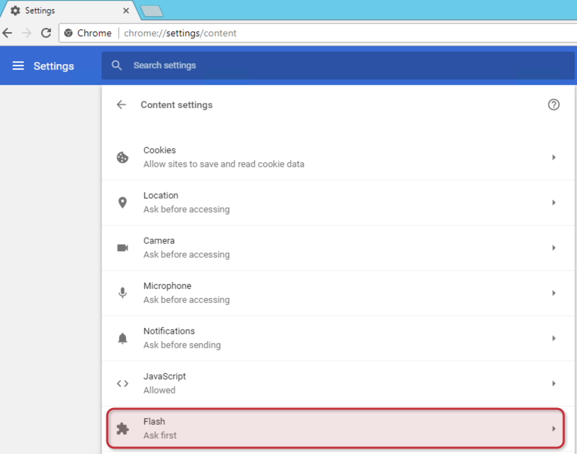

* Under Allow, click ADD

  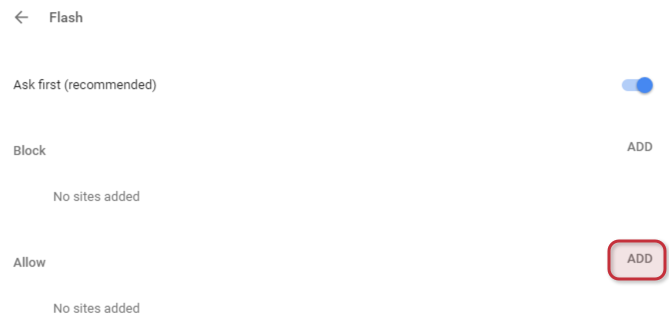

* Type in `[*.]dccf.ctl.io` then click ADD

  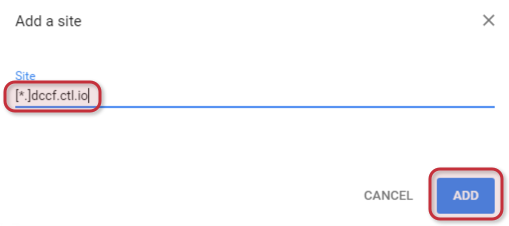

**Popups**
* Go to Settings -> Advanced -> Privacy and security -> Content settings -> Popups

  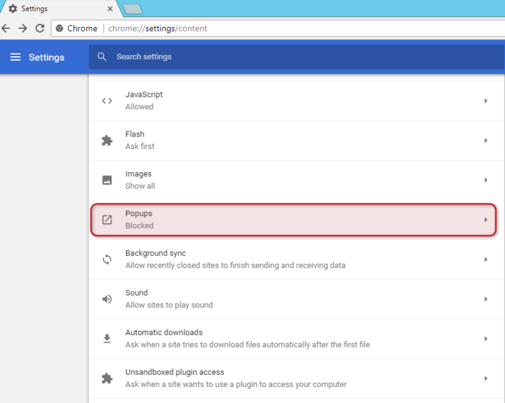

* Under Allow, click ADD

  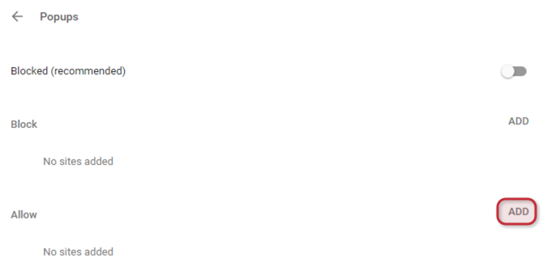

* Type in `[*.]dccf.ctl.io` then click ADD

  

**Trusted Sites**
* Go to Settings -> Advanced -> System -> Open proxy settings

  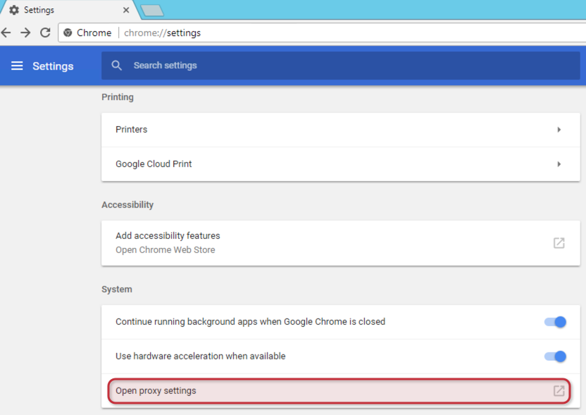

* Internet Properties (Internet Explorer) will open. Click the Security tab -> Trusted Sites -> Sites

  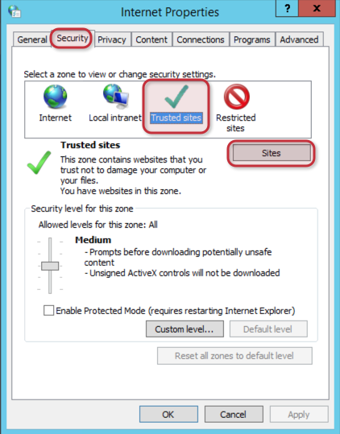

* In Add this website to the zone, type in `https://*.dccf.ctl.io`, then click Add, then Close

  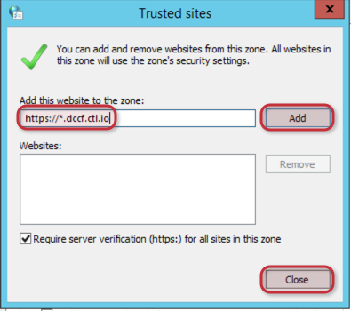

* Close all Chrome windows, then relaunch Chrome and go to your DCCF URL. When prompted to _Open VMware Client Integration Plug-in?_, check _Always open these types of links in the associated app_, then click _Open VMware Client Integration Plug-in_

  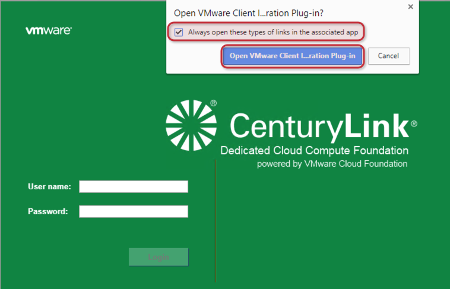

Note: When using the Upload OVF or Media functionality for the first time, you will be prompted whether to allow or deny Client Integration Access Control. When prompted, select Allow.

  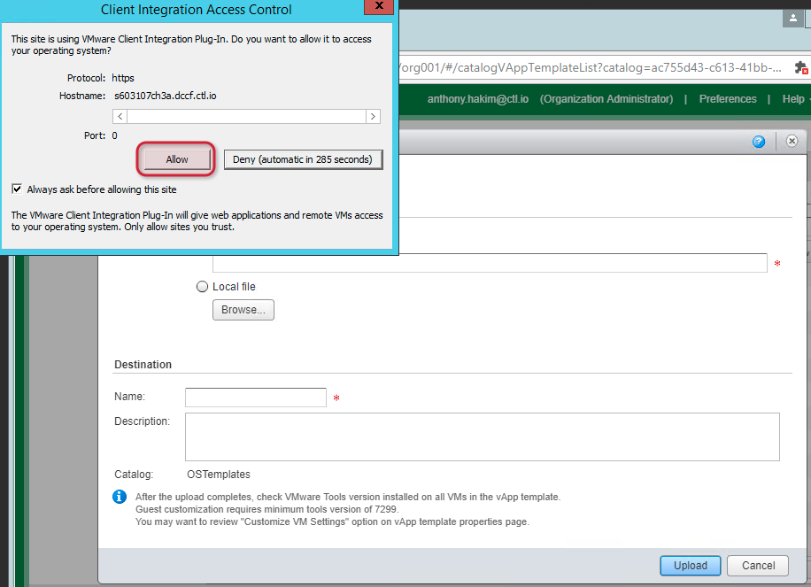

**Note:** Chrome is the recommended browser for full functionality.

### Browsers Supported on Macintosh Platforms
On Macintosh platforms, the vCloud Director Web Console is compatible with the most recent version of Mozilla Firefox, Google Chrome, and Safari and with their immediate predecessor versions.

#### Chrome on Mac
* [Download and install the Macintosh (Google Chrome) VMware Client Integration Plug-in (CIP)](https://kb.vmware.com/s/article/2145401).

Configure the following settings in Chrome:

**Flash**
* Go to Settings -> Advanced -> Privacy and security -> Content settings -> Flash

  

* Under Allow, click ADD

  

* Type in `[*.]dccf.ctl.io` then click ADD

  

**Popups**
* Go to Settings -> Advanced -> Privacy and security -> Content settings -> Popups

  

* Under Allow, click ADD

  

* Type in `[*.]dccf.ctl.io` then click ADD

  

**Trusted Sites**
* Go to Settings -> Advanced -> System -> Open proxy settings

  

* The Network app will open. Click the Proxies tab and add `*.dccf.ctl.io` to the **Bypass proxy settings for these Hosts & Domains:** section as indicated below, then click OK.

  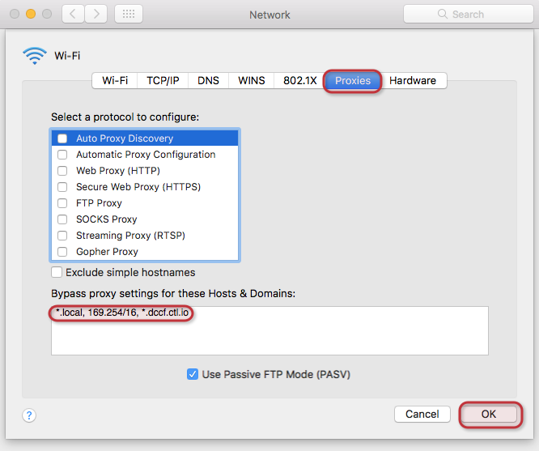

* Close System Preferences.

* Close all Chrome windows, then relaunch Chrome and go to your DCCF URL. When prompted to _Open VMware Client Integration Plug-in?_, check _Always open these types of links in the associated app_, then click _Open VMware Client Integration Plug-in_

  

Note: When using the Upload OVF or Media functionality for the first time, you will be prompted whether to allow or deny Client Integration Access Control. When prompted, select Allow.

  

**Note:** Chrome is the recommended browser for full functionality.

#### Safari on Mac
Not recommended.

**Note:** Chrome is the recommended browser for full functionality.

### Browsers Supported on Linux Platforms
On these Linux platforms, the vCloud Director Web Console is compatible with the most recent version of Mozilla Firefox and Google Chrome, and with their immediate predecessor versions.

* CentOS 7.x
* Red Hat Enterprise Linux 7.x
* Ubuntu 14.x

**Note:** Chrome is the recommended browser for full functionality.
