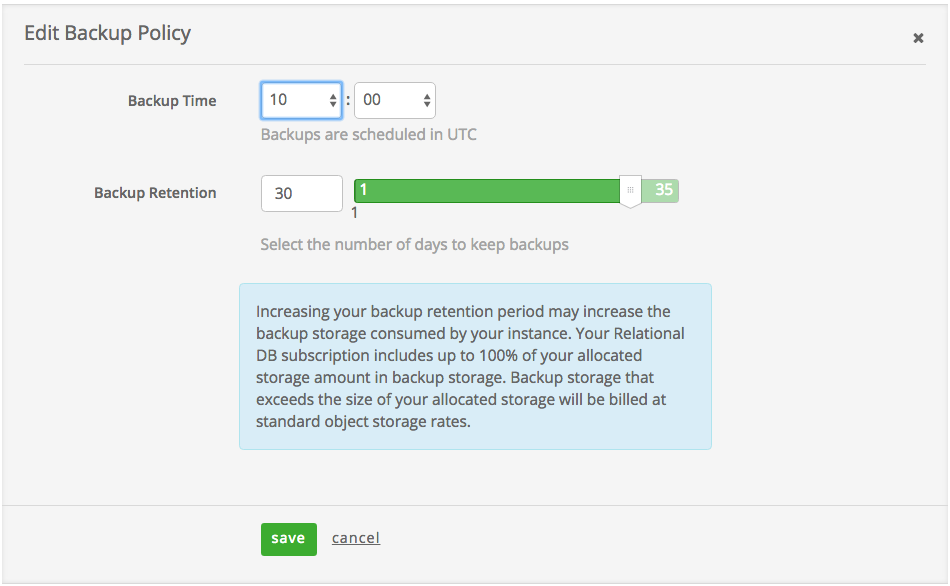
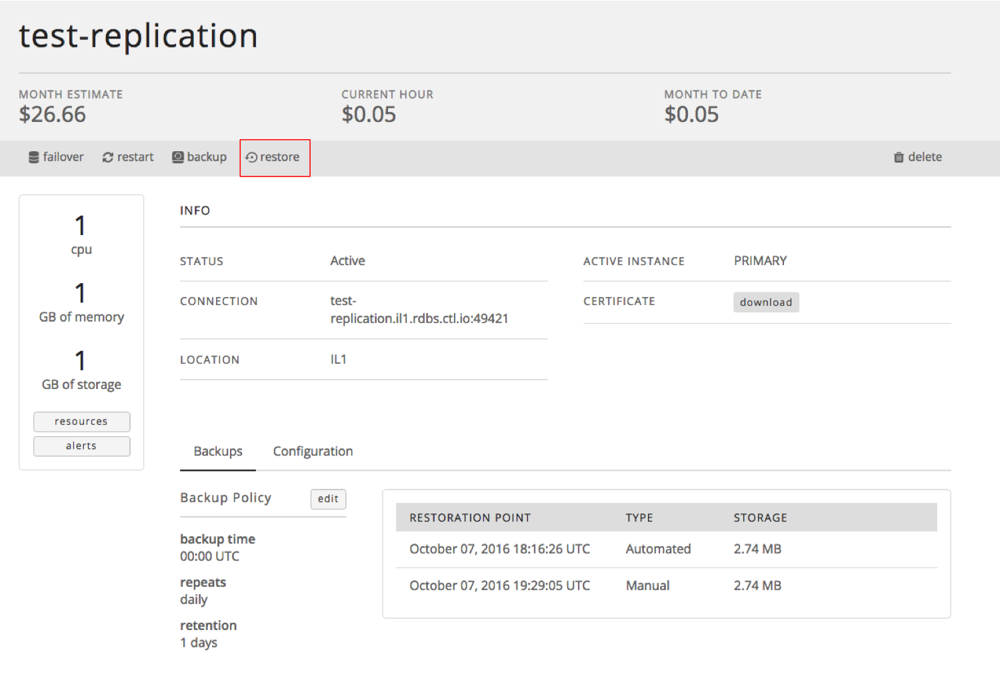

{{{
  "title": "Backups and Restores",
  "date": "05-24-2016",
  "author": "Christine Parr",
  "attachments": [],
  "related-products" : [],
  "contentIsHTML": false
}}}

### Audience
This article is to support customers of Relational DB Service, CenturyLink's database-as-a-service product. These instructions are specific to performing backups and restores through the Control Portal.

### Overview
CenturyLink's MySQL-compatible Relational DB Service is a database-as-a-service product that provides instant access to a database instance with SSL support, daily backups, restore functionality, basic monitoring and a replication option with auto-failover. Users can configure the amount of CPU, Memory, and Storage based on their database needs. They can choose to replicate their instance in a datacenter for a more highly available solution. As the customer's capacity needs grow, they can easily scale their CPU, RAM, and/or Storage with the click of a button.

### Prerequisites
Access to the CenturyLink Cloud Platform as an authorized user

### Relational DB Backups
The Relational DB service includes daily, automated hot backups as well as the ability to take a backup on demand. Users have the ability to define the time of day backups are run as well as a data retention policy. Backups are held off-site at least 350 miles from the datacenter housing the Relational DB instance.

### Data Sovereignty
The below details where backups are held in relation to the datacenter location of the primary instance. **Please note that for CA3 instances, our current backup strategy does not provide us an off-site location in Canada, so backups are being held in North America.**

**Primary Instance Datacenter Location**|**Backup Location**
-----------|-----------
UC1, VA1, IL1, NY1 |Oregon
GB3 |  Ireland
CA3 | Oregon
SG1 | Singapore

### Defining your Backup Policy

1. Upon provisioning of a Relational DB instance, the user is asked to define their Backup Schedule and their Backup Retention. The Backup Schedule governs the time of day all automated, daily backups are taken. Backup retention can be set to any value between 1 and 35 days. Please note that increasing your backup retention period may increase the backup storage consumed by your instance. Your Relational DB subscription includes up to 100% of your allocated storage amount in backup storage. Backup storage that exceeds the size of your allocated storage is billed at the Additional Backup Storage rate defined in the [pricing catalogue](https://www.ctl.io/pricing/#/va1).
   

2. Users may also change the backup policy of an existing Relational DB instance from the subscription details page. The details page includes a "Backup Policy" section with an "Edit" option.
   

3. When a user clicks the 'edit' button, a new section appears that allows the user to make changes to the backup policy. Simply change the backup time and/or backup retention to the new desired settings and click 'save'. The request results in the Relational DB instance being in a "Configuring" status for a few minutes, at which point no additional policy changes, backups, or restores can occur.
   

### Taking a Manual Backup
Users may choose to take a backup at any time. Manual backups are retained in accordance with the defined backup policy for that instance, but can also be deleted at any time by the user.
1. Identify the Relational DB instance for back up and click on the instance to navigate to the details page.

2. Click the 'backup' button on the action bar.

3. The action bar then indicates that there is a "backup in process" and the status of the instance is changed to "Backing Up".

4. Upon successful completion, the backup is listed and marked as "Manual".

   

### Restoring from Backup
A Relational DB instance can be restored from any available backup within the same account of equal or smaller storage size, or a user can define a specific point in time within the last week as the restore point. This enables developers to easily move their development environment into a production environment simply by creating a backup of development, creating a new instance for production, and restoring that new instance from the development environment's backup.

Similarly, the functionality enables users to pull back their production data into a test environment on a regular basis. Backups from a single instance can be restored to a replicated instance and vice versa, allowing the user to seamlessly transition data loads between environments with different levels of availability and performance.

1. A list of available backups for a given instance are displayed on the Subscription Details page. In order to restore from an available backup, navigate to the database instance to be restored and click the 'restore' button on the action bar.
   

2. When the 'restore' button is clicked, a new window is displayed.
   * The "Restore From" drop-down displays a list of all instances of equal or larger storage size. Select the instance you would like to restore from.
   * Once the user has selected the Relational DB instance they would like to restore from, they should select either "Full Restore" to select a previous full backup or "Point in Time Restore" to select a point in time within the last week as the restore point.  
   * When "Full Restore" is selected, a drop-down menu appears showing all available backups of qualifying size.
   * When "Point in Time Restore" is selected, the user is able to select a particular date and time as the restore point.
   * Select which restore point should be used and click "restore". During the restore process, the status of the instance will be set to "Restoring", at which point no other actions can be performed against the instance.
   

   
   

3. If you have questions or feedback, please submit them to our team by emailing <a href="mailto:rdbs-help@ctl.io">rdbs-help@ctl.io</a>.
