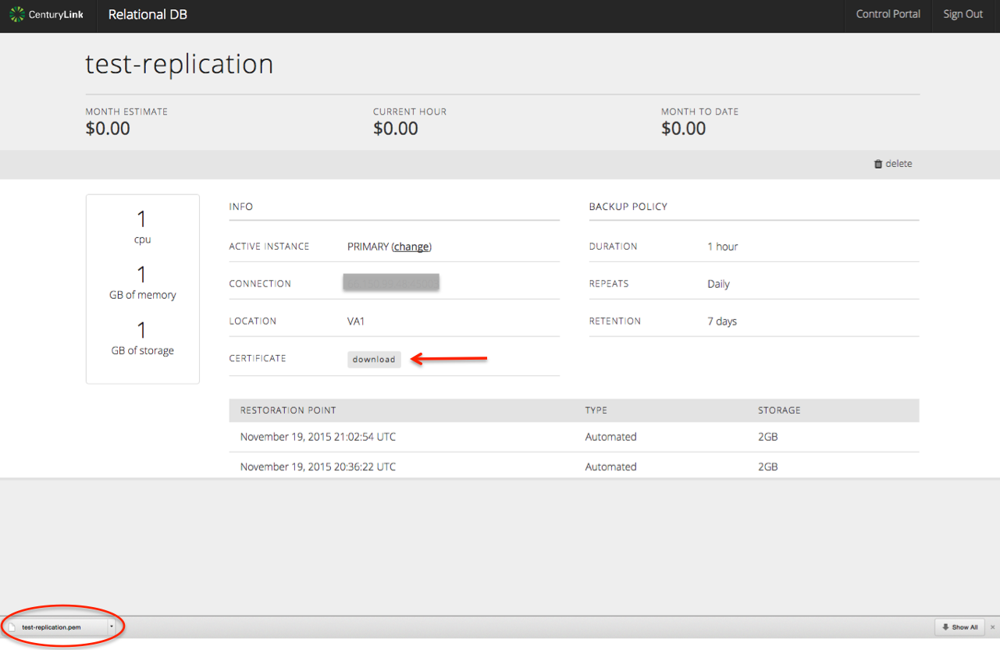

{{{
  "title": "Connecting to MySQL DBaaS over SSL-enabled Connection",
  "date": "11-22-2015",
  "author": "Lane Maxwell",
  "attachments": [],
  "related-products" : [],
  "contentIsHTML": false
}}}


#### IMPORTANT NOTE

CenturyLink Cloud’s MySQL-compatible Database-as-a-Service product is currently in a Limited Beta with specific customers by invitation only and is not intended for production usage.
During the Limited Beta there is no production Service Level Agreement.

#### Audience

Currently, this article is to support customers in the Limited Beta program.  Additionally, the steps below are for customers using the DBaaS service through our Beta UI.  For instructions on how to use your cert in AppFog, please see [Connecting to MySQL DBaas Over SSL on AppFogv2](../Database/connecting-to-mysql-dbaas-over-ssl-on-appfog.md).

## Connecting over SSL-enabled Connection

1.  Once in the user interface, you will see a list of your database subscriptions.  Locate and click on the subscription for which you need to download a certificate.  This will take you to a new screen with subscription details and a button to download your certificate.  When you click this button, you will download a file called [dbinsancename].pem. This is the certificate that will enable the SSL connection.  

2.  Once the certificate is downloaded, you can connect specifying the `--ssl-ca` parameter and pass in the certificate.
`mysql -h 10.0.0.1 -u admin -p --ssl-ca=/{path_to_download_location}/ca-cert.pem -P 49152`

3.  Once logged in, validate the SSL connection by using the show command.

`mysql> show status like 'Ssl_cipher';`

```
+---------------+--------------------+
| Variable_name | Value              |
+---------------+--------------------+
| Ssl_cipher    | DHE-RSA-AES256-SHA |
+---------------+--------------------+
1 row in set (0.07 sec)

mysql>
```
