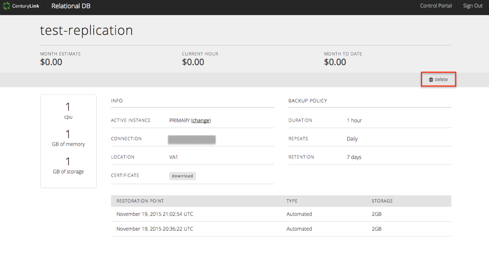

{{{
  "title": "Deleting a MySQL DBaaS Instance",
  "date": "08-14-2015",
  "author": "Christine Parr",
  "attachments": [],
  "related-products" : [],
  "contentIsHTML": false
}}}

#### IMPORTANT NOTE

CenturyLink Cloud’s MySQL-compatible Database-as-a-Service product is currently in a Limited Beta with specific customers by invitation only and is not intended for production usage.
During the Limited Beta there is no production Service Level Agreement.

#### Audience

Currently, this article is to support customers in the Limited Beta program.  Additionally, these instructions are specific to deleting a subscription that was created through the DBaaS user interface.

## Overview

Our MySQL-compatible Database-as-a-Service limited beta provides instant access to a MySQL-compatible database instance with SSL support, daily backups held for 7 days, basic monitoring and a replication option.  Users can configure the amount of CPU, Memory and Storage based on their database needs and can choose to replicate their instance in datacenter for a more highly available solution.

#### Prerequisites

- Access to the CenturyLink Cloud Platform as an authorized user
- Acceptance into the DBaaS Limited Beta Program
- Existing DBaaS Instance

## Deleting a MySQL DBaaS Subscription

1.  Browse to CenturyLink Cloud’s DBaaS Beta User Interface and login using your CenturyLink Cloud username and password.

2.	Navigate to the “Database Instances” screen, identify and click on the database subscription you would like to delete. This will take you to a details screen specific to that subscription.

3.  From the details screen, click on the delete button in the upper right hand side of the page, and click 'Yes' when prompted.  
