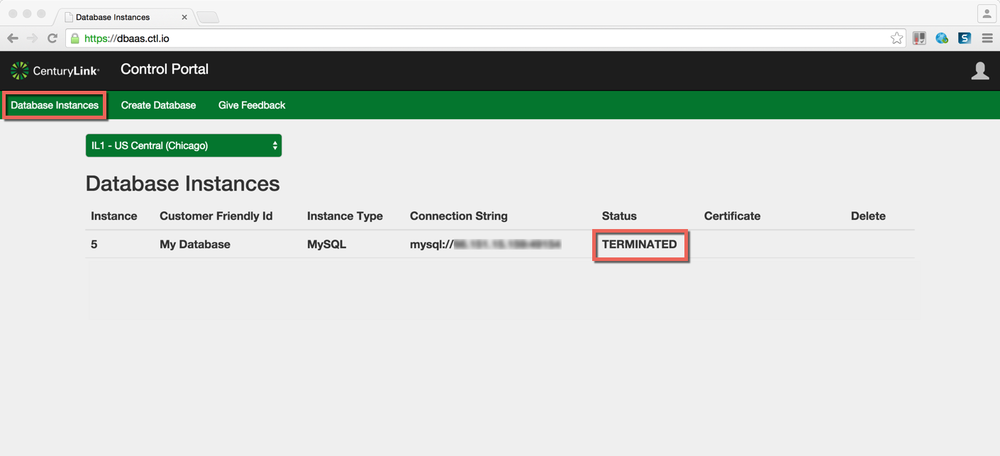

{{{
  "title": "Deleting a MySQL DBaaS Instance",
  "date": "08-14-2015",
  "author": "Christine Parr",
  "attachments": [],
  "related-products" : [],
  "contentIsHTML": false
}}}

#### IMPORTANT NOTE

CenturyLink Cloud’s MySQL-compatible Database-as-a-Service product is currently in a Limited Beta with specific customers by invitation only and is not intended for production usage.
During the Limited Beta there is no production Service Level Agreement.

#### Audience

Currently, this article is to support customers in the Limited Beta program.  Additionally, these instructions are specific to deleting a subscription that was created through the DBaaS user interface.

## Overview

Our MySQL Database-as-a-Service limited beta provides instant access to a single MySQL-compatible database instance with SSL support, daily backups held locally for 7 days and basic monitoring.  The free beta is limited to a 1vCPU/1GB database instance with up to 100 MB storage and support for 100 concurrent connections in IL1 datacenter.

#### Prerequisites

- Access to the CenturyLink Cloud Platform as an authorized user
- Acceptance into the DBaaS Limited Beta Program
- Existing DBaaS Instance

## Deleting a MySQL DBaaS Subscription

1.  Browse to CenturyLink Cloud’s DBaaS Beta User Interface and login using your CenturyLink Cloud username and password.

2.	Navigate to the “Database Instances” screen, identify the database subscription you would like to delete, and click the delete button. 

3.  After the database instance is deleted, the status will indicate "Terminated". 
