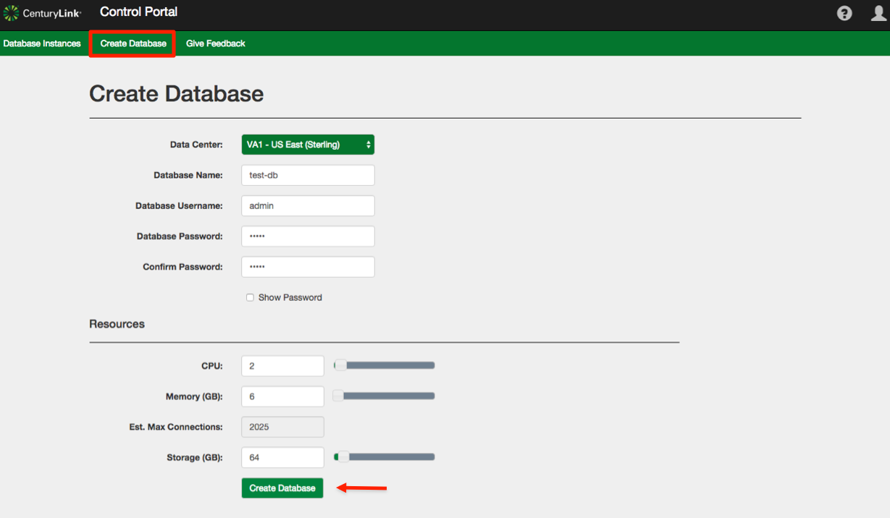
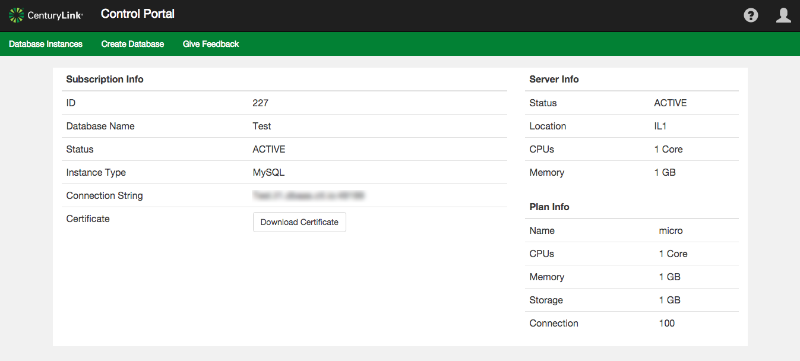
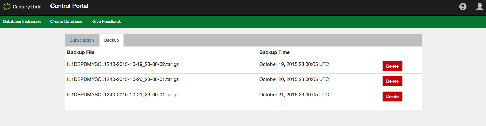

{{{
  "title": "Getting Started with MySQL DBaaS",
  "date": "11-3-2015",
  "author": "Christine Parr",
  "attachments": [],
  "related-products" : [],
  "contentIsHTML": false,
  "sticky": true
}}}

#### IMPORTANT NOTE

CenturyLink Cloud’s MySQL-compatible Database-as-a-Service product is currently in a Limited Beta with specific customers by invitation only and is not intended for production usage.
During the Limited Beta there is no production Service Level Agreement.

#### Audience

Currently, this article is to support customers in the Limited Beta program.  Additionally, these instructions are specific to provisioning service directly through the DBaaS user interface.  

## Overview

Our MySQL Database-as-a-Service limited beta provides instant access to a single MySQL-compatible database instance with SSL support, daily backups held for 7 days and basic monitoring.  The free beta now allows a user to configure the amount of CPU, Memory and Storage based on their database needs.  For users that would like some sizing guidance, below are a few common configurations and an approximate number of max connections that can be expected for that size:

**Micro**|**Small**|**Medium**|**Large**|**X-Large**
-----------|-----------|--------------|------------ |------------
CPUs: 1 Core Memory: 1 GB Storage: 1 GB Connections: 80|CPUs: 1 Core Memory: 2 GB Storage: 1 GB Connections: 470|CPUs: 2 Core Memory: 6 GB Storage: 64 GB Connections: 2025|CPUs: 4 Core Memory: 16 GB Storage: 256 GB Connections: 5900 |CPUs: 8 Core Memory: 32 GB Storage: 512 GB Connections: 12000

#### Prerequisites

- Access to the CenturyLink Cloud Platform as an authorized user.
- Acceptance into the DBaaS Limited Beta Program

## Configuring a New MySQL-compatible DBaaS Subscription

1.	Browse to CenturyLink Cloud’s DBaaS Beta User Interface.

2.  Input your CenturyLink Cloud username and password and click the login button. 

3.  Click on the Create Database tab.

4.	Select datacenter from the drop-down menu, enter a dns-friendly name for the database, and select your **database** username and password.  Provide values for the amount of CPU, Memory and Storage to provision.  The **estimated** max connections will auto-populate based on your memory selection.  Click “Create Database”.  

5.  When created, you will be returned your database information including connection string and can choose to download your certificate at that time. 

6.  You can view a list of all your database subscriptions with connection string info on the "Database Instances" tab.  From this screen, you can also download your certificate or delete your subscription and can filter on active or terminated instances.  

7. Click on your subscription from the 'Database Instances' screen to view your subscription details as well as a list of your available backups.  

8. Use the provided connection string information to administer your MySQL instance using standard command line interface from your favorite MySQL client.

9.  If you have questions or feedback, please submit them to our team using the feedback button. 
