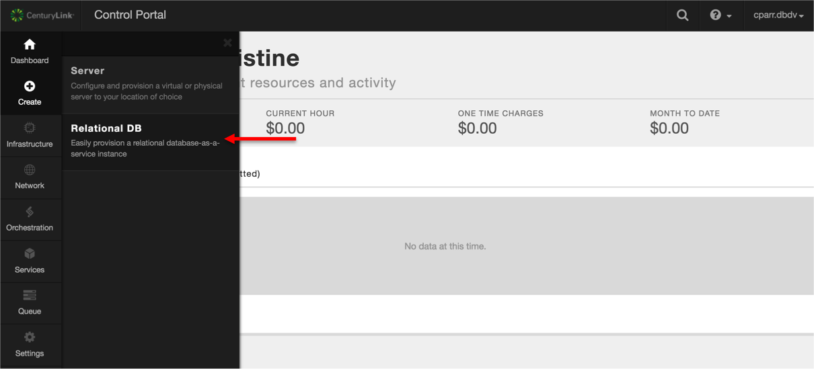
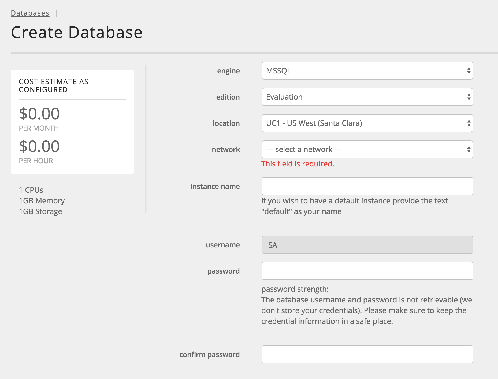
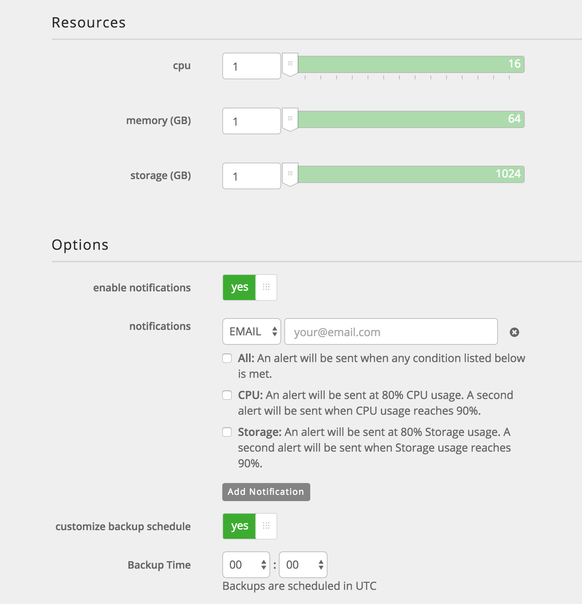
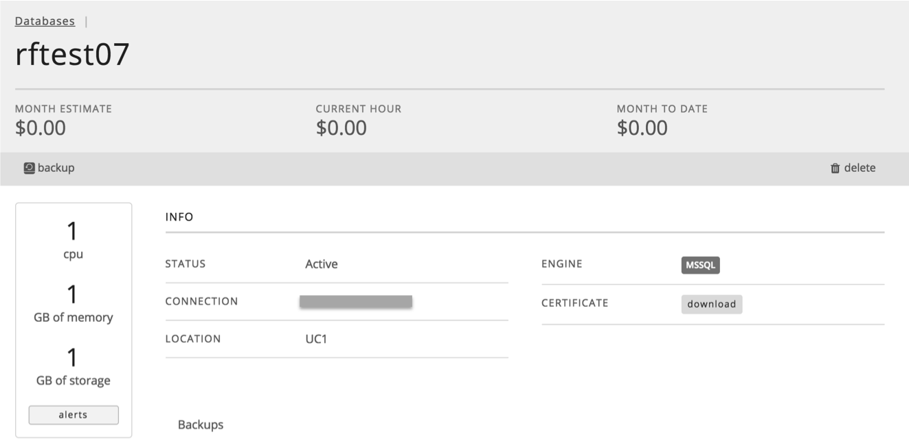
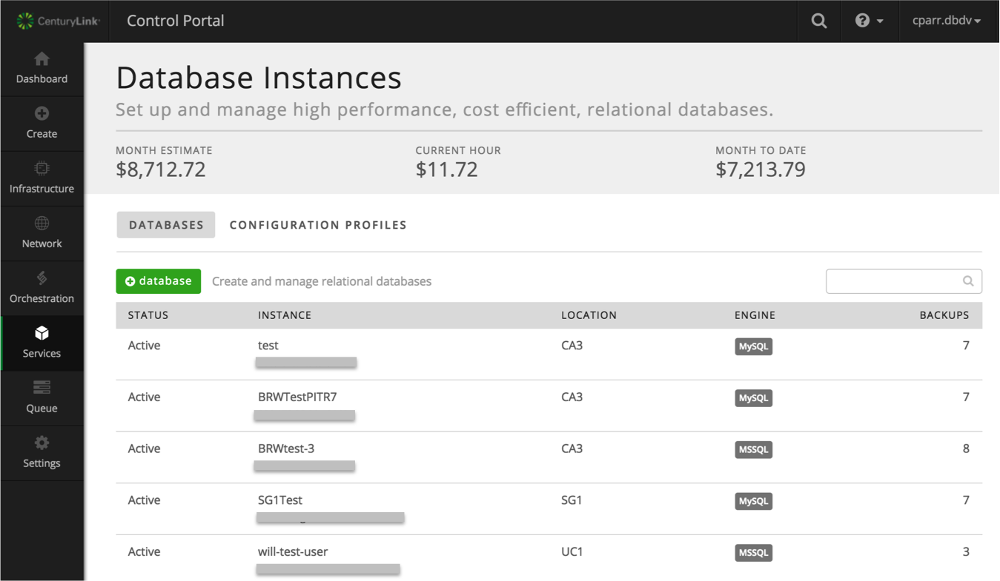

{{{
  "title": "Getting Started with MSSQL Relational DB Beta",
  "date": "10-26-2016",
  "author": "Christine Parr",
  "attachments": [],
  "related-products" : [],
  "contentIsHTML": false,
  "sticky": true
}}}

### Audience
This article is to support beta customers of MSSQL Relational DB Service, CenturyLink's MSSQL database-as-a-service product.  These instructions are specific to getting started provisioning and using a MSSQL beta instance directly through the Control Portal.

### Overview
CenturyLink's MSSQL Relational DB Service is currently in Limited Beta program.  **The beta program is open to approved users for a period of 60 days.  All instances will be deleted on day 60 if the instance has not already been deleted.**  If you are interested in joining the beta program, please visit the [product page](https://www.ctl.io/relational-database/) and enter your email address to initiate the request.     

MSSQL Relational DB, currently in BETA, is a database-as-a-service product that provides quick access to a MSSQL database instance with daily backups held offsite for 7 days, configurable backup time, basic monitoring and resource utilization alerts.  

### Prerequisites
* Access to the CenturyLink Cloud Platform as an authorized user
* Acceptance into the Beta Program

### Configuring a New MSSQL Relational DB Subscription
1. Browse to CenturyLink Cloud’s Relational DB UI through the Control Portal or directly at [rdbs.ctl.io](https://rdbs.ctl.io).

  

2. Click the 'Create Database' button from the Database Instances screen to provision your database instance.

3. Select a datacenter from the drop-down menu, enter a dns-friendly name for the database, and select your **database** password.

4. Make your database selections.
  * Provide values for the amount of CPU, Memory, and Storage to provision.
  * If you would like to be notified when your CPU or Storage reaches 80% and 90% of capacity, move the slider to choose to "enable notifications".  This will then prompt you for an email address to be used for the notifications.
  * If you would like to define the time of day your backup is run, move the slider to choose "customize backup schedule" and select the time of day in UTC you would like backups to run . If no customization is made, backups will run at 0:00 UTC.

5. Click “Create Database”. Your database information will be returned, including connection string.
   

6. You can view a list of all your database subscriptions with the datacenter and connection string information on the "Database Instances" tab.  Here you will see both MSSQL and MySQL instances if you are also a MySQL Relational DB customer.

   

7. Click on any instance to view subscription details and available backups or perform any of the following actions:
   * Change your alert notification settings.
   * Delete your instance.
   * Delete a Backup.
   * Perform a manual backup.
   * Download an SSL Certificate.

11. Use the connection string information provided to administer your instance using standard command line interface or from your favorite MSSQL client.

12. If you have questions or feedback, please submit them to our team by emailing <a href="mailto:rdbs-help@ctl.io">rdbs-help@ctl.io</a>.
