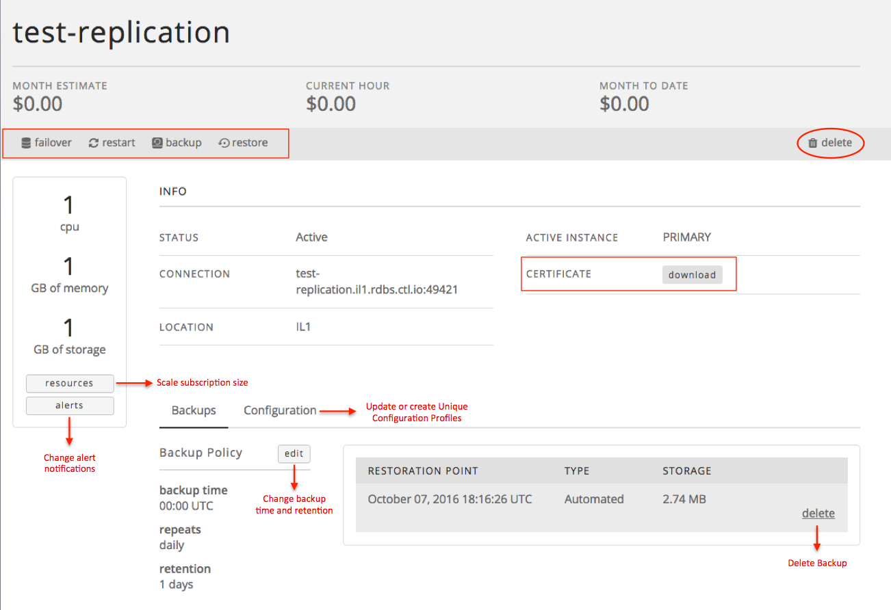

{{{
  "title": "Getting Started with Relational DB Service",
  "date": "02-29-2016",
  "author": "Christine Parr",
  "attachments": [],
  "related-products" : [],
  "contentIsHTML": false,
  "sticky": true
}}}

#### Audience

This article is to support customers of Relational DB Service, CenturyLink's MySQL-compatible database-as-a-service product.  Additionally, these instructions are specific to provisioning service directly through Control Portal.

## Overview

CenturyLink's Relational DB Service is a MySQL-compatible database-as-a-service that provides instant access to a database instance with SSL support, daily backups, basic monitoring and a replication option.  Users can configure the amount of CPU, Memory and Storage based on their database needs and can choose to replicate their instance in datacenter for a more highly available solution.  As customers' capacity needs grown, they can easily scale their CPU, RAM and/or Storage through the click of a button.  

For users that would like some sizing guidance, below are a few common configurations:

**Micro**|**Small**|**Medium**|**Large**|**X-Large**
-----------|-----------|--------------|------------ |------------
CPUs: 1 Core Memory: 1 GB Storage: 1 GB |CPUs: 1 Core Memory: 2 GB Storage: 1 GB|CPUs: 2 Core Memory: 6 GB Storage: 64 GB|CPUs: 4 Core Memory: 16 GB Storage: 256 GB |CPUs: 8 Core Memory: 32 GB Storage: 512 GB

#### Prerequisites

- Access to the CenturyLink Cloud Platform as an authorized user.

## Configuring a New MySQL-compatible Relational DB Subscription

1.	Browse to CenturyLink Cloud’s Relational DB UI through the Control Portal or directly at [rdbs.ctl.io](https://rdbs.ctl.io).

2.  Click on the "Create Database" button from the Database Instances screen to provision your database instance.

3.	Select datacenter from the drop-down menu, enter a dns-friendly name for the database, and select your **database** username and password.  

4. Provide values for the amount of CPU, Memory and Storage to provision. You can view the monthly and hourly pricing for the selected configuration.

5. Indicate whether you would like your database instance to be replicated.  If selected, a replica of the primary database will be created and failover will occur automatically if the primary instance becomes unavailable.  The replication feature comes at a higher price point, so notice how estimated charges change when you choose Replication.  

6.  Customize your Backup Schedule if you wish.  If no customization is made, backups will run at 0:00 UTC.  

7.  Define your Backup Retention.  You may select any retention policy between 1 day - 35 days.  
**Please note: Your Relational DB subscription includes up to 100% of your allocated storage amount in backup storage.  Backup storage that exceeds the size of your allocated storage will be billed at the 'Additional Backup Storage' rates defined in the pricing catalogue.  Backups are compressed in order to reduce the amount of backup storage used.**

8.  Click “Create Database”.  You will quickly be returned your database information including connection string and can choose to download your certificate at that time. 

9.  You can view a list of all your database subscriptions with datacenter and connection string information on the "Database Instances" tab.    

10. Click on any instance to view subscription details and available backups or to perform any of the following actions:
    - Download your certificate
    - Failover between Primary and Replica (for replicated instances only)
    - Change your alert notification settings
    - Change your scheduled backup time
    - Change your backup retention policy
    - Scale subscription size
    - Delete your instance
    - Delete a Backup

11. Use the provided connection string information to administer your MySQL instance using standard command line interface or from your favorite MySQL client.

12.  If you have questions or feedback, please submit them to our team by emailing <a href="mailto:rdbs-help@ctl.io">rdbs-help@ctl.io</a>.
