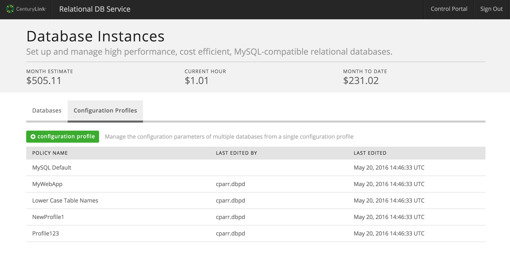
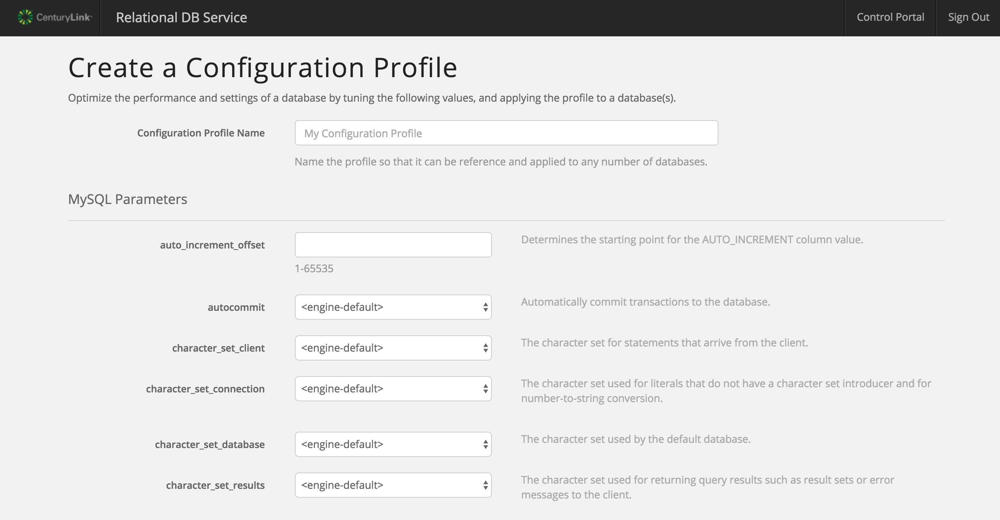
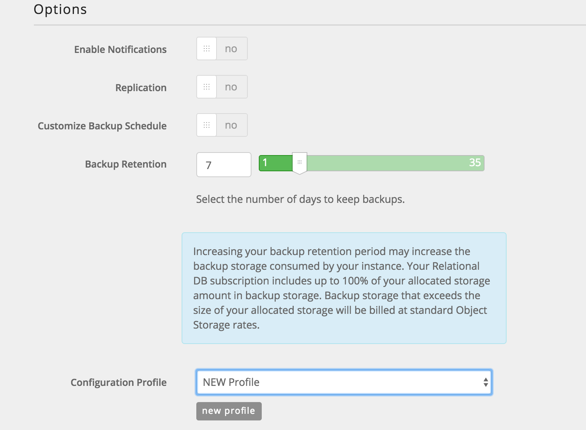
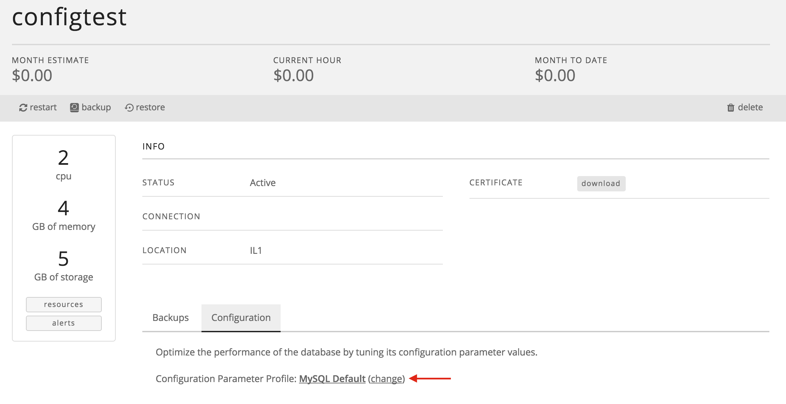
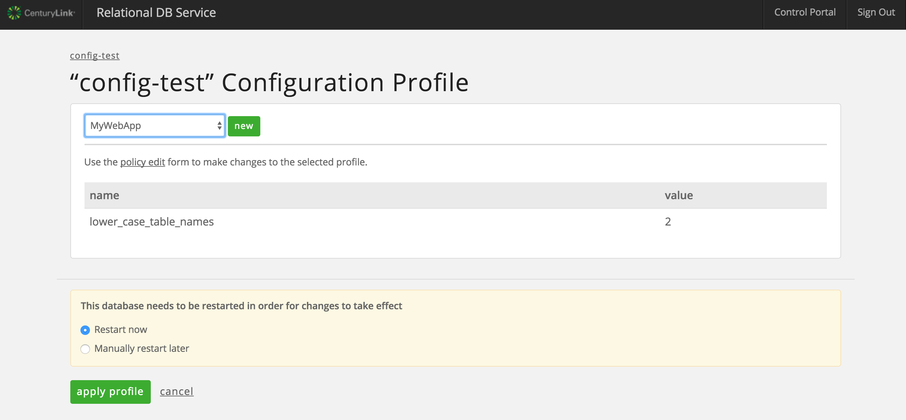
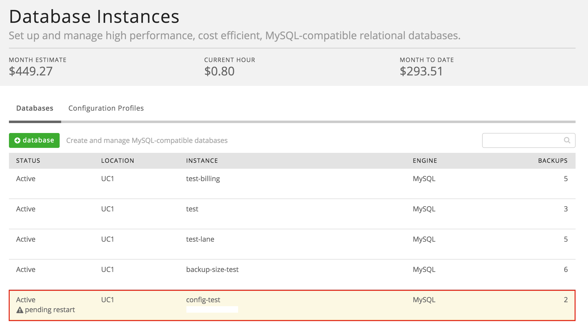
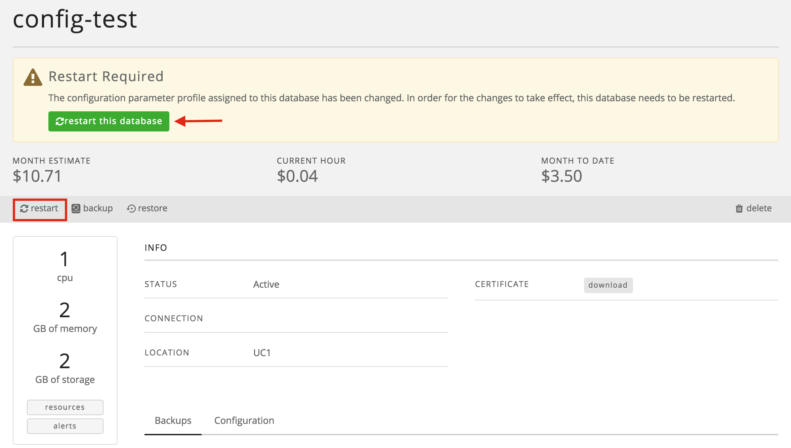

{{{
  "title": "Using Custom MySQL Configuration Profiles",
  "date": "05-25-2016",
  "author": "Christine Parr",
  "attachments": [],
  "related-products" : [],
  "contentIsHTML": false
}}}

### Audience

This article is to support customers of Relational DB Service, CenturyLink's MySQL compatible database-as-a-service product.  Additionally, these instructions are specific to customizing your MySQL configuration settings through the CenturyLink Control Portal.

### Overview

CenturyLink's Relational DB Service is a MySQL-compatible database-as-a-service that provides instant access to a database instance with SSL support, daily backups, basic monitoring and a replication option.  Users can configure the amount of CPU, Memory and Storage based on their database needs and can choose to replicate their instance in datacenter for a more highly available solution.  As customers' capacity needs grown, they can easily scale their CPU, RAM and/or Storage through the click of a button.

### Prerequisites

- Access to the CenturyLink Cloud Platform as an authorized user

### Creating a New Configuration Profile

1. Browse to CenturyLink Cloud’s Relational DB UI through the Control Portal or directly at [rdbs.ctl.io](https://rdbs.ctl.io).

2.	Click on the "Configuration Profiles" tab.  From here, you will see the "MySQL Default" profile which is automatically assigned to all Relational DB instances if a user-defined profile is not selected.  You will also see any custom profiles that a user has created for your account.

3. To create a new Configuration Profile.  Click on the green "Configuration Profile" button which will open a new screen with a list of all configurable parameters.  Edit the parameters to meet your needs and click "create profile" at the bottom of the page.

4.  At this point, your new Configuration Profile is not associated to any Relational DB instance.  Please see next section for applying a custom Configuration Profile.

### Applying Your Custom Configuration Profile

1. You can apply a custom Configuration Profile to a new Relational DB instance at time of creation or to an existing instance.

2. To create a new Relational DB instance with an existing Configuration Profile, navigate to CenturyLink Cloud’s Relational DB UI through the Control Portal or directly at [rdbs.ctl.io](https://rdbs.ctl.io).  From the "Databases" tab, click on the green "+ database" button.

3. When creating a new Relational DB instance, you are able to customize several options.  Listed in the "Options" section of the UI, is a drop down box that includes all available "Configuration Profiles" for your account. Simply select the profile you would like to use before clicking on "Create Database".

4. To change the Configuration Profile of an existing instance, select the database instance you would like to change in order to navigate to the details screen for that instance.  Click on the "Configuration" tab to view the current profile that is applied, and click "change".

5.  Once you have selected to make a change, you will be taken to a new screen that will allow you to either define a new profile or select an existing Configuration Profile from a drop down box at the top. Select the new Configuration Profile you would like associated to the instance.  **In order for these changes to take effect, the database instance must be restarted!**  You will be asked to select whether to restart the database instance now or to manually restart later.  Make a selection and click apply.

6.  If you choose to restart later, the instance will be flagged for restart until the restart occurs.

7.  When you are ready to restart, navigate to the details page for that instance by clicking on the instance from the main screen.  From here, you can restart your instance.

8.  If you have questions or feedback, please submit them to our team by emailing <a href="mailto:rdbs-help@ctl.io">rdbs-help@ctl.io</a>.
