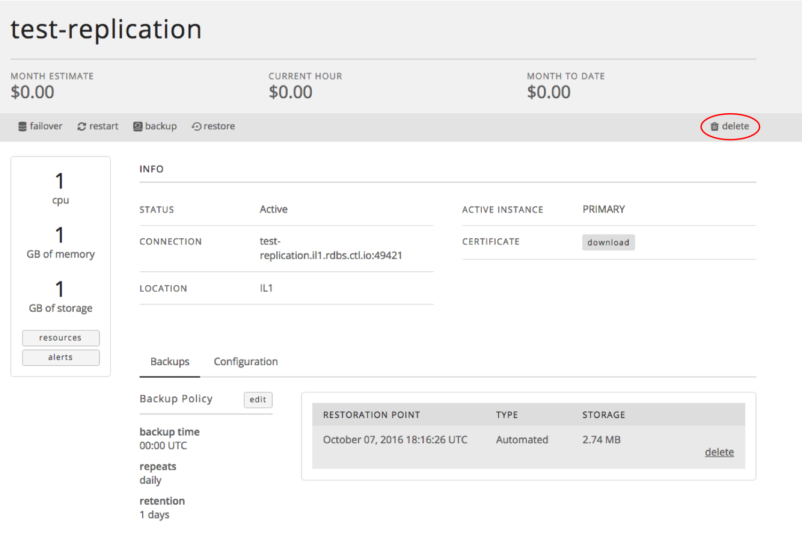

{{{
  "title": "Deleting a Relational DB Instance",
  "date": "10-22-2017",
  "author": "Brian Waganer",
  "keywords": ["clc", "cloud", "database", "db", "dbaas", "delete"],
  "attachments": [],
  "related-products" : [],
  "contentIsHTML": false
}}}

### Audience
This article is to support customers of Relational DB Service, CenturyLink's database-as-a-service product. These instructions are specific to deleting a subscription that was created through the Control Portal.

### Overview
CenturyLink's Relational DB Service is a database-as-a-service product that provides instant access to a database instance with SSL support, daily backups, restore functionality, basic monitoring and a replication option with auto-failover. Users can configure the amount of CPU, Memory, and Storage based on their database needs. They can choose to replicate their instance for a more highly available solution. As the customer's capacity needs grow, they can easily scale their CPU, RAM, and/or Storage with the click of a button.

### Prerequisites
* Access to the CenturyLink Cloud Platform as an authorized user
* Existing Relational DB Instance

### Deleting a Relational DB Instance
1. Browse to CenturyLink Cloud’s Relational DB UI through the Control Portal or directly at [rdbs.ctl.io](https://rdbs.ctl.io).

2. Navigate to the “Database Instances” screen. Identify and click on the database subscription you would like to delete. This takes you to a details screen specific to that subscription.

3. From the details screen. Click the 'delete' button in the upper right corner of the page. Then, click 'Yes' when prompted. This will delete any replica databases as well. Note: it's not possible to delete a replica without deleting the entire instance.
   

4. As part of the Delete process, we automatically execute one last backup.  This backup will be kept for 3 months.  This is to help safeguard people from themselves.  And allows you a very easy way to recover if you choose to.  If you know for sure you won't use it you can manually delete that backup.

5. If you have questions or feedback, please submit them to our team by emailing <a href="mailto:rdbs-help@ctl.io">rdbs-help@ctl.io</a>.
