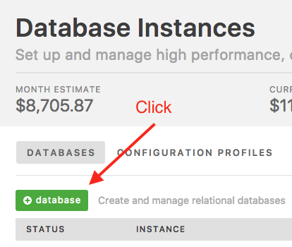
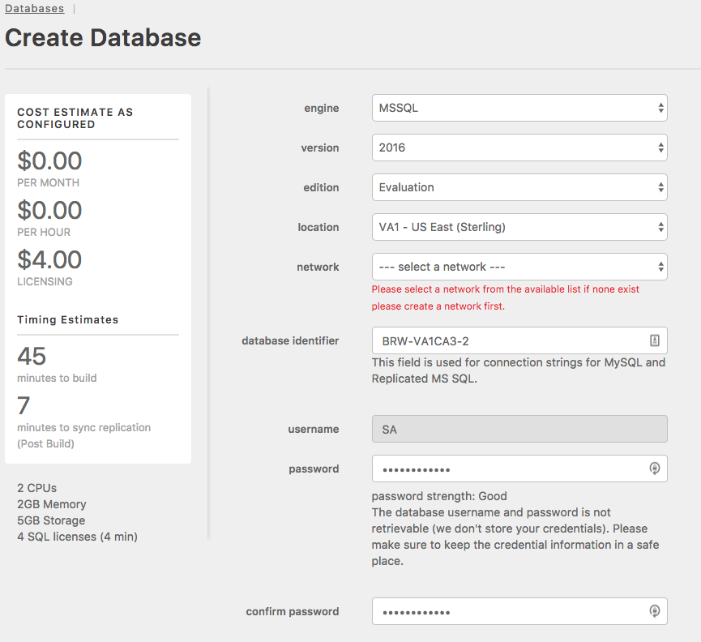
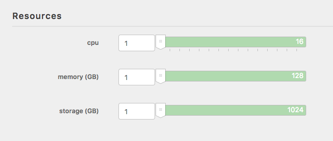
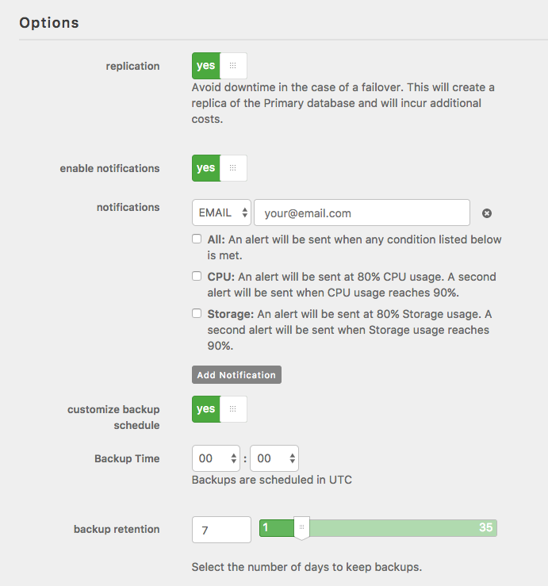
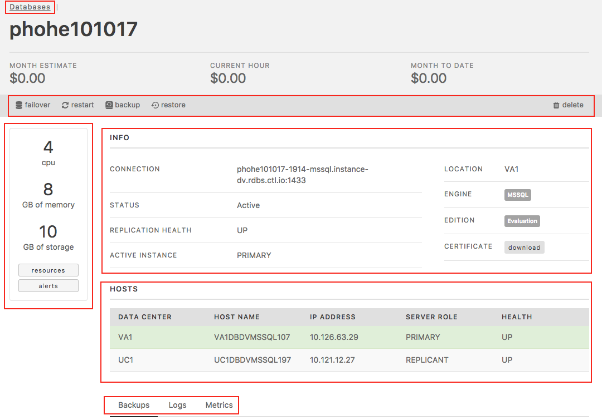
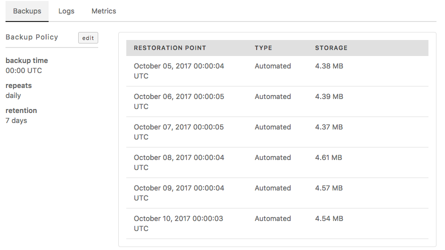
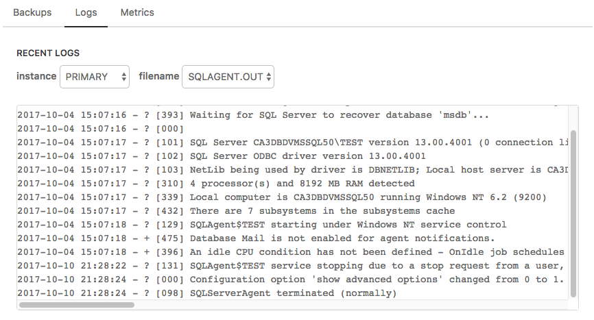
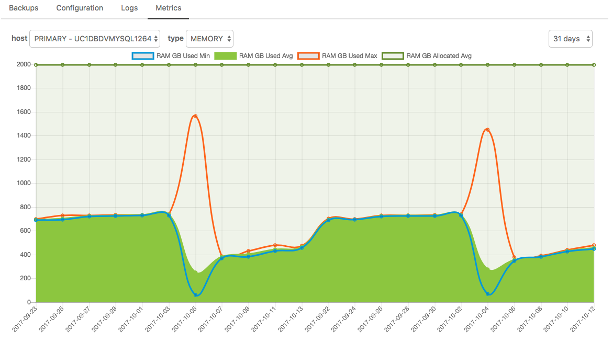

{{{
  "title": "Getting Started with MSSQL Relational DB",
  "date": "10-22-2017",
  "author": "Brian Waganer",
  "keywords": ["clc", "cloud", "database", "db", "dbaas", "mssql", "mysql"],
  "attachments": [],
  "related-products" : [],
  "contentIsHTML": false,
  "sticky": true
}}}

### Audience
This article is to support customers of Relational DB Service, Lumen's database-as-a-service product. These instructions are specific to getting started provisioning and using a SQL Server instance directly through the Control Portal.

### Overview
Lumen's Relational DB Service is a database-as-a-service product that provides access to a MSSQL database instance with SSL support, daily backups, restore functionality, logs, OS monitoring, notifications, and a replication option with manual-failover. Users can configure the amount of CPU, Memory, and Storage based on their database needs. Customers with High Available needs can choose to replicate their instance in-datacenter or cross-datacenter depending upon their HA solution. As the customer's capacity needs grow, they can easily scale their CPU, RAM, and/or Storage with the click of a button.

RelationalDB Microsoft SQL Server is created on a VM inside your account under a hidden folder.  Since this is inside your account that is why we ask what Network you want the Database(s) to be created in.

### Prerequisites
* Access to the Lumen Cloud Platform as an authorized user

### Connectivity
Since the msSQL RelationalDB databases are in your own network and don't have a Public IP address on the databases.  If you try to access them from your desktop with Microsoft SQL Server Management Studio you will first have to open your VPN to your account.  If you're just connecting to them from an application server you won't need a VPN, given your firewalls are set up correctly in CLC.

Replicated databases, just like stand-alone DBs, have their own non-public IPs. A DNS entry is used to point to the correct Private IP based upon which is the active database.  This allows your connection string to be consistent, and not needing to be changed in the case of a fail-over.

### Configuring a New MSSQL Relational DB Subscription
1. Browse to Lumen Cloud’s Relational DB UI through the Control Portal by clicking on Create->Relational DB, or Services->RelationalDB, or directly at [rdbs.ctl.io](https://rdbs.ctl.io).

   
   

2. Click the '+Database' button from the "Database Instances" screen to provision a new database instance.

   

3. Select a the engine: "MSSQL (2016)", edition, location, network, enter an instance name (dns-friendly) for the database, and enter your DB password.  Please make sure not to lose this password.  We do not store it.

   

4. Set the Resources for your database.
   * Select amount of CPU, Memory, and Storage to provision.

   

5. Setup the Options section
   * If you would like your DB/Instance to be Replicated, move the slider. If selected, a replica of the primary database is created. Failover occurs automatically if monitoring senses the active instance down. Notice how estimated charges change when you choose Replication.
   * If you would like to be notified when your CPU or Storage reaches 80% and 90% of capacity, move the slider to choose to "enable notifications".  This will then prompt you for an email address to be used for the notifications.
   * If you would like to define the time of day your backup is run, move the slider to choose "customize backup schedule" and select the time of day in UTC you would like backups to run. If no customization is made, backups will run at 0:00 UTC.
   * If you would like to change your backup retention period

   

6. Click “Create Database”. Your database information will be returned, including connection string.

   

7. You can view a list of all your database subscriptions with the datacenter and connection string information on the "Database Instances" tab.  Here you will see both MSSQL and MySQL instances if you are also a MySQL Relational DB customer.

   

8. Click on any instance name to view subscription details. From there you can:
   * Breadcrumbs
     * Databases (Takes you back to the Summary Page)
   * Action Bar
     * Failover (If your Db is replicated)
     * Restart your VM
     * Backup your Instance/DB
     * Restore a Backup to your Instance
     * Delete your instance
   * Resource Box on the left side
     * Change Resources (CPU, RAM, Disk
     * Change your alert notification settings
   * Info Section
     * Download an SSL Certificate
     * Use the connection string information provided to connect from your favorite Database client.
   * Hosts Section (Currently only in msSQL)
     * The one highlighted shows you the active server
     * This also shows you the Health of each server in a replication
   * Detail Tab Bar

   

     * The Details Tab Bar (Backups)
        * Change your Backup Policy
        * Delete backups (Hover over backup to delete)
        

     * Configuration (Currently not on msSQL)
        * Allows you to connect a DB to a Configuration Parameter Profile

     * Logs (Displays log files in near real-time)
        * Instance (Pick the server you want to look at)
        * Filename (list of the log files you can look at)
        

     * Metrics (Shows OS level metrics)
        * Host (Pick which server you want to look at)
        * Type (CPU, Memory, Storage)
        * Graph Time Range (1 hour, 1 day, 31 days)
        * If you don't want to see a metric click on it in the Ledgen
        

If you have questions or feedback, please submit them to our team by emailing <a href="mailto:rdbs-help@ctl.io">rdbs-help@ctl.io</a>.
