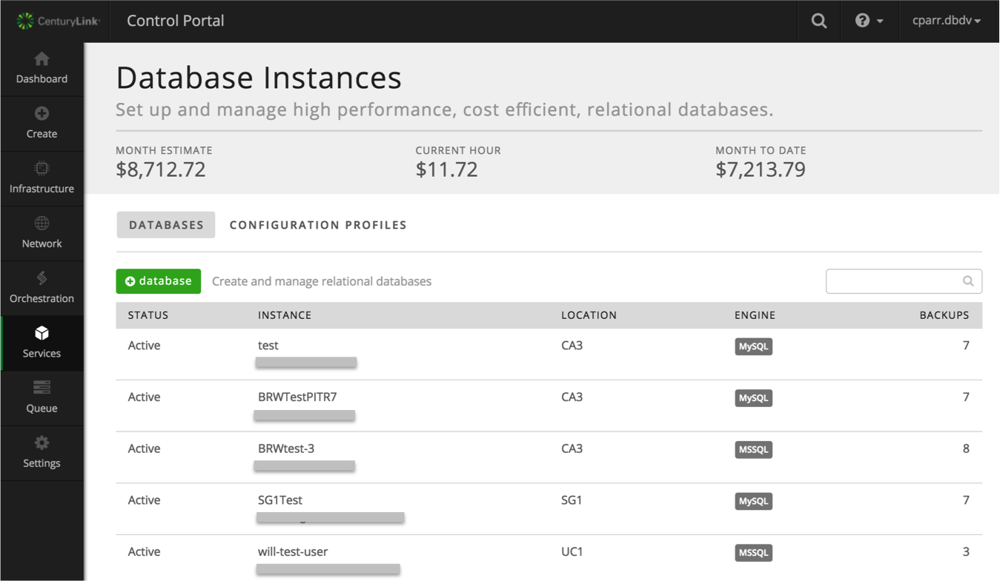

{{{
  "title": "Getting Started with MSSQL Relational DB",
  "date": "10-22-2017",
  "author": "Brian Waganer",
  "attachments": [],
  "related-products" : [],
  "contentIsHTML": false,
  "sticky": true
}}}

### Audience
This article is to support customers of Relational DB Service, CenturyLink's database-as-a-service product. These instructions are specific to getting started provisioning and using a SQL Server instance directly through the Control Portal.

### Overview
CenturyLink's Relational DB Service is a database-as-a-service product that provides instant access to a MSSQL database instance with SSL support, daily backups, restore functionality, logs, OS monitoring, notifications, and a replication option with manual-failover. Users can configure the amount of CPU, Memory, and Storage based on their database needs. Customers with High Available needs can choose to replicate their instance in-datacenter or cross-datacenter depending upon their HA solution. As the customer's capacity needs grow, they can easily scale their CPU, RAM, and/or Storage with the click of a button.

### Prerequisites
* Access to the CenturyLink Cloud Platform as an authorized user

### Configuring a New MSSQL Relational DB Subscription
1. Browse to CenturyLink Cloud’s Relational DB UI through the Control Portal or directly at [rdbs.ctl.io](https://rdbs.ctl.io).

2. Click the 'Create Database' button from the Database Instances screen to provision your database instance.

3. Select a datacenter from the drop-down menu, enter a dns-friendly name for the database, and select your **database** password.
  

4. Make your database selections.
  * Select amount of CPU, Memory, and Storage to provision.
  * If you would like to be notified when your CPU or Storage reaches 80% and 90% of capacity, move the slider to choose to "enable notifications".  This will then prompt you for an email address to be used for the notifications.
  * If you would like to define the time of day your backup is run, move the slider to choose "customize backup schedule" and select the time of day in UTC you would like backups to run. If no customization is made, backups will run at 0:00 UTC.
  

5. Click “Create Database”. Your database information will be returned, including connection string.
   

6. You can view a list of all your database subscriptions with the datacenter and connection string information on the "Database Instances" tab.  Here you will see both MSSQL and MySQL instances if you are also a MySQL Relational DB customer.
   

7. Click on any instance name to view subscription details. From there you can:
   * Breadcrumbs
     * Databases (Takes you back to the Summary Page)
   * Action Bar
     * Failover (If your Db is replicated)
     * Restart your VM
     * Backup your Instance/DB
     * Restore a Backup to your Instance
     * Delete your instance
   * Resource Box on the left side
     * Change Resources (CPU, RAM, Disk
     * Change your alert notification settings
   * Info Section
     * Download an SSL Certificate
   * Detail Tab Bar
     * Backups (Display backup information)
        * Change your Backup Policy
        * Delete backups (Hover over backup to delete)
     * Configuration
        * Allows you to connect a DB to a Configuration Parameter Profile 
     * Logs (Displays log files in near real-time)
        * Instance (Pick the server you want to look at)
        * Filename (list of the log files you can look at)
     * Metrics (Shows OS level metrics)
        * Host (Pick which server you want to look at)
        * Type (CPU, Memory, Storage)
        * Graph Time Range (1 hour, 1 day, 31 days) 
   

11. Use the connection string information provided to administer your instance using standard command line interface or from your favorite Database client.

12. If you have questions or feedback, please submit them to our team by emailing <a href="mailto:rdbs-help@ctl.io">rdbs-help@ctl.io</a>.
