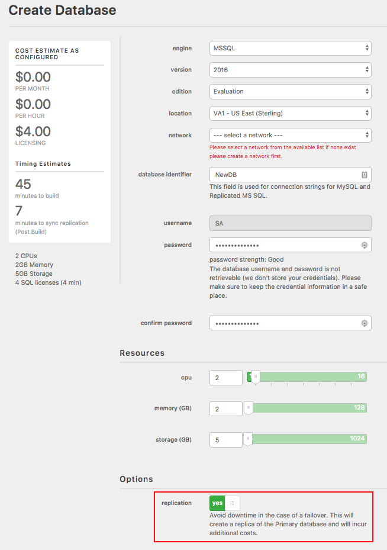
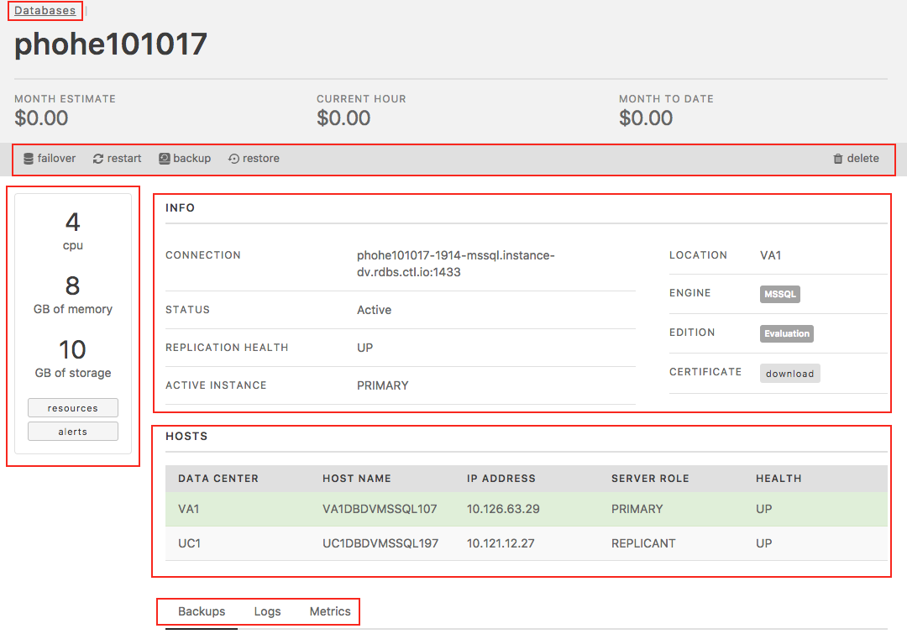

{{{
  "title": "Replication and Failover - MSSQL Relational DB",
  "date": "10-22-2017",
  "author": "Brian Waganer",
  "keywords": ["clc", "cloud", "database", "db", "dbaas", "failover", "mssql", "replication", "portal"],
  "attachments": [],
  "related-products" : [],
  "contentIsHTML": false
}}}

### Audience
This article is to support customers of Relational DB Service, CenturyLink's Microsoft SQL Server database-as-a-service product. These instructions are specific to using the replication features through the Control Portal.

### Overview
CenturyLink's Relational DB Service is a MSSQL database-as-a-service that provides instant access to a database instance with SSL support, daily backups, basic monitoring, logs, OS metrics, and a replication option. Users can configure the amount of CPU, Memory and Storage based on their database needs. They can choose to replicate their instance in a datacenter for a more highly available solution. As the customer's capacity needs grown, they can easily scale their CPU, RAM, and/or Storage with the click of a button.

### Prerequisites
* Access to the CenturyLink Cloud Platform as an authorized user

### Provisioning an Instance with Replication
1. Browse to CenturyLink Cloud’s Relational DB UI through the Control Portal or directly at [rdbs.ctl.io](https://rdbs.ctl.io).

2. Click on 'Create Database'. From there, select your subscription details (database name, username, password, cpu, memory, and storage). If you want your instance to be replicated, simply, flip the Replication toggle to 'yes' and click on 'Create Database'.
   

3. The resulting provisioning creates a primary database instance, a replica database instance, and returns a single connection string. Replication is asynchronous over a local 10G connection, resulting in real-time replication assuming normal network conditions.

### Manual Failover
1. A customer can determine if their database instance is currently running on the primary or replica by selecting the database subscription in question from the "Database Instances" screen. When you click on the subscription in question, it takes you to a details page with a line for Active Instance. This line indicates either 'Primary' or 'Replica'.  You can also see it by looking in the Hosts section the one with the green highlight is the active server.
   

2. Manual Failover - To perform a manual failover, navigate to the same location in the UI as described in Step 1 above and click the 'failover' button in the top left corner. This action triggers failover, and the active instance is show as being on the replica.  The two instances are backed by a DNS entry so it might take a little bit to propagate that change.
   Please note that with any replication there is always a chance of some data loss, so be sure you want to fail-over before proceeding.  
   

### Replication Details
- RelationalDB MSSQL Replication is based on block replication, so we replicate the whole instance completely.  This is a more efficient way of replicating than replicating DML & DDL statements.  It is also less complex so as you change objects in the database, it will always be replicated.
- As with any replication, if you disconnect from your primary before you fail-over you will greatly increase the ability for the two database to be in sync and have the last transactions replicated.
- With this type of replication the blocks between the servers must sync before it becomes fully replicated.  The initial sync could be hours if your database is multiple terabytes.  We track the replication status in the DB Detail web page.
- One major benefit to this type of replication is that the replicant server does not have MSSQL running, thus you don't need to pay for a Microsoft SQL Server license that you will never be using.  
- As you fail-over MSSQL it will shutdown MSSQL on the original primary, try and finish any syncing if possible, the start on the new primary server.
- There is a DNS entry is in front of the two private IPs of the databases.  This insures that you won't have to change your connection string as you fail back and forth.
- Since the two databases are replicated if you choose two different data centers you must open up a private firewall between those networks.

If you have questions or feedback, please submit them to our team by emailing <a href="mailto:rdbs-help@ctl.io">rdbs-help@ctl.io</a>.
