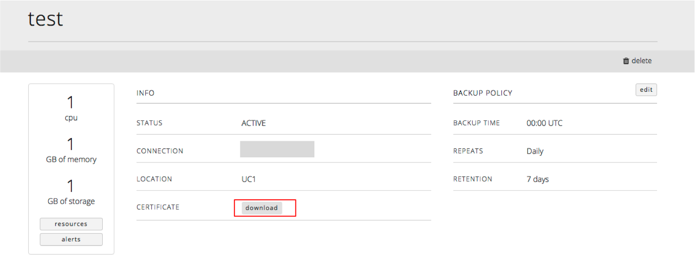

{{{
  "title": "Connecting to MySQL Relational DB over SSL-enabled Connection",
  "date": "01-25-2016",
  "author": "Lane Maxwell",
  "attachments": [],
  "related-products" : [],
  "contentIsHTML": false
}}}

### Audience
This article is to support customers of Relational DB Service, CenturyLink's MySQL compatible database-as-a-service product. The steps below are for customers using Relational DB Service through the Control Portal.

### Connecting over SSL-enabled Connection
1. Once in the user interface, you will see a list of your database subscriptions. Locate and click on the subscription for which you need to download a certificate. This takes you to a new screen with subscription details and a button to download your certificate. When you click this button, a file called `[dbinsancename].pem`. is downloaded. This is the certificate that enables the SSL connection.
   

2. Once the certificate is downloaded, you can make an SSL connection using mysql's `--ssl-ca` parameter. If you created your subscription in UC1 with Server name "demo-app", Username "admin", and downloaded your cert to `/Users/my-home-dir/Downloads`, then your connection shown on the subscription details look something like `demo-app.uc1.rdbs.ctl.io:49929`, and the command line you would use is:

   `mysql -h demo-app.uc1.rdbs.ctl.io -u admin -p --ssl-ca=/Users/my-home-dir/Downloads/demo-app.pem -P 49929`

   Note: If you see an error during the connection attempt that looks like this,

   `ERROR 2026 (HY000): SSL connection error: ASN: bad other signature confirmation`

   the most likely cause is `--ssl-ca` file not found. Ensure that you are using an absolute path to your pem file and that the path is correct.

3. Once logged in, validate the SSL connection by using the show command.
   `mysql> show status like 'Ssl_cipher';`

   ```
   +---------------+--------------------+
   | Variable_name | Value              |
   +---------------+--------------------+
   | Ssl_cipher    | DHE-RSA-AES256-SHA |
   +---------------+--------------------+
   1 row in set (0.07 sec)

   mysql>
   ```
4. If you have questions or feedback, please submit them to our team by emailing <a href="mailto:rdbs-help@ctl.io">rdbs-help@ctl.io</a>.
