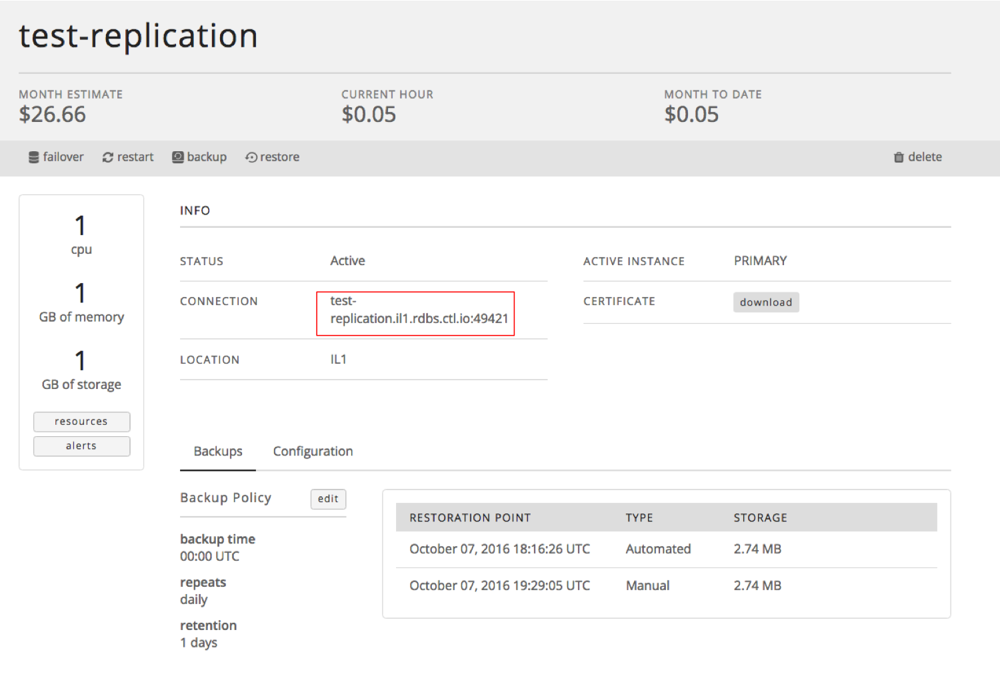
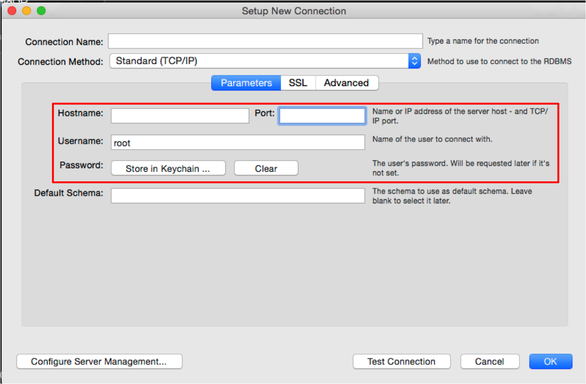
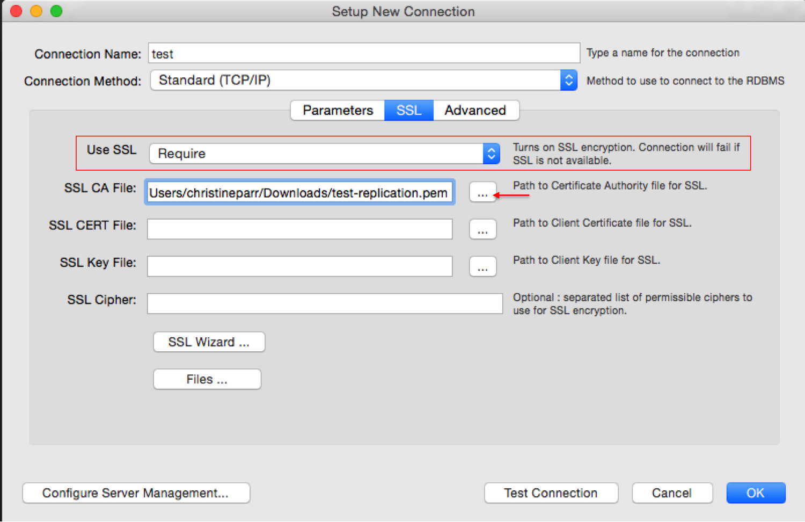
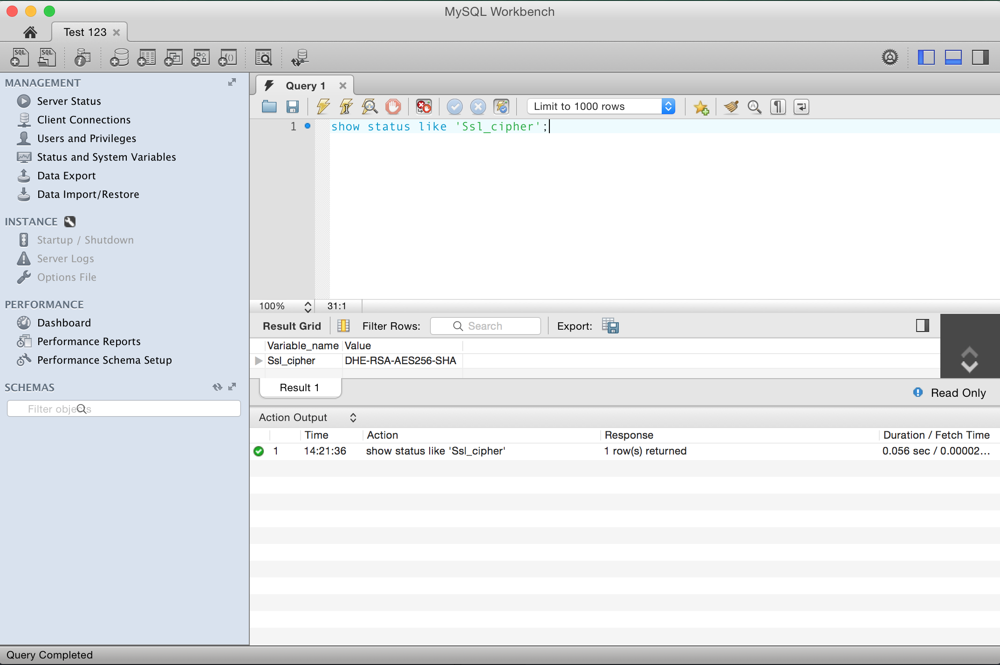

{{{
  "title": "Connecting to Relational DB using MySQL Workbench",
  "date": "03-04-2016",
  "author": "Christine Parr",
  "keywords": ["clc", "cloud", "database", "db", "dbaas", "mysql", "ssl"],
  "attachments": [],
  "related-products" : [],
  "contentIsHTML": false
}}}

### Audience
This article is to support customers of Relational DB Service who have procured a MySQL-compatible instance.

### Connecting to your Relational DB Instance through the MySQL Workbench Client

1. All you need to connect to your Relational DB is the connection string of your instance and the **database** username and password you created when you provisioned your Relational DB instance. Your connection string is included on the database details page which you can get to by navigating to and clicking on the instance you would like to connect to.


2. Open MySQL Workbench and click on the + button to create a new connection. Choose a name for that connection and enter it in the "Connection Name" field. Then, complete the following steps:
   * Enter your connection string information in the "Hostname" and "Port" fields. For example, for the "test123" instance in the screenshot above, the connection string is test-replication.il1.rdbs.ctl.io:49421.
   * To connect to your database instance using this connection string in Workbench, enter *test-replication.il1.rdbs.ctl.io* into the "Hostname" field and *49421* into the "Port" field.
   * Replace the word 'root' with the username you created when you provisioned your Relational DB instance.
   * Click on "Store in Keychain" and enter the password you created when you provisioned your Relational DB instance.
   <p>

   <p>

3. If you would like to encrypt your connection, you can upload your certificate by navigating to the 'SSL' tab in the MySQL workbench and completing the following steps:
   * First you must download your certificate from the Relational DB details page. (See the screenshot in Step #1 above.)
   * From MySQL Workbench, select from the "Use SSL" drop-down to require SSL.
   * Click where indicated with the arrow to upload the certificate. When clicked, you are then able to navigate to where you saved the certificate file. The certificate name will be `dbname.pem`. In this example, the certificate name would be test-replication.pem.
   

4. Click OK and open your connection. To validate the SSL connection, use the following query:

   `show status like 'Ssl_cipher';`

   ```
   +---------------+--------------------+
   | Variable_name | Value              |
   +---------------+--------------------+
   | Ssl_cipher    | DHE-RSA-AES256-SHA |
   +---------------+--------------------+
   1 row in set (0.07 sec)

   mysql>
   ```
   

5. If you have questions or feedback, please submit them to our team by emailing <a href="mailto:rdbs-help@ctl.io">rdbs-help@ctl.io</a>.
