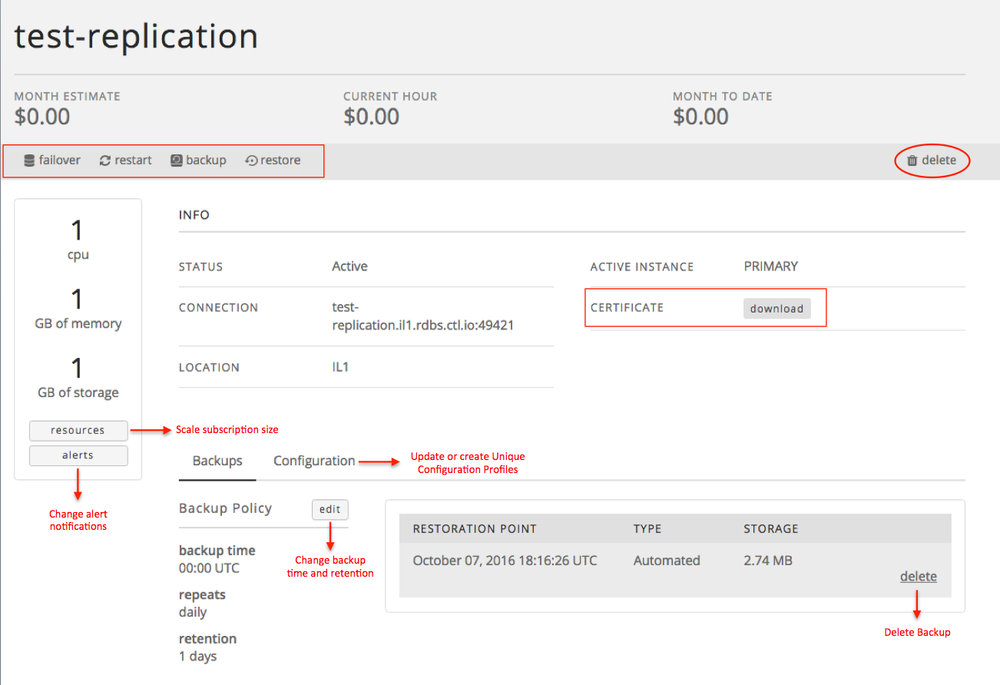

{{{
  "title": "Getting Started with MySQL Relational DB Service",
  "date": "10-22-2017",
  "author": "Brian Waganer",
  "attachments": [],
  "related-products" : [],
  "contentIsHTML": false,
  "sticky": true
}}}

### Audience
This article is to support customers of Relational DB Service, CenturyLink's database-as-a-service product.  These instructions are specific to getting started provisioning and using a MySQL-compatible instance directly through the Control Portal.

### Overview
CenturyLink's MySQL-compatible Relational DB Service is a database-as-a-service product that provides instant access to a MySQL-compatible database instance with SSL support, daily backups, restore functionality, logs, OS monitoring, notifications, and a replication option with auto-failover. Users can configure the amount of CPU, Memory, and Storage based on their database needs. They can choose to replicate their instance in a datacenter for a more highly available solution. As the customer's capacity needs grow, they can easily scale their CPU, RAM, and/or Storage with the click of a button.

For users who would like some sizing guidance, below are a few common configurations:

**Micro**|**Small**|**Medium**|**Large**|**X-Large**
-----------|-----------|--------------|------------ |------------
CPUs: 1       |CPUs: 1      |CPUs: 2       |CPUs: 4         |CPUs: 8
Memory: 1 GB  |Memory: 2 GB |Memory: 6 GB  |Memory: 16 GB   |Memory: 32 GB
Storage: 1 GB |Storage: 2 GB|Storage: 64 GB|Storage: 256 GB |Storage: 512 GB

### Prerequisites
* Access to the CenturyLink Cloud Platform as an authorized user

### Configuring a New MySQL-Compatible Relational DB Subscription
1. Browse to CenturyLink Cloud’s Relational DB UI through the Control Portal or directly at [rdbs.ctl.io](https://rdbs.ctl.io).

2. Click the 'Create Database' button from the Database Instances screen to provision your database instance.
   

3. Select a datacenter from the drop-down menu, enter a dns-friendly name for the database, and select your **database** username and password.

4. Provide values for the amount of CPU, Memory, and Storage to provision. You can view the monthly and hourly pricing for the selected configuration.

5. Indicate whether you would like your database instance to be replicated. If selected, a replica of the primary database is created and failover occurs automatically if the primary instance becomes unavailable. The replication feature comes at a higher price point, so notice how estimated charges change when you choose Replication.

6. Customize your Backup Schedule if you wish. If no customization is made, backups will run at 0:00 UTC.

7. Define your Backup Retention. You may select any retention policy between 1 day - 35 days.
   * **Note: Your Relational DB subscription includes up to 100% of your allocated storage amount in backup storage. Backup storage that exceeds the size of your allocated storage is billed at the 'Additional Backup Storage' rates defined in the pricing catalog. Backups are compressed in order to reduce the amount of backup storage used.**

8. Click “Create Database”. Your database information is quickly returned, including connection string. You can then choose to download your certificate.
   

9. You can view a list of all your database subscriptions with the datacenter and connection string information on the "Database Instances" tab.
   

10. Click on any instance to view subscription details and available backups or perform any of the following actions:
   * Download your certificate.
   * Failover between primary and replica (for replicated instances only).
   * Change your alert notification settings.
   * Change your scheduled backup time.
   * Change your backup retention policy.
   * Scale subscription size.
   * Delete your instance.
   * Delete a backup.
   * Edit the Configuration Profile for an instance.
   * Perform a manual backup.
   * Perform a restore.
   * Restart your database instance.

   

11. Use the connection string information provided to administer your MySQL instance using standard command line interface or from your favorite MySQL client.

12. If you have questions or feedback, please submit them to our team by emailing <a href="mailto:rdbs-help@ctl.io">rdbs-help@ctl.io</a>.
