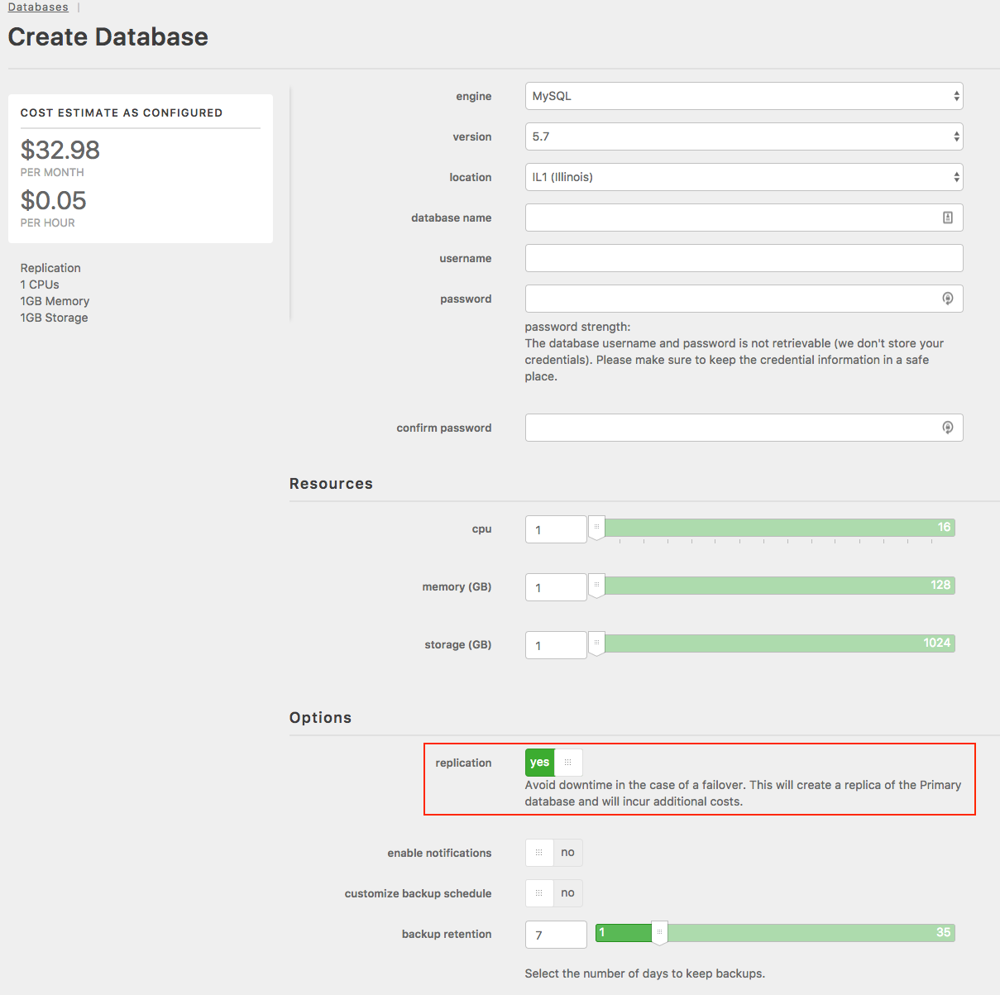
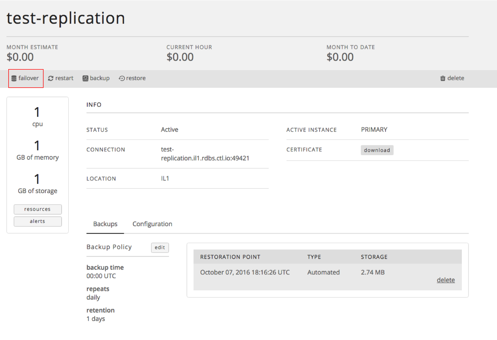

{{{
  "title": "Replication and Failover - MySQL Relational DB",
  "date": "01-25-2016",
  "author": "Christine Parr",
  "keywords": ["clc", "cloud", "database", "db", "dbaas", "failover", "mysql", "replication", "portal"],
  "attachments": [],
  "related-products" : [],
  "contentIsHTML": false
}}}

### Audience
This article is to support customers of Relational DB Service, CenturyLink's MySQL compatible database-as-a-service product. These instructions are specific to using the replication features through the Control Portal.

### Overview
CenturyLink's Relational DB Service is a MySQL-compatible database-as-a-service that provides instant access to a database instance with SSL support, daily backups, basic monitoring, and a replication option. Users can configure the amount of CPU, Memory and Storage based on their database needs. They can choose to replicate their instance in a datacenter for a more highly available solution. As the customer's capacity needs grown, they can easily scale their CPU, RAM, and/or Storage with the click of a button.

### Prerequisites
* Access to the CenturyLink Cloud Platform as an authorized user

### Provisioning an Instance with Replication
1. Browse to CenturyLink Cloud’s Relational DB UI through the Control Portal or directly at [rdbs.ctl.io](https://rdbs.ctl.io).

2. Click on 'Create Database'. From there, select your subscription details (database name, username, password, cpu, memory, and storage). If you want your instance to be replicated, simply, flip the Replication toggle to 'yes' and click on 'Create Database'.
   

3. The resulting provisioning creates a primary database instance, a replica database instance, and returns a single connection string. Replication is asynchronous over a local 10G connection, resulting in real-time replication assuming normal network conditions.

### Manual & Automatic Failover
1. Automatic Failover - Your instance will automatically failover to the replica when we detect that your primary instance is unavailable for longer than 6 seconds, or 3 consecutive failed health checks. Failback occurs after one minute of successful health checks of the primary.

2. A customer can determine if their database instance is currently running on the primary or replica by selecting the database subscription in question from the "Database Instances" screen. When you click on the subscription in question, it takes you to a details page with a line for Active Instance. This line indicates either 'Primary' or 'Replica'.

3. Manual Failover - To perform a manual failover, navigate to the same location in the UI as described in Step 2 above and click the 'failover' button in the top left corner. This action triggers failover, and the active instance is show as being on the replica.
   

4. If you have questions or feedback, please submit them to our team by emailing <a href="mailto:rdbs-help@ctl.io">rdbs-help@ctl.io</a>.
