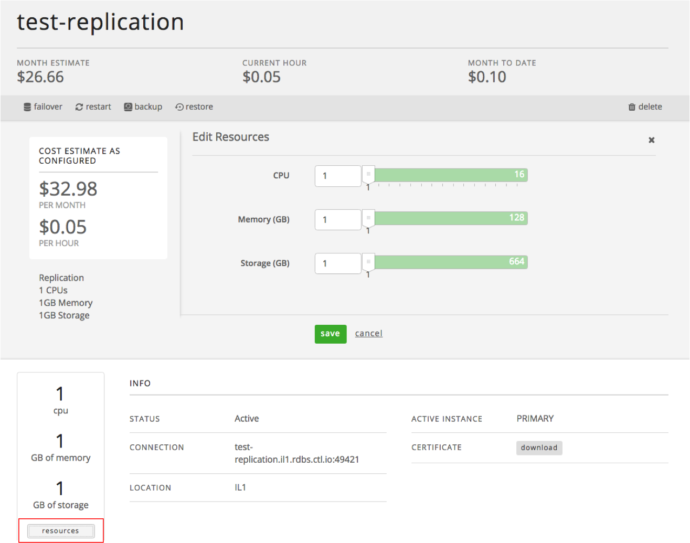

{{{
  "title": "Resizing a Relational DB Instance",
  "date": "10-22-2017",
  "author": "Brian Waganer",
  "attachments": [],
  "related-products" : [],
  "contentIsHTML": false
}}}

### Audience
This article is to support customers of Relational DB Service, CenturyLink's database-as-a-service product. These instructions are specific to resizing a subscription through the Control Portal.

### Overview
CenturyLink's Relational DB Service is a database-as-a-service that provides instant access to a database instance with SSL support, daily backups, basic monitoring, logs, metrics, and a replication option. Users can configure the amount of CPU, Memory, and Storage based on their database needs. They can choose to replicate their instance in a datacenter for a more highly available solution. As the customer's capacity needs grown, they can easily scale their CPU, RAM, and/or Storage with the click of a button.

### Prerequisites
* Access to the CenturyLink Cloud Platform as an authorized user
* Existing Relational DB Instance

### Resizing an Existing Relational DB Instance
1. Browse to CenturyLink Cloud’s Relational DB UI through the Control Portal or directly at [rdbs.ctl.io](https://rdbs.ctl.io).

2. Navigate to the “Database Instances” screen. Identify and click on the database subscription you would like to resize. This takes you to a details screen specific to that subscription.

3. From the details screen, click the 'resources' button. This brings up a new section of the screen with slide bars that allows you to select the new size of your instance. Make your new selections and click 'save'. You then see the status change to "Configuring".
   

4. **The following resize requests result in a database restart and the UI will warn the user as such:**
   * Increasing Memory
   * Decreasing Memory
   * Decreasing CPU

5. Storage can be scaled up, but cannot be scaled down through the API or UI.

6. New applicable hourly charges apply after successful resize.

7. If you have questions or feedback, please submit them to our team by emailing <a href="mailto:rdbs-help@ctl.io">rdbs-help@ctl.io</a>.
