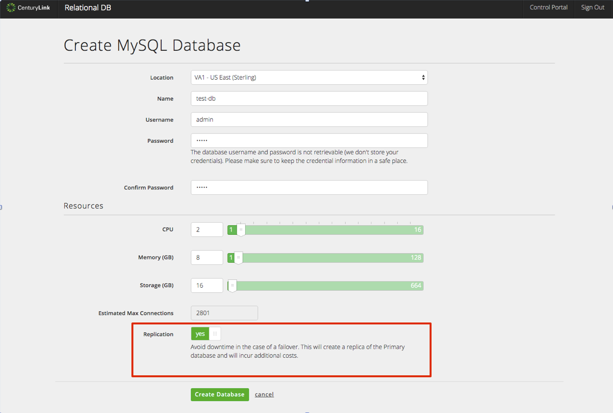
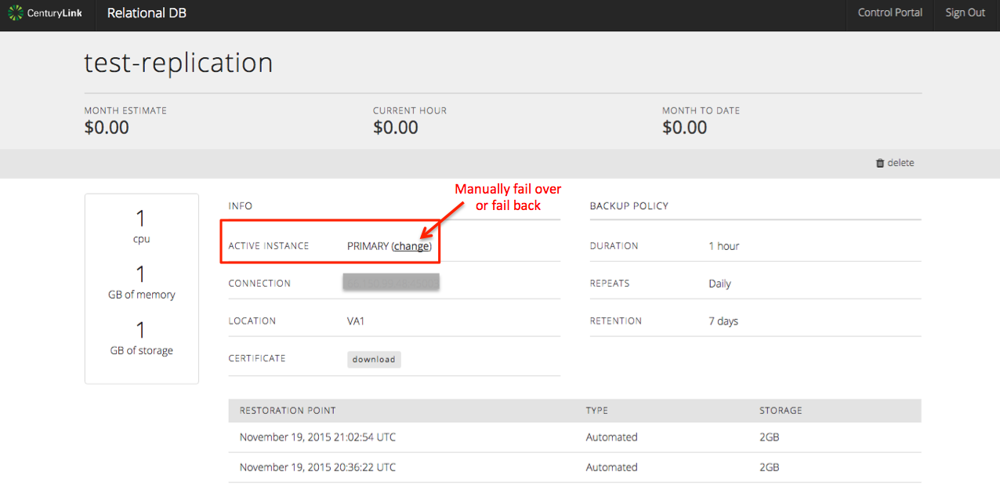

{{{
  "title": "Replication and Failover",
  "date": "11-23-2015",
  "author": "Christine Parr",
  "attachments": [],
  "related-products" : [],
  "contentIsHTML": false
}}}

#### IMPORTANT NOTE

CenturyLink Cloud’s MySQL-compatible Database-as-a-Service product is currently in a Limited Beta with specific customers by invitation only and is not intended for production usage.
During the Limited Beta there is no production Service Level Agreement.

#### Audience

Currently, this article is to support customers in the Limited Beta program.  Additionally, these instructions are specific to using your replication features through the DBaaS user interface.

## Overview

Our MySQL-compatible Database-as-a-Service limited beta provides instant access to a MySQL-compatible database instance with SSL support, daily backups held for 7 days, basic monitoring and a replication option.  Users can configure the amount of CPU, Memory and Storage based on their database needs and can choose to replicate their instance in datacenter for a more highly available solution.

#### Prerequisites

- Access to the CenturyLink Cloud Platform as an authorized user
- Acceptance into the DBaaS Limited Beta Program

## Provisioning a Replicated Instance

1.  Browse to CenturyLink Cloud’s DBaaS Beta User Interface and login using your CenturyLink Cloud username and password.

2.	Click on "Create Database".  From here, select your subscription details (database name, username, password, cpu, memory and storage).  If you want your instance to be replicated, simply, flip the Replication toggle to yes and click on Create Database.

3. The resulting provisioning will create a primary database instance as well as a replica database instance and will return you a single connection string.  When a failover occurs, your application will continue to access your database instance using the same connection string.

## Manual & Automatic Failover
1.  Automatic Failover - Your instance will automatically failover to the replica when we detect that your primary instance is unavailable for longer than 6 seconds or 3 consecutive failed health checks.  Failback will occur after one minute of successful health checks of the primary.

2. A customer can determine if their database instance is currently running on the primary or replica by selecting the database subscription in question from the "Database Instances" screen.  When you click on the subscription in question, it will take you to a details page with a line for Active Instance.  This line will indicate either 'Primary' or 'Replica'.

3.  Manual Failover - To perform a manual failover, navigate to the same location in the UI as described in step 2, above, and click on the "change" link next to Active Instance.  This will trigger failover, and the
active instance will now show as being on the replica.

