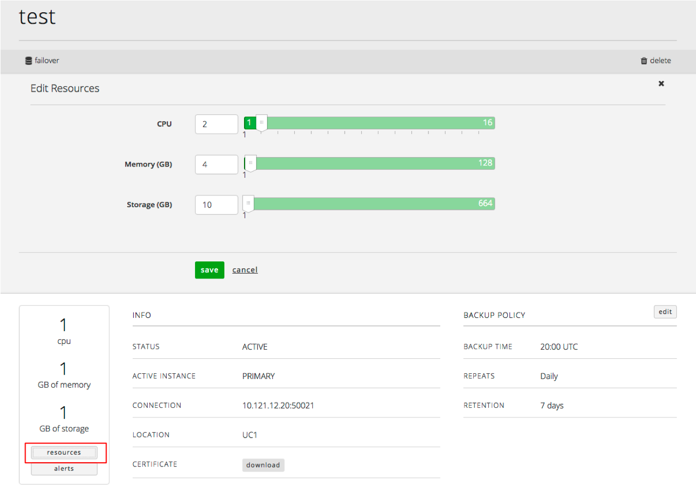

{{{
  "title": "Resizing a Relational DB Instance",
  "date": "01-25-2016",
  "author": "Christine Parr",
  "attachments": [],
  "related-products" : [],
  "contentIsHTML": false
}}}

#### Audience

This article is to support customers of Relational DB Service, CenturyLink's MySQL compatible database-as-a-service product.  Additionally, these instructions are specific to deleting a subscription that was created through Control Portal.

## Overview

CenturyLink's Relational DB Service is a MySQL-compatible database-as-a-service that provides instant access to a database instance with SSL support, daily backups, basic monitoring and a replication option.  Users can configure the amount of CPU, Memory and Storage based on their database needs and can choose to replicate their instance in datacenter for a more highly available solution.  As customers' capacity needs grown, they can easily scale their CPU, RAM and/or Storage through the click of a button.

#### Prerequisites

- Access to the CenturyLink Cloud Platform as an authorized user
- Existing Relational DB Instance

## Resizing an Existing Relational DB Instance

1.  Browse to CenturyLink Cloud’s Relational DB UI through the Control Portal or directly at [rdbs.ctl.io](https://rdbs.ctl.io).

2.	Navigate to the “Database Instances” screen, identify and click on the database subscription you would like to resize. This will take you to a details screen specific to that subscription.

3.  From the details screen, click on the "resources" button.  This will bring up a new section of the screen with slide bars that will allow you to select the new size of your instance.  Make your new selections and click save.  You will then see the status change to "Configuring".  

4.  **The following resize requests will result in a database restart and the UI will warn the user as such:**
  - Increasing Memory
  - Decreasing Memory
  - Decreasing CPU

5.  Storage can be scaled up, but cannot be scaled down through the API or UI.

6.  New applicable hourly charges will be apply after successful resize.

7.  If you have questions or feedback, please submit them to our team by emailing <a href="mailto:rdbs-help@ctl.io">rdbs-help@ctl.io</a>.
