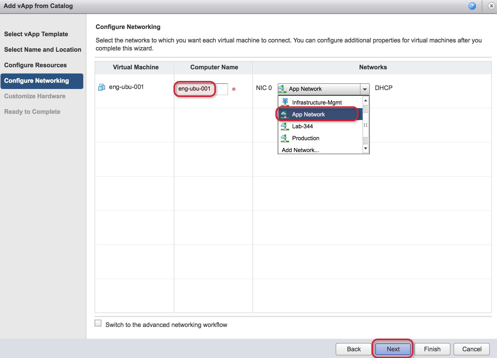

{{{
  "title": "Creating a Server",
  "date": "9-20-2017",
  "author": "Anthony Hakim",
  "attachments": [],
  "related-products" : [],
  "contentIsHTML": false,
  "sticky": false
}}}

## Description
In this KB article, we demonstrate how to provision a new virtual server in DCC Foundation.

__Once you've gone through this KB article and created a new virtual server, you can follow this guide to learn how to securely connect to your DCC Foundation environment.__

## Steps
* Login to your DCC Foundation environment

  

* Once logged in, you will see the __Quick Access__ page. The easiest way to create a virtual server is to click __Add vApp from Catalog__

  

* In the Add vApp from Catalog page, click __All Templates__ to show all templates. Select the template you wish to deploy, then click __Next__.

  

* Enter a name for the new vApp you are creating and click __Next__ - in the context of vCloud Director, a vApp is simply a container for the objects you create.

  

* Enter a name for your Virtual Machine - this is the friendly name that will be displayed inside of vCloud Director.

  

* Enter your __Computer Name__ - in this example, I have used the same name as the Virtual Machine name. Select the network you wish to place your new virtual server on - you also have the ability to add a network if you need to create a new one. Click __Next__.

  

* Now you have the option to granularly select __CPU, Memory, and Hard Disks__. Make your selections and click __Next__.

  

* The final page provides a summary of your selections. You also have the option to __Power on vApp after this wizard is finished__ to save you that step once the vApp is built. Click __Finish__.

  
