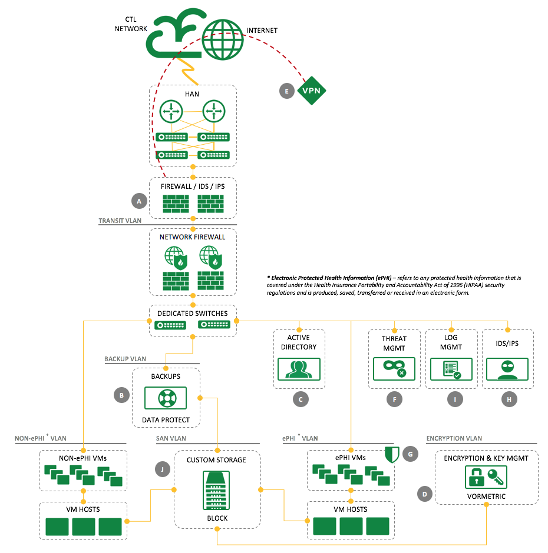

{{{
"title": "Dedicated Cloud Compute - HIPAA Architecture",
"date": "06-15-2017",
"author": "",
"attachments": [],
"related-products" : [],
"contentIsHTML": false
}}}

Security and compliance are big issues in the world of data management and storage, especially as more and more governing agencies set up rules to protect the security of that data. HIPAA, the [Health Insurance Portability and Accountability Act](https://www.hhs.gov/hipaa/for-professionals/index.html?language=en), sets rules around protected health information (PHI) and the required physical, network, and process security measures for PHI.

Dedicated Cloud Compute (DCC) has a recommended architecture plan for HIPAA compliance which ensures that many of the HIPAA standards for [technical safeguards](https://www.hhs.gov/sites/default/files/ocr/privacy/hipaa/administrative/securityrule/techsafeguards.pdf) are met. HIPAA covers many areas of requirements (not just technical), but this architecture focuses on meeting the needs of the technical ones. Below is a diagram of that architecture, along with an explanation of the HIPAA standards that elements of the architecture comply with.

|      HIPAA Standard        |    Location    | Explanation |
|----------------------------|:--------------:|-------------|
|    HIPAA 164.310(d)(1)     |  B  | Create a retrievable, exact copy of ePHI, when needed, before movement of equipment. |
|    HIPAA 164.312(a)(1)     |  C  | Assign a unique and/or number for identifying and tracking user identity. |
|    HIPAA 164.312(a)(1)     |  D  | Implement a mechanism to encrypt and decrypt ePHI. |
|    HIPAA 164.312(a)(1)     |  I  | Implement a mechanism to encrypt and decrypt ePHI. |
|    HIPAA 164.312(b)(1)     |  G  | Implement hardware, software, and/or procedural mechanisms that record and examine activity in information systems that contain or use ePHI. |
|    HIPAA 164.312(b)(1)     |  I  | Implement hardware, software, and/or procedural mechanisms that record and examine activity in information systems that contain or use ePHI. |
|    HIPAA 164.312(c)(1)     |  A  | Implement electronic mechanisms to corroborate that ePHI has not been altered or destroyed in an unauthorized manner. |
|    HIPAA 164.312(c)(1)     |  F  | Implement electronic mechanisms to corroborate that ePHI has not been altered or destroyed in an unauthorized manner. |
|    HIPAA 164.312(c)(1)     |  G  | Implement electronic mechanisms to corroborate that ePHI has not been altered or destroyed in an unauthorized manner. |
|    HIPAA 164.312(c)(1)     |  H  | Implement electronic mechanisms to corroborate that ePHI has not been altered or destroyed in an unauthorized manner. |
|    HIPAA 164.312(c)(1)     |  I  | Implement electronic mechanisms to corroborate that ePHI has not been altered or destroyed in an unauthorized manner. |
|     HIPAA 164.312(e)(1)    |  D  | Implement security measures to ensure that electronically transmitted ePHI is not improperly modified without detection until disposed of. |
|    HIPAA 164.312(e)(1)     |  E  | Implement a mechanism to encrypt ePHI whenever deemed appropriate. |
|    HIPAA 164.312(e)(1)     |  G  | Implement a mechanism to encrypt ePHI whenever deemed appropriate. |
|    HIPAA 164.312(e)(1)     |  I  | Implement a mechanism to encrypt ePHI whenever deemed appropriate. |

*The Lumen Products and Services illustrated in this document are guidelines for implementing a HIPAA compliant solution using Dedicated Cloud. Attaining overall HIPAA compliance remains the responsibility of the Customer.*
