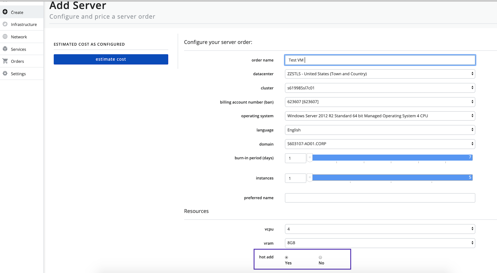
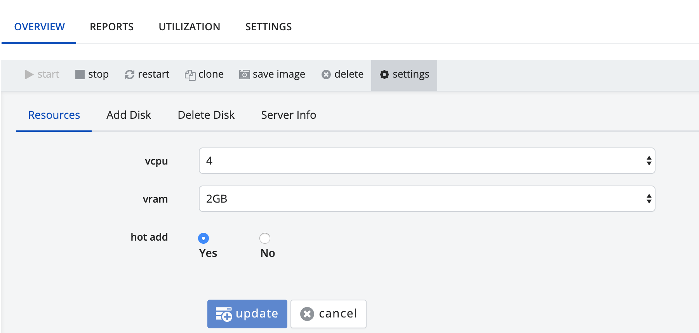

{{{
  "title": "Support Hot Add/Plug",
  "date": "05-04-2020",
  "author": "Madhavi PavanRaj",
  "attachments": [],
  "related-products" : [],
  "contentIsHTML": false,
  "sticky": false
}}}

### Description

**Enable Hot Add/Plug**: Dedicated Cloud Compute (DCC) now lets you add resources to a running virtual machine. By default, you cannot change resources ~ vCPU & vRAM to a powered on virtual machine.

### Audience

Dedicated Cloud Compute customers.

### Conditions that apply
* The ability to dynamically add/remove CPU to a virtual machine is dependent on the guest OS and ESX version. Check here to see if your VM supports Hot Add [VMware Compatibility Guide](https://www.vmware.com/resources/compatibility/search.php) and [VMware Resources](https://www.vmware.com/resources/compatibility/pdf/VMware_GOS_Compatibility_Guide.pdf).

* Hot Add on [Linux 64-bit](https://kb.vmware.com/s/article/2008405) guest OS with 3GB vRAM or less.

### How to Enable/Disable Hot Add?

* Log-in to the new DCC UI. For more information, please refer to the [Logon to New UI](../../Getting Started/logon-new-UI.md) KB article.

**Create VM**: Once logged in the DCC UI, click Create > [Add Server](../../Getting Started/create-server.md).

 * Under Resource section, select the amount of **vCPU** and **vRAM** you would like to allocate to the server(s).
 * On supported guest operating system and VMware ESXi, the Hot Add feature is **pre-enabled** . This can be changed to **NO** if Hot Add is not needed.

   

 * Move ahead with Create VM order.

**For Existing VM** : On supported guest operating system and VMware ESXi, the Hot Add feature can be **enabled/disabled** by changing the VM resource setting as shown below:

  * 
