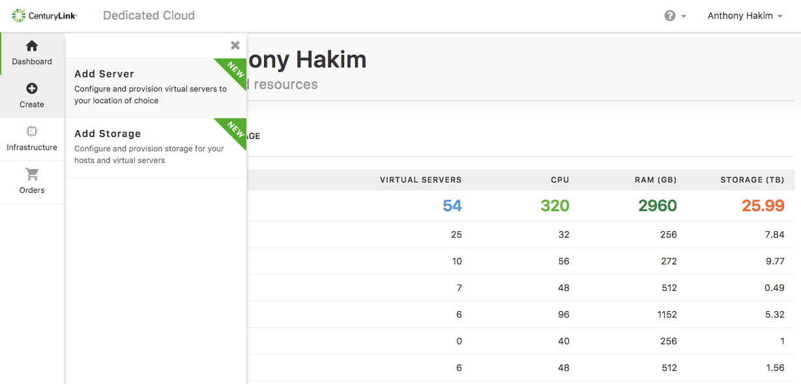
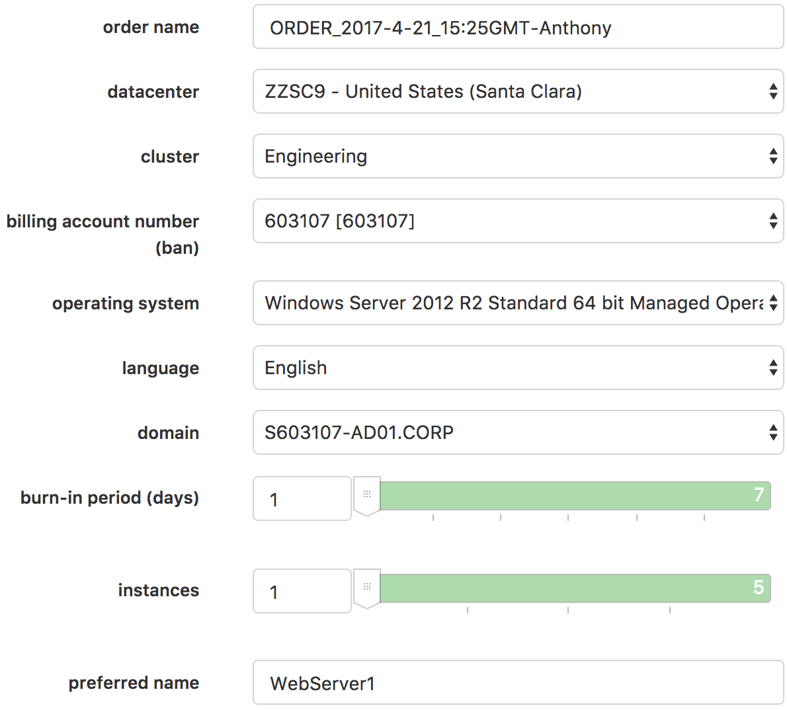
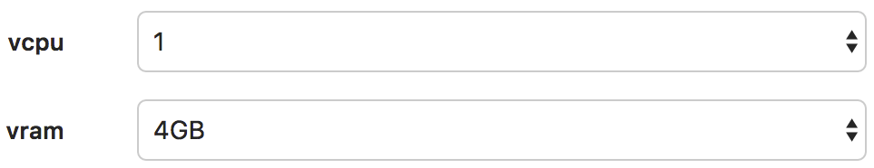
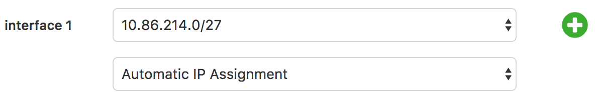
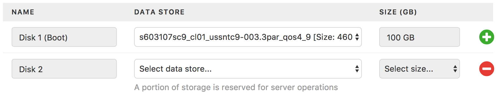
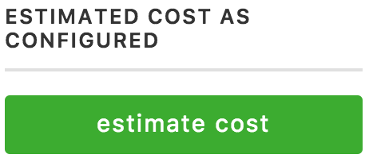
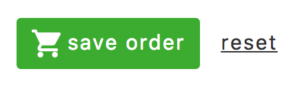
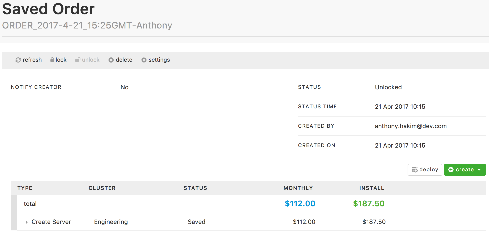
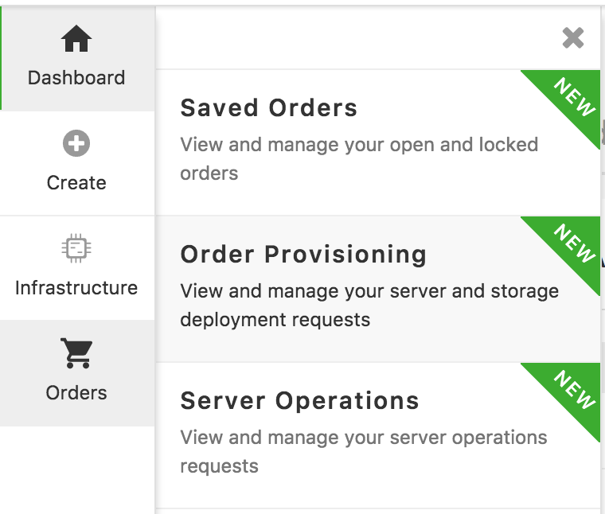

{{{
  "title": "Create Server",
  "date": "05-08-2018",
  "author": "Anthony Hakim",
  "attachments": [],
  "related-products" : [],
  "contentIsHTML": false,
  "sticky": false
}}}

### Description

The Dedicated Cloud Compute User Interface ((DCC UI) has been updated with a new look and feel. This documents the process to create a new server.

### Audience

Dedicated Cloud Compute customers.

### Assumptions

* You have a SavvisStation Portal account and can log on successfully.

### Add Server Process

1. Log-in and go to the new DCC UI. For more information, please refer to the [Logon to New UI](logon-new-UI.md) KB article.

2. Once logged in the DCC UI, click Create > Add Server.

  

#### Configure your server order

In this section, you will have the ability to customize the specifications of your server:

  

* Change your **order name** as needed.

* Select your **datacenter**.

* Select your **cluster**.

* Select your **billing account number (ban)**.

* Select your desired **operating system**.

* Select your preferred **language** if applicable.

* Select your **domain** &mdash; only applicable if you selected a Windows OS.

* Select your desired duration for the **burn-in period (days)**.

* Select the number of **instances** you require to be provisioned.

* Enter your **preferred name**.

#### Resources

  

* Select the amount of **vcpu** you would like to allocate to the server(s).

* Select the amount of **vram** you would like to allocate to the server(s).

#### Networks

* Select the network to which you will assign for **interface 1**. You can assign up to two (2) network interfaces.

* Choose either ** Automatic IP Assignment** or **Manual IP Assignment**.

#### Storage

  

* Select the **data store** for **Disk 1 (Boot)**. Size is predetermined for the Boot Disk.

* Select the **data store** for **Disk 2** (this is optional).

Now you have the option to either **estimate cost** for your order, or to **save order**.

* If you choose to **estimate cost**, you will be presented with the estimated cost as configured.

  

* Once you are satisfied with your selections, click **save order**.

  

#### Saved Orders

* If there are no configuration issues, you will then be taken to the **Saved Orders** page.

  

* In the **Saved Orders** page, you are able to **lock**, **delete**, or change the **settings** of your order.

  * Adding a **lock** to an order disables the ability for others to add/modify. You can **unlock** your order if you need to add/modify. If your permissions allow, you also have the ability to **deploy** your order from this screen.
  * From this screen, you can **delete** your order.
  * You can modify the **order name**, **notify creator**, and **notify emails** if you click on **settings**.

* If you (or an assigned approver) is satisfied with your order, click on **deploy**, then **agree** to the **Deployment Terms** to start the process to provision your server. The job will be queued, then will step through the build process.

#### Order Status

  

To check your order status, go to the left navigation bar and click on **Orders**, then select **Order Provisioning**. Look for the order you created and the associated status.
