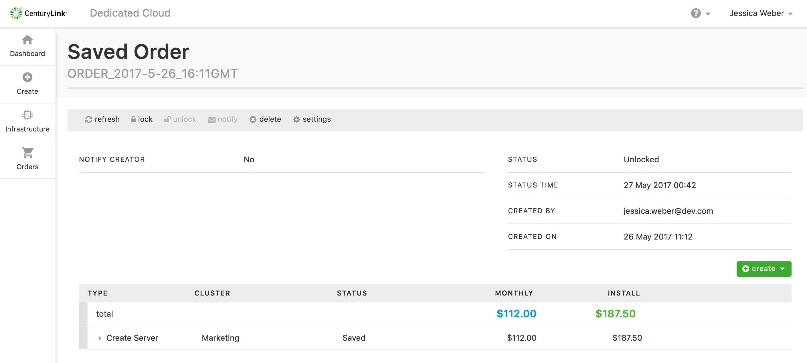

{{{
"title": "Dedicated Cloud Compute - Adding Unified Storage",
"date": "06-01-2017",
"author": "",
"attachments": [],
"related-products" : [],
"contentIsHTML": false
}}}

### Unified Storage – Standard Increments

With Unified Storage, customers have the choice of block or file storage. They can also choose from multiple performance levels, including:

|  Performance Level  |  Increments   |  IOPS  |
|---------------------|---------------|--------|
| Velocity            |     500 GB    | 15,000 |
| Vital               |     50 GB     |  5,000 |
| Value               |     50 GB     |   500  |

### Configuring Unified Storage on a DCC Cluster

You can add Unified Storage to virtual servers in an existing cluster. The steps in configuring Unified Storage saves the order, but does not deploy the server.

**Configure and Price a Storage Order**

1. Log into the SavvisStation Portal.
2. From the main menu, choose **Savvis Cloud > Dedicated Cloud Compute Beta**.
3. From the Navigation menu, choose **Create > Add Storage**.

    

4. On the **Add Storage** page, configure the order by providing the following information:

    * order name (The default is ORDER_yyyy-m-d_hh:mmGMT.)
    * datacenter
    * cluster
    * billing account number (ban)
    * storage type (**Note:** The storage type drop-down labels are Velocity, Vital, and Value when the cluster type you select is Unified Storage. When the cluster type is Utility Storage, the drop-down labels are QOS1, QOS2, QOS3, and QOS4.
    * storage amount

5. Click **estimated cost** to calculate the cost of installation and monthly charges.
6. Click **save order**.

### View, Deploy, and Manage the Saved Order

After saving your order the Saved Order window appears. You can also view saved orders by choosing **Orders > Saved Orders**. Then, highlight the order name and click **actions > View Details**.

**Note:** Currently, there isn’t an option to modify a product once it is added to the order. The customer must delete it from the order and then add a new product.

### Edit Order Settings
1. Click **settings**.

2. Toggle the notify creator button and specify any email notifications.

3. Click **update**.

### Control Modifications to the Order

1. To prevent modifications to the order, click **lock**.

2. To allow modification, click **unlock**.

### Modify Unified Storage Requirements

1. Click **create > add storage**.

### Deploy the Order for Unified Storage

1. Click **deploy**.

### Delete the Order for Unified Storage

1. Click **delete**.
