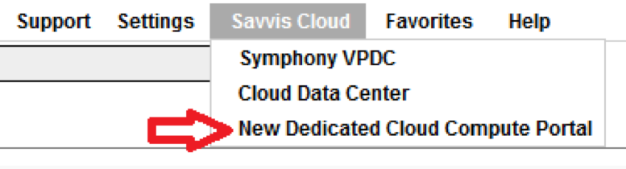

{{{ "title": "New DCC UI Hands-On Introduction",
"date": "05-30-2017",
"author": "",
"attachments": [],
"contentIsHTML": false
}}}

### New DCC UI Hands-On Introduction

This is a script to work through some basic functionality in the new DCC UI.

**Note:** this is a live production environment and the functionality in the UI is active. The below steps have been carefully chosen to have no impact on the customer (no power operations, order deployment, etc). Test actions are highlighted in **bold** with a brief description of what the user should see when performing the action.

**New DCC UI Hands-On Introduction**

* Log-in
* Dashboard
* Infrastructure
* Create
* End
* Optional

### Log-in

Navigate to [savvisstation.com](///savvisstation.savvis.com/.cccLoginPage;jsessionid=75E6A07F4341A0D71F8D442CC282202D) and log-in. Once portal has loaded, navigate to **Savvis Cloud > New Dedicated Cloud Compute Portal.**

This will open the new DCC Portal in a new tab.

#### Dashboard

The landing page in the new portal is the Dashboard's Overview tab. This page lists the data centers where this customer has DCC services and the amount of Virtual Machines, physical CPUs, physical RAM, and Storage in each. The Dashboard also has Compute and Storage tabs which display similar information to the Compute and Storage Dashboards in SavvisStation Portal.

**Navigate to both of these tabs and expand some of the rows to drill down through the hierarchical display.**

#### Infrastructure

In the main menu on the left side of the page, **open the Infrastructure item and select Overview from the fly-out menu that appears.**

This gives a similar display to the Dashboard Overview, but from a Data Center level instead of a global level. The columns are the same as well, showing amount of VMs, physical CPU, physical RAM, and Storage, but broken down per cluster. There are also Compute and Storage tabs here which are identical to their Dashboard counterparts, but start from the Data Center level. This also adds a second menu to the left side of the page displaying an expandable hierarchy of the customer's data centers, clusters, and VMs.

**In the left menu, select a cluster.**

This expands the cluster in the left menu, listing all the VMs in the cluster by preferred name. VMs that are running will display with a "play" icon (a right-facing triangle) before their name. VMs that are stopped will display a "stop" icon (a square). The main view also changes to the Overview for the cluster and displays the Hosts in the cluster. The columns change to show a count of VMs and the amount of vCPUs and vRAM provisioned on each host and the total amount of storage in the cluster. Again, there are Compute and Storage tabs which start from the Cluster level. Additionally, the Cluster view has a Hosts tab and Utilization tab.

**Click the Hosts tab and then select a Host from the drop-down menu that appears.** This view shows the Host's details. Circular graphs show the CPU and RAM usage with charts showing the same over a 12-hour period.

**In the left menu, select a VM.** This view shows the VM's details. As with the Host, circular graphs show the vCPU and vRAM usage with charts showing the same over a 12-hour period.

**Note:** depending on your user permissions, you may see action buttons on a bar near the top of this view. This is where a customer would start, stop, restart, clone, delete, or modify the VM displayed. **These buttons are active and functional.** Clicking them is not a part of this test.

#### Create

In the main menu on the left side of the page, **open the Create item and select Add Server from the fly-out menu that appears.** This brings up the Add Server form.

**Make selections in the datacenter, cluster, billing account number, and operating system fields.** Each selection will populate and enable other fields on the page. Once these four fields have been filled, the estimate cost button on the left side of the page will enable.

**Click the estimate cost button.** This will display the install and monthly costs and discounts for a VM with the selected options.

**Make selections in the vcpu, vram, interface 1, and Storage fields.** This will finish populating all the required fields in the form and enable the save order button.

In the main menu on the left side of the page, **open the Create item again and select Add Storage from the fly-out menu that appears.** This brings up the Add Storage form. **Make selections in the datacenter, cluster, billing account number, storage type, and storage amount fields.**

Each selection will populate and enable the field below it. Once all the options have been selected, the estimate cost button on the left side of the page will enable. 

**Click the estimate cost button.** This will display the install and monthly costs and discounts for a VM with the selected options.

**Note:** clusters with Unified storage may not show any storage types and will instead show a message indicating storage cannot be provisioned through the portal at this time. In that case, try a different cluster. If no clusters for the customer can select a storage type, the estimate step can be skipped.

#### End

This concludes the test script. We greatly appreciate your participation! Please direct any feedback or issues to [new_dcc_ui_feedback@centurylink.com](mailto:new_dcc_ui_feedback@centurylink.com).

#### Optional

Time permitting, one additional area to look at would be utilization metrics. These metrics are available on Hosts and VMs. Refer to the Infrastructure section above to reach the Host or VM details pages.

From there, **click the Utilization tab.**

If you've selected a host, the Utilization tab is a drop-down menu and you will need to select a host from the list. This view matches the **Service Utilization** tab on the details page in SavvisStation Portal. The options on this page allow a date range to be set, the display type to be chosen - graph or table, and up to 14 metrics to be selected. After choosing at least one metric, click the show graph button. For each metric that was selected, a graph will be displayed over the date range entered in the form.

Additionally, the advanced options allow multiple metrics to be compared on the same graph, a single metric to be compared on two time frames, or a single metric to be compared across up to 5 machines. These advanced options are only available in the graph display, and not in a table.
