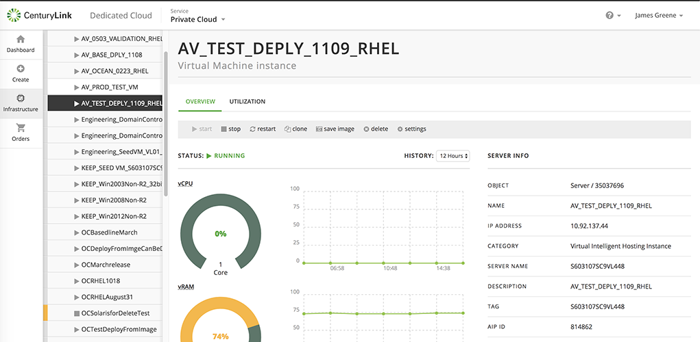
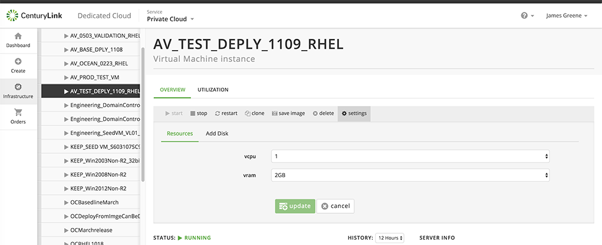

{{{
"title": "Dedicated Cloud Compute &mdash; Operational Orders",
"date": "05-08-2018",
"author": "",
"attachments": [],
"related-products" : [],
"contentIsHTML": false
}}}

The new Dedicated Cloud Compute User Interface (DCC UI) gives the ability to perform power operations and tier changes on servers/VMs. [Go here](dcc-ui-demo-videos.md) for a demo on using the new DCC UI.

### Power Operations

There are several power operations you can perform on deployed servers. A server that has been deployed can be stopped, or one that isn't functioning properly can be restarted. You can also clone or delete a server.

To perform power operations:

1. Click the **Infrastructure** tab and locate the cluster and then server.

2. Click the server name, which will load the server page.

3. The **Overview** tab contains the power operations buttons in a toolbar at the top of the page.

### Change Tier

The server/VM tier can also be changed on the server page.

1. On the server page, click the **Overview** tab.

2. Click **Settings** in the toolbar at the top.

3. The **Resouces** tab should appear. The **vcpu** and **vram** dropdowns will allow you to change the tier for the VM.

