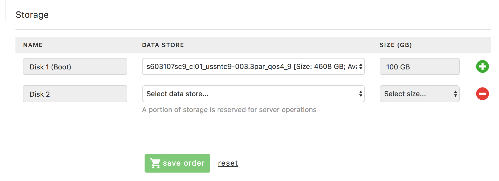

{{{
"title": "Dedicated Cloud Compute &mdash; Provisioning Orders",
"date": "05-08-2018",
"author": "",
"attachments": [],
"related-products" : [],
"contentIsHTML": false
}}}

You can provision orders in the new Dedicated Cloud Compute User Interface (DCC UI). Steps include adding and deleting a VM, adding a datastore, and adding and deleting a disk. [Go here](dcc-ui-demo-videos.md) for a demo on using the new DCC UI.

### Add VM/Delete VM

1. On the left-hand navigation, click **Create > Add Server**.

2. Make selections in the data center, cluster, billing account number, and operating system fields. Each selection will populate and enable other fields on the page. Once these four fields have been filled, the estimate cost button on the left side of the page will become available.

    

3. Optional: Click the **Estimate Cost** button. This will display the install and monthly costs and discounts for a VM with the selected options.

    

4. Make selections in the vcpu, vram, and interface 1 fields. This will finish populating all the required fields in the form and enable the **Save Order** button.

### Add Datastore

You can also add data storage to the VM/server order.

1. Under **Storage**, add a name for the Disk (or Disks).

2. Select the storage location and size.

    

3. Click **Save Order**. This will put your order in the **Saved Orders** section, which you can then [deploy](dcc-ui-working-with-orders.md).

### Add Disk/Delete Disk

You can also add and delete disk storage from an order.

1. To add more disk storage, under the **Storage** section click the green **Plus sign** to the right of the resource.

2. To delete storage assets, click the **Red minus sign** to the right of the resource.
