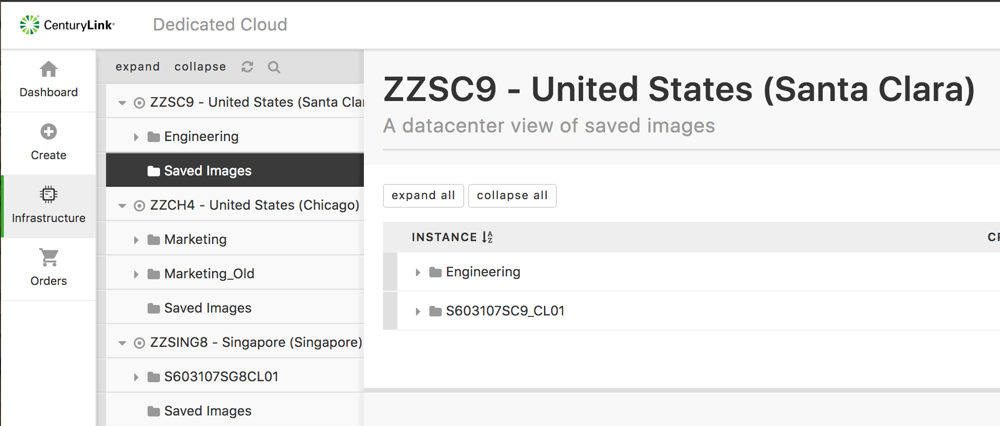

{{{
"title": "Dedicated Cloud Compute &mdash; Viewing DCC Resources",
"date": "05-08-2018",
"author": "",
"attachments": [],
"related-products" : [],
"contentIsHTML": false
}}}

The new Dedicated Cloud Compute (DCC) User Interface in the SavvisStation Portal contains information on clusters, hosts, VMs, images, and utilization metrics. [Go here](dcc-ui-demo-videos.md) for a demo on using the new DCC UI.

### Clusters

The dashboard view groups all virtual resources together by parent data center, and provides server, CPU, RAM, and Storage totals on the Overview tab. This is helpful for those customers that have dedicated clusters across multiple physical sites.

### Hosts

The Hosts tab displays all the hosts in a dropdown menu. This view shows the Host's details. Circular graphs show the CPU and RAM usage with charts showing the same over a 12-hour period.

### Virtual Machines

Each cluster expands to a list of VMs in the cluster by preferred name. VMs that are running will display with a "play" icon (a right-facing triangle) before their name. VMs that are stopped will display a "stop" icon (a square).

Clicking on a VM name shows the VM's details. The circular graphs show the vCPU and vRAM usage, with charts showing the same over a 12-hour period.

### Images

Customers can view their stored images in the Dashboard UI, which uses a decentralized view that lists available images under each cluster.

**Note:** When you first click on Saved Images, the UI will display all the clusters under a given site.  You can then click on a specific folder to view the images associated with that cluster.

### Utilization Metrics

The clusters, hosts, and VMs contain a utilization tab that can provide utilization metrics for a number of different variables, including load time, disk utilization, available memory, uptime, traffic, and errors.

Selecting the variables and clicking **Show Graph** will display the different metrics. The graphs can be exported to excel for easy metric reporting.

