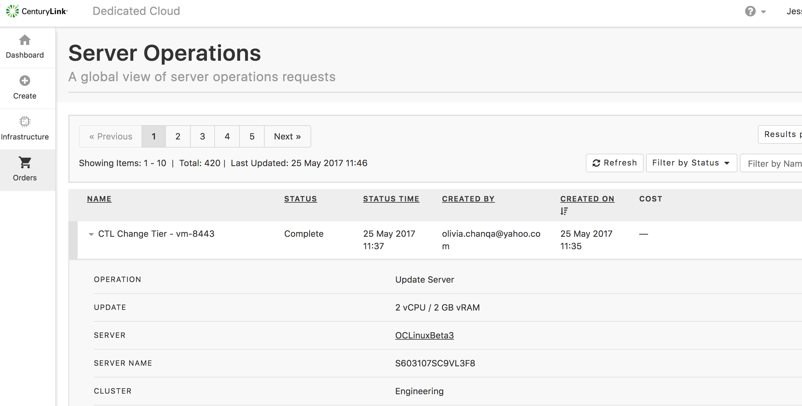
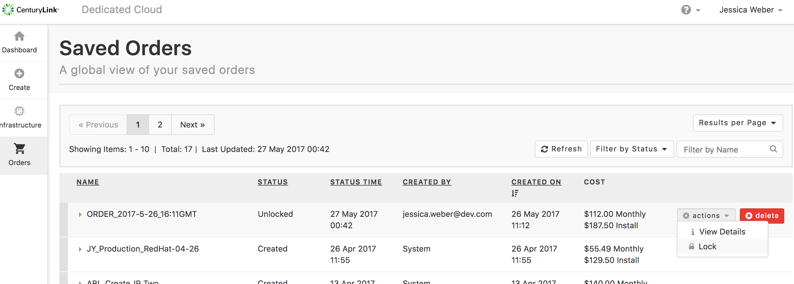
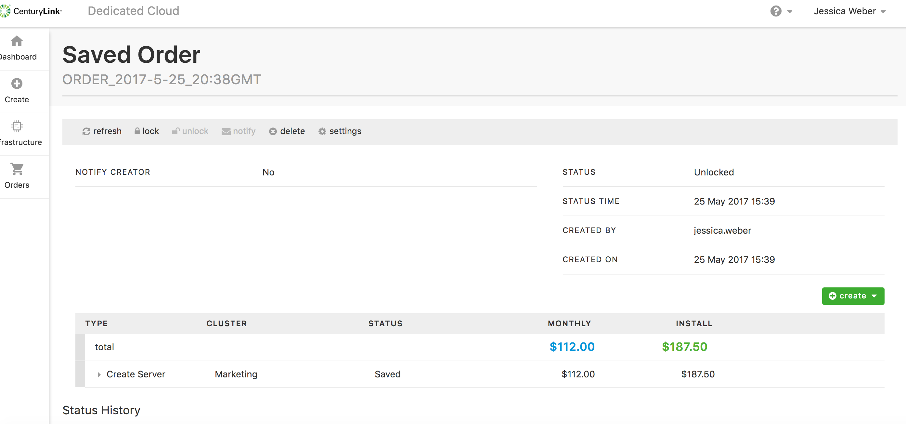
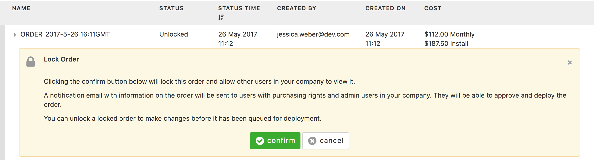
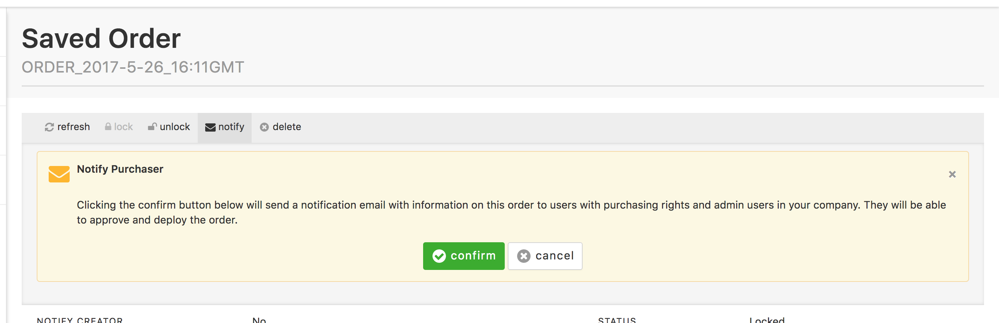
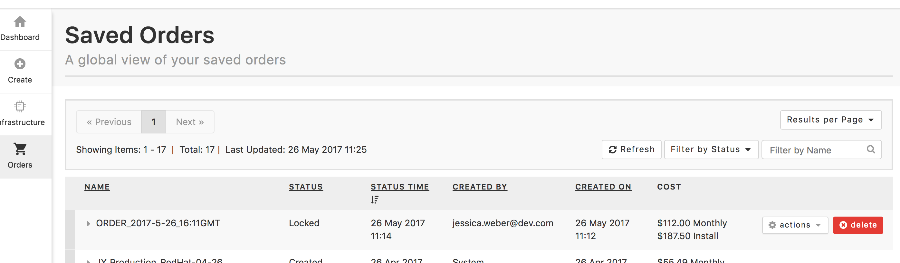

{{{
"title": "Dedicated Cloud Compute &mdash; Working with Orders",
"date": "05-08-2018",
"author": "",
"attachments": [],
"related-products" : [],
"contentIsHTML": false
}}}

Once an [order is provisioned](dcc-ui-provisioning-orders.md) in the new Dedicated Cloud Compute (DCC) UI, you can view, lock/unlock, edit, deploy, and delete the order. [Go here](dcc-ui-demo-videos.md) for a demo on using the new DCC UI.

### View an Order

To view an order:

1. In the DCC UI Portal, click **Orders** on the left navigation bar.

2. The **Server Operations** view shows each order, which can be expanded to show the details of the order.

### Lock/Unlock an Order

1. On the **Server Operations** page, hover the pointer over an order. The **actions** dropdown will appear.

2. Click the arrow on the **actions** dropdown list and select **Lock**. This locks the order to changes and makes it available to admins to approve and deploy the order.

3. To unlock the server, click the **actions** dropdown list and select **Unlock**.

### Edit an Order

You can also lock and unlock the order, as well as editing the details of an order on the order page.

1. Locate the order on the **Server Operations** page.

2. Hover the pointer over the order. The **actions** dropdown will appear.

3. Select **View Details**.

4. The **Saved Order** page contains all the order details that you can edit.

### Deploy an Order

1. Once you have created an order, lock the order so it can be deployed (make sure you have made all changes to the order before locking it).

    

2. You can then send a notification email to admins so that they know the order is ready for approval and deployment.

    

**Note:** If you have admin/deploy rights for DCC, you can deploy an order by locating the order and going through the deploy process on the order page.

### Delete an Order

1. On the **Server Operations** page, hover the pointer over an order. A **Delete** button will appear.

2. Click **Delete**. This deletes the server. The server can also be deleted on the order details page you can access from the **actions** dropdown menu.

