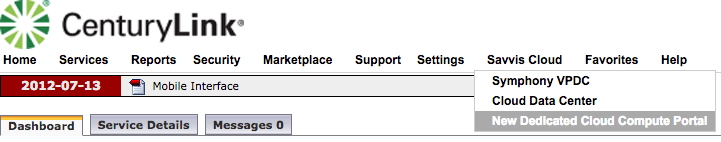

{{{
  "title": "Log On to new UI",
  "date": "05-08-2018",
  "author": "Anthony Hakim",
  "attachments": [],
  "related-products" : [],
  "contentIsHTML": false,
  "sticky": false
}}}

### Description

The User Interface (UI) for Dedicated Cloud Compute (DCC) has been updated with a new look and feel. This documents the process to logon and launch the new UI.

### Audience

Dedicated Cloud Compute customers.

### Assumptions

* You have a SavvisStation Portal account and can log on successfully.

### Process

1. Go to [SavvisStation Portal](https://www.savvisstation.savvis.com/) and log in with your username and password.

  

2. Once logged in to SavvisStation Portal (SSP), hover your mouse over Savvis Cloud, then select Dedicated Cloud Compute.

  

3. The DCC UI will open in a new tab.

  
