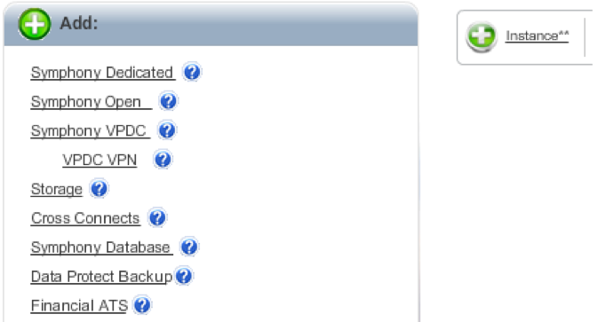
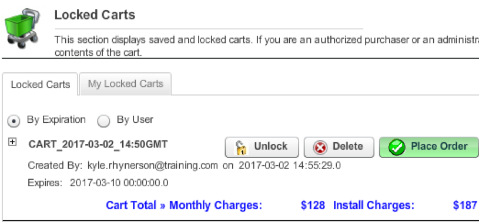

{{{ "title": "New Dedicated Cloud Compute User Interface Changes and Updated Views",
"date": "05-08-2018",
"author": "",
"attachments": [],
"contentIsHTML": false
}}}

#### Overview

1. This section covers the major improvements on the back-end of the DCC User Interface, which should greatly increase the reliability and speed to perform various tasks (e.g., provisioning a VM, performing a power operation, etc.). The most obvious changes will be the ones that customers see when using the new UI (listed below) including: the new color scheme, new ways to view and create resources, and the introduction of the concept of "Orders" to replace the "Carts" and "Tasks" from the old UI. Finally, it references all the features included in the MVP release and those that development will add in before the General Availability (GA) release.

   **Behind-the-scenes changes listed**
   * **Updated views**
	   * New color scheme
	   * View resources by Data Center Site/Cluster
	   * Decentralized Image Management
	   * New interface for creating storage and servers
	   * "Orders" vs. "Carts" and "Tasks"
     * MVP vs. GA

2. **API Hierarchy Changes**

To address slowness and stability with the old/existing SSP, the back end of the portal interface was completely redesigned.  Developers introduced an application programming interface (API) that can retrieve data from various sources (e.g., Vantive, MongoDB, etc.). **Figure 1** shows the API hierarchy and the various interactions.

   **Figure 1.**
   

3. **ABL Hierarchy Changes and Interactions**

In addition, developers also created the Automation Business Logic Layer (ABL) that performs Pre-Provisioning, Provisioning, and Post-Provisioning tasks.

   **Figure 2.** shows the various interactions, which include:
   * Notifications
   * Mongo Order/Job updating
   * CCCDB and Remedy updating
   * Orchestrating provisioning tasks against infrastructure systems including storage, vCenter, CHEF, HP Server Automation (HP SA), etc.

   **Figure 2.**
   

   **References**
   * API – https://confluence.savvis.net/x/3vGCBg
   * ABL – https://confluence.savvis.net/x/enYNBw

4. **Updated Views**
This section covers the following:

   * New Color Scheme
   * View resources by Data Center Site/Cluster
   * Decentralized Image Management

   One of the most visible changes presented with the new UI is a new color scheme. **Figure 3** shows the old SSP, which features a white background with red highlights and banners. **Figure 4** shows the new color scheme, which features a black and grey theme with green highlights.

   **Figure 3.**
   

   **Figure 4.**
   

   Experienced users of the old/existing SSP, will recognize **Figure 5.**, and how it limits users to viewing their resources by parent cluster only.

   **Figure 5.**
   

   **Figure 6.** shows the new DCC UI and the Dashboard view. It groups all virtual resources together by parent data center, and provides server, CPU, RAM, and Storage totals on the *Overview* tab. This is helpful for customers that have dedicated clusters across multiple physical sites.

   **Figure 6.**
   

    Another change within the new UI is how customers view their stored images. The old SSP provided a centralized *Image Management Dashboard* under Symphony Orchestrator where customers could view and work with all of their saved images. **Figure 7.** shows how the new UI uses a decentralized view that lists available images under each cluster.

   **Figure 7.**
   

   **Note:** When you click on Saved Images, the UI will display all the clusters under a given site as shown in **Figure 8.** You can then click on a specific folder to view the images associated with that cluster.

   **Figure 8.**
   

5. **Updated Views continued**

   This section covers:
   * New interface for creating servers and storage
   * "Orders" vs. "Carts" and "Tasks"

   Another difference within the new UI is how users create servers and storage.  

   **Figure 9.** shows two ways users can create servers in the old SSP. The first image shows the splash screen when you first launch *Marketplace*, and the small Instance button appears as an option when you select a cluster in the *Compute Dashboard*. To create storage, users could click the *Storage* link shown in the screenshot on the left.

   **Figure 9.**
   

   **Figure 10.** shows the new UI, which features a Create button where users can then choose to add a server or storage.

   **Figure 10.**
   

  A final, fundamental change with the new UI is the replacement of "Carts" (i.e., Shopping Carts) and "Tasks" with the concept of "Orders".

   **Figure 11.** shows an example in the old SSP where a user could create a "Cart" like you might have if you were on an e-commerce site like Amazon.  This would allow you to put things in and take things out without buying (provisioning) them. For CenturyLink, it also allows companies to separate user rights where technical personnel might have the means to build out one or more systems, but authorization to spend money could be limited to someone in a manager or finance role.

   **Figure 11.**
   

   The old SavvisStation Portal also used "Tasks" to show things that were going on in the environment. **Figure 12.** is an example of a reboot operation task.

   **Figure 12.**
   

   In the new UI, **Figure 13.** shows how "Carts" and "Tasks" are replaced with the *Orders* view. From here, users can access *Saved Orders*, which would be akin to a "Locked Cart". They can also view *Order Provisioning*, which would show server and storage deployment tasks, and *Server Operations*, which would show things like power operations, add/delete disk, delete VM, etc.)

   **Figure 13.**
   

6. **MVP Release vs. GA Release**

The DCC Product Team is planning an **MVP** release to select customers with the understanding that the new UI will not have complete feature-parity with the old UI. The core features most customers use will be available, which include:

   * **Power operations** &mdash; Start, Stop, and Reboot a VM.
   * **Edit Resources** &mdash; This is the new name for "Change Tier", which allows customers to increase/decrease CPU and/or RAM on a VM.
   * **Add/Delete VM** &mdash; This covers provisioning a new VM from and delete a VM.
   * **Clone VM** &mdash; This is another way to provision a VM, and it makes a copy of an existing VM.
   * **User-specified IP Address** &mdash; This is a sub-task of both adding a new VM and cloning a VM, which gives customers the ability to manually specify an IP Address rather than selecting one from a pool of "available" addresses.
   * **Add Utility Storage (3Par and NetApp)** &mdash; This is the process to create a new datastore.
   * **Add/Delete Disk** &mdash; This is the process to add/delete a disk (VMDK file) on a VM.
   * **Linked Help files** &mdash; The old UI had basic help information  for things like mount/unmount a drive, cloning limitations, etc. This feature will recreate that experience through Knowledge Base articles available at [Knowledge Base](/dedicated-cloud-compute/general/#1).

   The goal of the **GA** release will be to have complete feature parity with the old UI. As such, there are several features development teams will need to create after the MVP release. These include:

   * **Add/Edit/Delete Image** &mdash; The concept of images are present in the new UI, but customers won’t be able to add, edit, or delete an image until the GA release is complete.
   * **Deploy from Image** &mdash; This feature will allow customers to deploy a VM based on a saved image.
   * **Modify Saved Order** &mdash; This feature will allow customers to save an order and then make changes and/or have someone else submit the order who has right the make Cloud purchases.
   * **Backup Management Link (maybe)** &mdash; The old UI has a link to the Backup Management dashboard that allows customers to request and/or configure backups on their VMs. It hasn’t been discussed whether the new UI will provide a link to that dashboard or if customers will need to return to the old UI.
