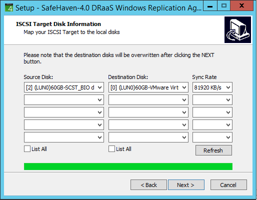

{{{
  "title": Boot Recovery Proxy into local disk instead of iSCSI",
  "date": "10-26-2016",
  "author": "Anshul Arora",
  "attachments": [],
  "contentIsHTML": false
}}}

## Article Overview
This article aims at providing a method to boot the stubs into local vmdk instead of iSCSI. This is sometimes useful if DR testing is required
to be done for more than a week or so and its not feasible to be in Test Failover mode during that period.

###1. Resize the the primary disk of the stub.
Increase the size of the primary disk of the stub server so that it matches the size of the boot disk of production server. If the production
server has data disks then attach data disks of same size to the stub

###2. Initiate Test Failover

###3. In-band To Out-of-band Conversion
Run In-band To Out-of-band Converter

Select SCST(iSCSI) disk as the source disk and VMware disk as destination. Carefully map the iSCSI disks to the Disks of the Recovery Server so the the boot

