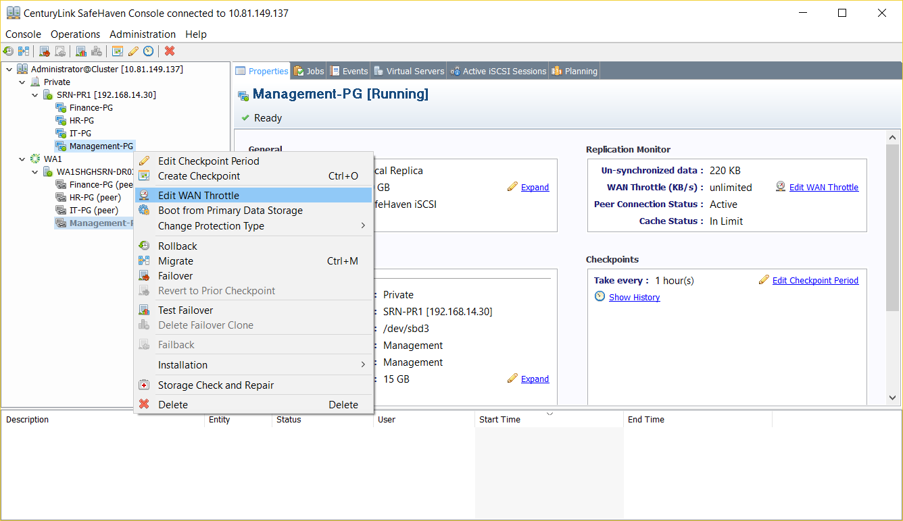
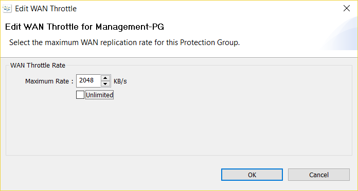

{{{
  "title": Edit WAN Throttle",
  "date": "11-29-2016",
  "author": "Anshul Arora",
  "attachments": [],
  "contentIsHTML": false
}}}

###Article Overview
This article explains how to edit the WAN throttle. Basically, it is used to change the sync speed from source to recovery SRN

###Editing WAN Throttle
1. Right click on the Protection Group and then click on Edit WAN Throttle from the drop down menu.

2. Enter the desired value for maximum WAN replication rate. It can be set to Unlimited by checking the box in front of Unlimited.

